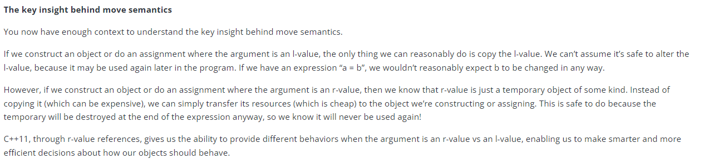

# Move Semantics and Smart Pointers

- RAII

<p align="center">
  
</p>

- Smart Pointers

<p align="center">
  
</p>

```c++
#include <iostream>

template <typename T>
class Auto_ptr1
{
	T* m_ptr;
public:
	// Pass in a pointer to "own" via the constructor
	Auto_ptr1(T* ptr=nullptr)
		:m_ptr(ptr)
	{
	}

	// The destructor will make sure it gets deallocated
	~Auto_ptr1()
	{
		delete m_ptr;
	}

	// Overload dereference and operator-> so we can use Auto_ptr1 like m_ptr.
	T& operator*() const { return *m_ptr; }
	T* operator->() const { return m_ptr; }
};

// A sample class to prove the above works
class Resource
{
public:
    Resource() { std::cout << "Resource acquired\n"; }
    ~Resource() { std::cout << "Resource destroyed\n"; }
};

int main()
{
	Auto_ptr1<Resource> res(new Resource()); // Note the allocation of memory here

        // ... but no explicit delete needed

	// Also note that the Resource in angled braces doesn't need a * symbol, since that's supplied by the template

	return 0;
} // res goes out of scope here, and destroys the allocated Resource for us
```

<p align="center">
  
</p>

- **A critical flaw**

```c++
int main()
{
	Auto_ptr1<Resource> res1(new Resource());
	Auto_ptr1<Resource> res2(res1); // Alternatively, don't initialize res2 and then assign res2 = res1;

	return 0;
}
```

<p align="center">
  
</p>

<p align="center">
  
</p>

## Move semantics

- Instead of having our copy constructor and assignment operator copy the pointer (“copy semantics”), we instead transfer/move ownership of the pointer from the source to the destination object. This is the core idea behind move semantics. **Move semantics** means the class will transfer ownership of the object rather than making a copy.

```c++
#include <iostream>

template <typename T>
class Auto_ptr2
{
	T* m_ptr;
public:
	Auto_ptr2(T* ptr=nullptr)
		:m_ptr(ptr)
	{
	}

	~Auto_ptr2()
	{
		delete m_ptr;
	}

	// A copy constructor that implements move semantics
	Auto_ptr2(Auto_ptr2& a) // note: not const
	{
		m_ptr = a.m_ptr; // transfer our dumb pointer from the source to our local object
		a.m_ptr = nullptr; // make sure the source no longer owns the pointer
	}

	// An assignment operator that implements move semantics
	Auto_ptr2& operator=(Auto_ptr2& a) // note: not const
	{
		if (&a == this)
			return *this;

		delete m_ptr; // make sure we deallocate any pointer the destination is already holding first
		m_ptr = a.m_ptr; // then transfer our dumb pointer from the source to the local object
		a.m_ptr = nullptr; // make sure the source no longer owns the pointer
		return *this;
	}

	T& operator*() const { return *m_ptr; }
	T* operator->() const { return m_ptr; }
	bool isNull() const { return m_ptr == nullptr; }
};

class Resource
{
public:
	Resource() { std::cout << "Resource acquired\n"; }
	~Resource() { std::cout << "Resource destroyed\n"; }
};

int main()
{
	Auto_ptr2<Resource> res1(new Resource());
	Auto_ptr2<Resource> res2; // Start as nullptr

	std::cout << "res1 is " << (res1.isNull() ? "null\n" : "not null\n");
	std::cout << "res2 is " << (res2.isNull() ? "null\n" : "not null\n");

	res2 = res1; // res2 assumes ownership, res1 is set to null

	std::cout << "Ownership transferred\n";

	std::cout << "res1 is " << (res1.isNull() ? "null\n" : "not null\n");
	std::cout << "res2 is " << (res2.isNull() ? "null\n" : "not null\n");

	return 0;
}
```

- ```std::auto_ptr```, and why it was a bad idea

<p align="center">
  
</p>

## R-value references

<p align="center">
  
</p>

<p align="center">
  
</p>

<p align="center">
  
</p>

- ```std::forward```

<p align="center">
  
</p>

```c++
int main(){
  some_struct<int> s1(5);
  // in ctor: '5' is rvalue (int&&), so 'U' is deduced as 'int', giving 'int&&'
  // ctor after deduction: 'some_struct(int&& v)' ('U' == 'int')
  // with rvalue reference 'v' bound to rvalue '5'
  // now we 'static_cast' 'v' to 'U&&', giving 'static_cast<int&&>(v)'
  // this just turns 'v' back into an rvalue
  // (named rvalue references, 'v' in this case, are lvalues)
  // huzzah, we forwarded an rvalue to the constructor of '_v'!

  // attention, real magic happens here
  int i = 5;
  some_struct<int> s2(i);
  // in ctor: 'i' is an lvalue ('int&'), so 'U' is deduced as 'int&', giving 'int& &&'
  // applying the reference collapsing rules yields 'int&' (& + && -> &)
  // ctor after deduction and collapsing: 'some_struct(int& v)' ('U' == 'int&')
  // with lvalue reference 'v' bound to lvalue 'i'
  // now we 'static_cast' 'v' to 'U&&', giving 'static_cast<int& &&>(v)'
  // after collapsing rules: 'static_cast<int&>(v)'
  // this is a no-op, 'v' is already 'int&'
  // huzzah, we forwarded an lvalue to the constructor of '_v'!
}
```

<p align="center">
  
</p>

## Move constructors and move assignment

<p align="center">
  
</p>

```c++
#include <iostream>

template<typename T>
class Auto_ptr4
{
	T* m_ptr;
public:
	Auto_ptr4(T* ptr = nullptr)
		:m_ptr(ptr)
	{
	}

	~Auto_ptr4()
	{
		delete m_ptr;
	}

	// Copy constructor
	// Do deep copy of a.m_ptr to m_ptr
	Auto_ptr4(const Auto_ptr4& a)
	{
		m_ptr = new T;
		*m_ptr = *a.m_ptr;
	}

	// Move constructor
	// Transfer ownership of a.m_ptr to m_ptr
	Auto_ptr4(Auto_ptr4&& a) noexcept
		: m_ptr(a.m_ptr)
	{
		a.m_ptr = nullptr; // we'll talk more about this line below
	}

	// Copy assignment
	// Do deep copy of a.m_ptr to m_ptr
	Auto_ptr4& operator=(const Auto_ptr4& a)
	{
		// Self-assignment detection
		if (&a == this)
			return *this;

		// Release any resource we're holding
		delete m_ptr;

		// Copy the resource
		m_ptr = new T;
		*m_ptr = *a.m_ptr;

		return *this;
	}

	// Move assignment
	// Transfer ownership of a.m_ptr to m_ptr
	Auto_ptr4& operator=(Auto_ptr4&& a) noexcept
	{
		// Self-assignment detection
		if (&a == this)
			return *this;

		// Release any resource we're holding
		delete m_ptr;

		// Transfer ownership of a.m_ptr to m_ptr
		m_ptr = a.m_ptr;
		a.m_ptr = nullptr; // we'll talk more about this line below

		return *this;
	}

	T& operator*() const { return *m_ptr; }
	T* operator->() const { return m_ptr; }
	bool isNull() const { return m_ptr == nullptr; }
};

class Resource
{
public:
	Resource() { std::cout << "Resource acquired\n"; }
	~Resource() { std::cout << "Resource destroyed\n"; }
};

Auto_ptr4<Resource> generateResource()
{
	Auto_ptr4<Resource> res{new Resource};
	return res; // this return value will invoke the move constructor
}

int main()
{
	Auto_ptr4<Resource> mainres;
	mainres = generateResource(); // this assignment will invoke the move assignment

	return 0;
}
```

> The address of a reference is the address of the aliased object or function

```c++
	Auto_ptr4& operator=(const Auto_ptr4& a)
	{
		// Self-assignment detection
		if (&a == this)
			return *this;
```

The move constructor and move assignment operator are simple. Instead of deep copying the source object (a) into the implicit object, we simply move (steal) the source object’s resources. This involves shallow copying the source pointer into the implicit object, then setting the source pointer to null.

<p align="center">
  
</p>

<p align="center">
  
</p>

> Automatic l-values returned by value may be moved instead of copied.

## ```std::move```

Once you start using move semantics more regularly, you’ll start to find cases where you want to invoke move semantics, but the objects you have to work with are l-values, not r-values

```c++
#include <iostream>
#include <string>

template<class T>
void myswapCopy(T& a, T& b)
{
	T tmp { a }; // invokes copy constructor
	a = b; // invokes copy assignment
	b = tmp; // invokes copy assignment
}

int main()
{
	std::string x{ "abc" };
	std::string y{ "de" };

	std::cout << "x: " << x << '\n';
	std::cout << "y: " << y << '\n';

	myswapCopy(x, y);

	std::cout << "x: " << x << '\n';
	std::cout << "y: " << y << '\n';

	return 0;
}
```

<p align="center">
  
</p>

```c++
static_cast<T&&>(t);
```

<p align="center">
  
</p>


```c++
#include <iostream>
#include <string>
#include <utility> // for std::move

template<class T>
void myswapMove(T& a, T& b)
{
	T tmp { std::move(a) }; // invokes move constructor
	a = std::move(b); // invokes move assignment
	b = std::move(tmp); // invokes move assignment
}

int main()
{
	std::string x{ "abc" };
	std::string y{ "de" };

	std::cout << "x: " << x << '\n';
	std::cout << "y: " << y << '\n';

	myswapMove(x, y);

	std::cout << "x: " << x << '\n';
	std::cout << "y: " << y << '\n';

	return 0;
}
```

- Moved from objects will be in a valid, but possibly indeterminate state

```c++
#include <iostream>
#include <string>
#include <utility> // for std::move
#include <vector>

int main()
{
	std::vector<std::string> v;

	// We use std::string because it is movable (std::string_view is not)
	std::string str { "Knock" };

	std::cout << "Copying str\n";
	v.push_back(str); // calls l-value version of push_back, which copies str into the array element

	std::cout << "str: " << str << '\n';
	std::cout << "vector: " << v[0] << '\n';

	std::cout << "\nMoving str\n";

	v.push_back(std::move(str)); // calls r-value version of push_back, which moves str into the array element

	std::cout << "str: " << str << '\n'; // The result of this is indeterminate
	std::cout << "vector:" << v[0] << ' ' << v[1] << '\n';

	return 0;
}
```

<p align="center">
  
</p>

<p align="center">
  
</p>

## ```std::unique_ptr```

<p align="center">
  
</p>

<p align="center">
  
</p>

<p align="center">
  
</p>

```c++
unique_ptr<int> x {new int(10)};
unique_ptr<int> y {x};

cout << *y.get();

main.cpp: In function ‘int main(int, char**)’:
main.cpp:19:21: error: use of deleted function ‘std::unique_ptr<_Tp, _Dp>::unique_ptr(const std::unique_ptr<_Tp, _Dp>&) [with _Tp = int; _Dp = std::default_delete]’
   19 | unique_ptr<int> y {x};
      |                     ^
In file included from /usr/include/c++/9/memory:80,
                 from main.cpp:10:
/usr/include/c++/9/bits/unique_ptr.h:414:7: note: declared here
  414 |       unique_ptr(const unique_ptr&) = delete;
      | 


int test(unique_ptr<int> x) {
    return 1;
}

int main(int argc, char ** argv){
	unique_ptr<int> x {new int(10)};
	cout << test(x);
}

main.cpp: In function ‘int main(int, char**)’:
main.cpp:23:15: error: use of deleted function ‘std::unique_ptr<_Tp, _Dp>::unique_ptr(const std::unique_ptr<_Tp, _Dp>&) [with _Tp = int; _Dp = std::default_delete]’
   23 | cout << test(x);
```

<p align="center">
  
</p>

- **Use ```std::make_unique()``` to avoid exception safety issue!!!!**

```c++
// Compiler can change the order of the execution
some_function(std::unique_ptr<T>(new T), function_that_can_throw_exception());
```

<p align="center">
  
</p>

- Returning std::unique_ptr from a function

<p align="center">
  
</p>

<p align="center">
  
</p>

## ```std::shared_ptr```

Unlike std::unique_ptr, which is designed to singly own and manage a resource, std::shared_ptr is meant to solve the case **where you need multiple smart pointers co-owning a resource**.

<p align="center">
  
</p>

<p align="center">
  
</p>

- ```std::make_shared```

<p align="center">
  
</p>

> std::make_shared is more performant

<p align="center">
  
</p>

## Circular dependency issues with std::shared_ptr, and std::weak_ptr

```c++
#include <iostream>
#include <memory> // for std::shared_ptr
#include <string>

class Person
{
	std::string m_name;
	std::shared_ptr<Person> m_partner; // initially created empty

public:

	Person(const std::string &name): m_name(name)
	{
		std::cout << m_name << " created\n";
	}
	~Person()
	{
		std::cout << m_name << " destroyed\n";
	}

	friend bool partnerUp(std::shared_ptr<Person> &p1, std::shared_ptr<Person> &p2)
	{
		if (!p1 || !p2)
			return false;

		p1->m_partner = p2;
		p2->m_partner = p1;

		std::cout << p1->m_name << " is now partnered with " << p2->m_name << '\n';

		return true;
	}
};

int main()
{
	auto lucy { std::make_shared<Person>("Lucy") }; // create a Person named "Lucy"
	auto ricky { std::make_shared<Person>("Ricky") }; // create a Person named "Ricky"

	partnerUp(lucy, ricky); // Make "Lucy" point to "Ricky" and vice-versa

	return 0;
}
```

<p align="center">
  
</p>

<p align="center">
  
</p>

- ```std::weak_ptr```

<p align="center">
  
</p>

> use ```lock()``` to convert ```weak_ptr``` to ```shared_ptr``` to use

<p align="center">
  
</p>

```c++
#include <iostream>
#include <memory> // for std::shared_ptr and std::weak_ptr
#include <string>

class Person
{
	std::string m_name;
	std::weak_ptr<Person> m_partner; // note: This is now a std::weak_ptr

public:

	Person(const std::string &name) : m_name(name)
	{
		std::cout << m_name << " created\n";
	}
	~Person()
	{
		std::cout << m_name << " destroyed\n";
	}

	friend bool partnerUp(std::shared_ptr<Person> &p1, std::shared_ptr<Person> &p2)
	{
		if (!p1 || !p2)
			return false;

		p1->m_partner = p2;
		p2->m_partner = p1;

		std::cout << p1->m_name << " is now partnered with " << p2->m_name << "\'\n'";

		return true;
	}

	const std::shared_ptr<Person> getPartner() const { return m_partner.lock(); } // use lock() to convert weak_ptr to shared_ptr
	const std::string& getName() const { return m_name; }
};

int main()
{
	auto lucy { std::make_shared<Person>("Lucy") };
	auto ricky { std::make_shared<Person>("Ricky") };

	partnerUp(lucy, ricky);

	auto partner = ricky->getPartner(); // get shared_ptr to Ricky's partner
	std::cout << ricky->getName() << "'s partner is: " << partner->getName() << '\n';

	return 0;
}
```

<p align="center">
  
</p>