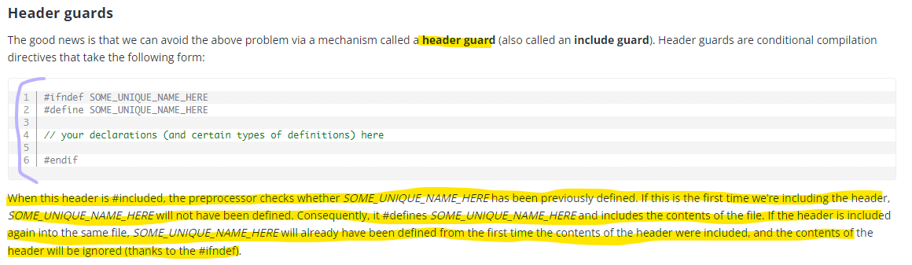
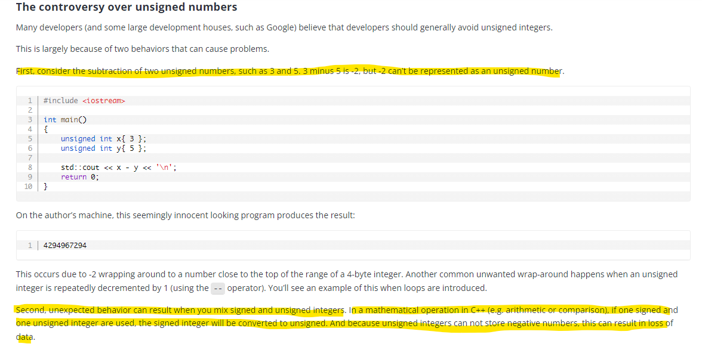

# C++ Basics

- [Source](https://www.learncpp.com/)

## [Compiler vs Interpreter](https://stackoverflow.com/questions/38491212/difference-between-compiled-and-interpreted-languages/38491646#38491646)

<p align="center">
  
</p>

<p align="center">
  
</p>

## [Uninitialized variables and undefined behavior](https://www.learncpp.com/cpp-tutorial/uninitialized-variables-and-undefined-behavior/)

<p align="center">
  
</p>

## Return by value && Pass by value

<p align="center">
  
</p>

<p align="center">
  
</p>

## [Forward declarations and definitions](https://www.learncpp.com/cpp-tutorial/forward-declarations/)

<p align="center">
  
</p>

## [The scope of defines](https://www.learncpp.com/cpp-tutorial/introduction-to-the-preprocessor/)

<p align="center">
  
</p>

<p align="center">
  
</p>

## [Angled brackets vs double quotes](https://www.learncpp.com/cpp-tutorial/header-files/#includemethod)

<p align="center">
  
</p>

## [Header guards](https://www.learncpp.com/cpp-tutorial/header-guards/)

<p align="center">
  
</p>

<p align="center">
  
</p>

<p align="center">
  
</p>

## [Object sizes and the sizeof operator](https://www.learncpp.com/cpp-tutorial/object-sizes-and-the-sizeof-operator/)

<p align="center">
  
</p>

<p align="center">
  
</p>

<p align="center">
  
</p>

<p align="center">
  
</p>

## [The controversy over unsigned numbers](https://www.learncpp.com/cpp-tutorial/unsigned-integers-and-why-to-avoid-them/)

<p align="center">
  
</p>

<p align="center">
  
</p>

<p align="center">
  
</p>

## [Fixed-width integers && Fast and least integers](https://www.learncpp.com/cpp-tutorial/fixed-width-integers-and-size-t/)

<p align="center">
  
</p>

## [type conversion and static_cast](https://www.learncpp.com/cpp-tutorial/introduction-to-type-conversion-and-static_cast/)

<p align="center">
  
</p>

## [Compile-time constants, constant expressions, and constexpr](https://www.learncpp.com/cpp-tutorial/compile-time-constants-constant-expressions-and-constexpr/)

<p align="center">
  
</p>

<p align="center">
  
</p>

<p align="center">
  
</p>

<p align="center">
  
</p>

<p align="center">
  
</p>

## [Constexpr and consteval functions](https://www.learncpp.com/cpp-tutorial/constexpr-and-consteval-functions/)

<p align="center">
  
</p>

<p align="center">
  
</p>

<p align="center">
  
</p>

<p align="center">
  
</p>

<p align="center">
  
</p>

<p align="center">
  
</p>

<p align="center">
  
</p>

## [Literals](https://www.learncpp.com/cpp-tutorial/literals/)

<p align="center">
  
</p>

<p align="center">
  
</p>

## **图解 Git 工作原理**

From: https://mp.weixin.qq.com/s/YM2dNmmR_oKPO9hctTOhjg

- ++i will increment the value of i, and then return the incremented value.

```C++ 
i = 1;
j = ++i;
(i is 2, j is 2)
 ```
- i++ will increment the value of i, but return the original value that i held before being incremented.

```C++
i = 1;
j = i++;
(i is 2, j is 1)
 ```