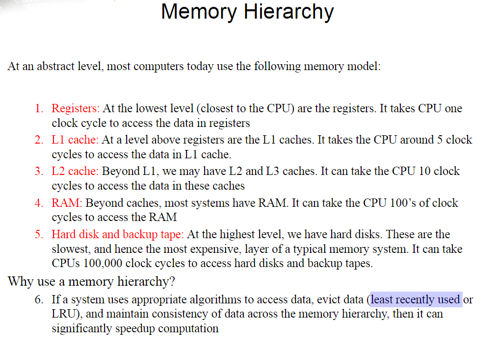
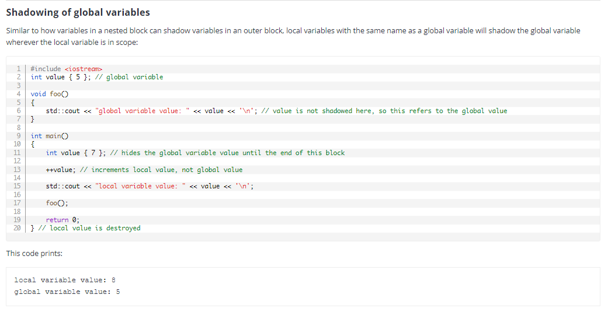
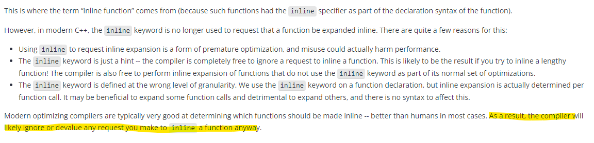
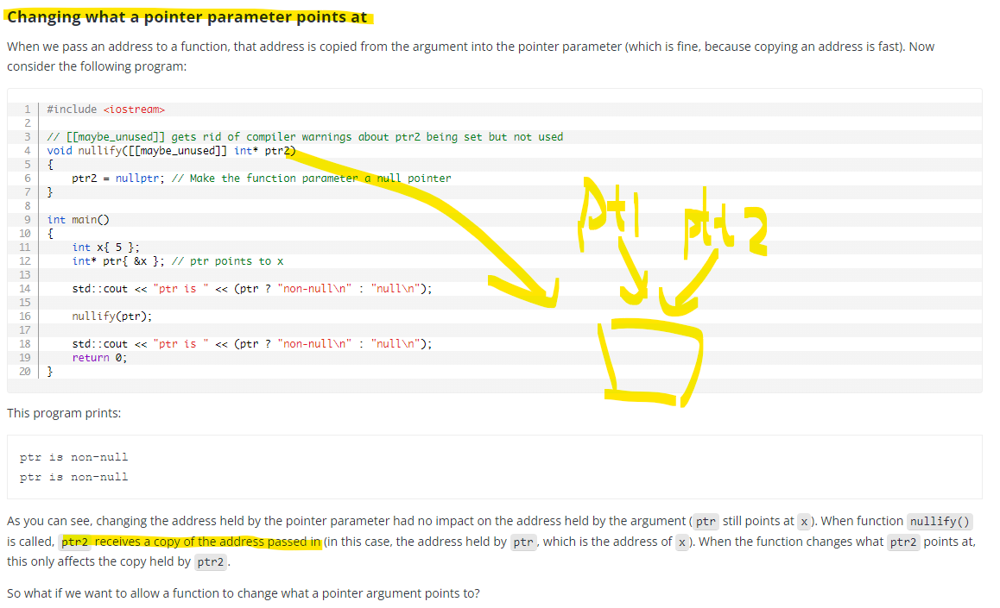

# C++ Basics

<p align="center">
  
</p>

<p align="center">
  
</p>

- Memory Hierarchy

<p align="center">
  
</p>

<p align="center">
  
</p>

- Least Recently Used (LRU Cache)

<p align="center">
  
</p>

<p align="center">
  
</p>

- [Source](https://www.learncpp.com/)

## [Compiler vs Interpreter](https://stackoverflow.com/questions/38491212/difference-between-compiled-and-interpreted-languages/38491646#38491646)

<p align="center">
  
</p>

<p align="center">
  
</p>

- For Java(interpreting), it runs the executable on JVM (virtual machine)
- Java use Just-in-time compilation (Jit)

<p align="center">
  
</p>

## [Uninitialized variables and undefined behavior](https://www.learncpp.com/cpp-tutorial/uninitialized-variables-and-undefined-behavior/)

<p align="center">
  
</p>

## Return by value && Pass by value

<p align="center">
  
</p>

<p align="center">
  
</p>

## [Forward declarations and definitions](https://www.learncpp.com/cpp-tutorial/forward-declarations/)

<p align="center">
  
</p>

## [The scope of defines](https://www.learncpp.com/cpp-tutorial/introduction-to-the-preprocessor/)

<p align="center">
  
</p>

<p align="center">
  
</p>

## [Angled brackets vs double quotes](https://www.learncpp.com/cpp-tutorial/header-files/#includemethod)

<p align="center">
  
</p>

## [Header guards](https://www.learncpp.com/cpp-tutorial/header-guards/)

<p align="center">
  
</p>

<p align="center">
  
</p>

<p align="center">
  
</p>

## [Object sizes and the sizeof operator](https://www.learncpp.com/cpp-tutorial/object-sizes-and-the-sizeof-operator/)

<p align="center">
  
</p>

<p align="center">
  
</p>

<p align="center">
  
</p>

<p align="center">
  
</p>

## [The controversy over unsigned numbers](https://www.learncpp.com/cpp-tutorial/unsigned-integers-and-why-to-avoid-them/)

<p align="center">
  
</p>

<p align="center">
  
</p>

<p align="center">
  
</p>

## [Fixed-width integers && Fast and least integers](https://www.learncpp.com/cpp-tutorial/fixed-width-integers-and-size-t/)

<p align="center">
  
</p>

## [type conversion and static_cast](https://www.learncpp.com/cpp-tutorial/introduction-to-type-conversion-and-static_cast/)

<p align="center">
  
</p>

## [Compile-time constants, constant expressions, and constexpr](https://www.learncpp.com/cpp-tutorial/compile-time-constants-constant-expressions-and-constexpr/)

<p align="center">
  
</p>

<p align="center">
  
</p>

<p align="center">
  
</p>

<p align="center">
  
</p>

<p align="center">
  
</p>

## [Constexpr and consteval functions](https://www.learncpp.com/cpp-tutorial/constexpr-and-consteval-functions/)

<p align="center">
  
</p>

<p align="center">
  
</p>

<p align="center">
  
</p>

<p align="center">
  
</p>

<p align="center">
  
</p>

<p align="center">
  
</p>

<p align="center">
  
</p>

## [Literals](https://www.learncpp.com/cpp-tutorial/literals/)

<p align="center">
  
</p>

<p align="center">
  
</p>

## [std::ws](https://www.learncpp.com/cpp-tutorial/introduction-to-stdstring/)

<p align="center">
  
</p>

<p align="center">
  
</p>

## [Introduction to std::string_view](https://www.learncpp.com/cpp-tutorial/introduction-to-stdstring_view/)

<p align="center">
  
</p>

<p align="center">
  
</p>

<p align="center">
  
</p>

<p align="center">
  
</p>

- Passing strings by ```const std::string&``` or ```std::string_view```?

> ```std::string_view```

<p align="center">
  
</p>

<p align="center">
  
</p>

<p align="center">
  
</p>

## Bit Manipulation

- Binary literals and digit separators

<p align="center">
  
</p>

- Bit flags and bit manipulation via ```std::bitset```

> Since all objects need to have unique memory addresses, this means ```objects must be at least one byte in size```.

For most variable types, this is fine. However, **for Boolean values, this is a bit wasteful (pun intended)**. Boolean types only have two states: true (1), or false (0). This set of states only requires one bit to store. **However, if a variable must be at least a byte, and a byte is 8 bits, that means a Boolean is using 1 bit and leaving the other 7 unused.**

<p align="center">
  
</p>

<p align="center">
  
</p>

- The bitwise operators

<p align="center">
  
</p>

<p align="center">
  
</p>

<p align="center">
  
</p>

<p align="center">
  
</p>

<p align="center">
  
</p>

- [Other](https://m-peko.github.io/craft-cpp/posts/different-ways-to-define-binary-flags/)

<p align="center">
  
</p>

## Scope, Duration, and Linkage

- Multiple namespace blocks are allowed

<p align="center">
  
</p>

<p align="center">
  
</p>

- Local variables

<p align="center">
  
</p>

<p align="center">
  
</p>

<p align="center">
  
</p>

<p align="center">
  
</p>

- [Variable shadowing](https://www.learncpp.com/cpp-tutorial/variable-shadowing-name-hiding/)

> Need to avoid

<p align="center">
  
</p>

<p align="center">
  
</p>

- Global variables

<p align="center">
  
</p>

- Internal linkage

<p align="center">
  
</p>

<p align="center">
  
</p>

- External linkage

<p align="center">
  
</p>

<p align="center">
  
</p>

<p align="center">
  
</p>

<p align="center">
  
</p>

<p align="center">
  
</p>

## [Sharing global constants across multiple files (using inline variables)](https://www.learncpp.com/cpp-tutorial/sharing-global-constants-across-multiple-files-using-inline-variables/)

<p align="center">
  
</p>

<p align="center">
  
</p>

## [Static local variables](https://www.learncpp.com/cpp-tutorial/static-local-variables/)

<p align="center">
  
</p>

<p align="center">
  
</p>

## [Scope, duration, and linkage summary](https://www.learncpp.com/cpp-tutorial/scope-duration-and-linkage-summary/)

## [The performance of inline code](learncpp.com/cpp-tutorial/inline-functions/)

<p align="center">
  
</p>

<p align="center">
  
</p>

<p align="center">
  
</p>

## [Unnamed and inline namespaces](https://www.learncpp.com/cpp-tutorial/unnamed-and-inline-namespaces/)

<p align="center">
  
</p>

<p align="center">
  
</p>

## [The [[fallthrough]] attribute](https://www.learncpp.com/cpp-tutorial/switch-fallthrough-and-scoping/)

<p align="center">
  
</p>

<p align="center">
  
</p>

<p align="center">
  
</p>

## [For loops with multiple counters](https://www.learncpp.com/cpp-tutorial/for-statements/)

<p align="center">
  
</p>

## [Random number generation](https://www.learncpp.com/cpp-tutorial/generating-random-numbers-using-mersenne-twister/)

- https://www.learncpp.com/cpp-tutorial/introduction-to-random-number-generation/

## [Type casting](https://www.learncpp.com/cpp-tutorial/explicit-type-conversion-casting-and-static-cast/)

- Avoid C-style casts

<p align="center">
  
</p>

<p align="center">
  
</p>

- [Dynamic casting](https://www.learncpp.com/cpp-tutorial/dynamic-casting/)

<p align="center">
  
</p>

<p align="center">
  
</p>

<p align="center">
  
</p>

<p align="center">
  
</p>

<p align="center">
  
</p>

<p align="center">
  
</p>

<p align="center">
  
</p>

<p align="center">
  
</p>

<p align="center">
  
</p>

- Const cast

<p align="center">
  
</p>

## [Type aliases](https://www.learncpp.com/cpp-tutorial/typedefs-and-type-aliases/)

<p align="center">
  
</p>

<p align="center">
  
</p>

<p align="center">
  
</p>

<p align="center">
  
</p>

<p align="center">
  
</p>

<p align="center">
  
</p>

<p align="center">
  
</p>

## [Type deduction](https://www.learncpp.com/cpp-tutorial/type-deduction-with-pointers-references-and-const/)

<p align="center">
  
</p>

<p align="center">
  
</p>

- Top-level const and low-level const

<p align="center">
  
</p>

<p align="center">
  
</p>

> Once initialized, a reference in C++ cannot be reseated, meaning it cannot be changed to reference another object.

> So no const reference, but has reference to a const object.

> ```const std::string&``` is low-level const (reference to a const object)

> ```const int* const ptr``` left is hight-level const(cannot re-point to another obj), right is low-level const(point to a const obj) 

<p align="center">
  
</p>

<p align="center">
  
</p>

<p align="center">
  
</p>

## [Function overload differentiation](https://www.learncpp.com/cpp-tutorial/function-overload-differentiation/)

<p align="center">
  
</p>

<p align="center">
  
</p>

<p align="center">
  
</p>

<p align="center">
  
</p>

- [Function overload resolution and ambiguous matches](https://www.learncpp.com/cpp-tutorial/function-overload-resolution-and-ambiguous-matches/)

## [Abbreviated function templates (c++ 20)](https://www.learncpp.com/cpp-tutorial/function-templates-with-multiple-template-types/)

<p align="center">
  
</p>

<p align="center">
  
</p>

## Stack && Heap

<p align="center">
  
</p>

- Stack - function calls 

<p align="center">
  
</p>

<p align="center">
  
</p>

<p align="center">
  
</p>

<p align="center">
  
</p>

## [lvalues and rvalues](https://www.learncpp.com/cpp-tutorial/value-categories-lvalues-and-rvalues/)

<p align="center">
  
</p>

<p align="center">
  
</p>

<p align="center">
  
</p>

<p align="center">
  
</p>

<p align="center">
  
</p>

- [Lvalue references](https://www.learncpp.com/cpp-tutorial/lvalue-references/)

<p align="center">
  
</p>

<p align="center">
  
</p>

<p align="center">
  
</p>

<p align="center">
  
</p>

<p align="center">
  
</p>

<p align="center">
  
</p>

<p align="center">
  
</p>

<p align="center">
  
</p>

<p align="center">
  
</p>

<p align="center">
  
</p>

- [Pass by lvalue Reference](https://www.learncpp.com/cpp-tutorial/pass-by-lvalue-reference/)

<p align="center">
  
</p>

<p align="center">
  
</p>

<p align="center">
  
</p>

<p align="center">
  
</p>

<p align="center">
  
</p>

<p align="center">
  
</p>

<p align="center">
  
</p>

- [R Value Reference](https://www.learncpp.com/cpp-tutorial/rvalue-references/)

<p align="center">
  
</p>

<p align="center">
  
</p>

## [Pointers](https://www.learncpp.com/cpp-tutorial/introduction-to-pointers/)

<p align="center">
  
</p>

<p align="center">
  
</p>

<p align="center">
  
</p>

<p align="center">
  
</p>

<p align="center">
  
</p>

<p align="center">
  
</p>

<p align="center">
  
</p>

<p align="center">
  
</p>

<p align="center">
  
</p>

<p align="center">
  
</p>

<p align="center">
  
</p>

<p align="center">
  
</p>

<p align="center">
  
</p>

<p align="center">
  
</p>

- Const Pointer & Pointer to Const

<p align="center">
  
</p>

<p align="center">
  
</p>

- [Pass by Address](https://www.learncpp.com/cpp-tutorial/pass-by-address/)

<p align="center">
  
</p>

<p align="center">
  
</p>

<p align="center">
  
</p>

> Prefer pass by (const) reference

<p align="center">
  
</p>

<p align="center">
  
</p>

- [Return by reference and return by address](https://www.learncpp.com/cpp-tutorial/return-by-reference-and-return-by-address/)

<p align="center">
  
</p>

<p align="center">
  
</p>

<p align="center">
  
</p>

## Scoped enumerations (enum classes)

<p align="center">
  
</p>

<p align="center">
  
</p>

<p align="center">
  
</p>

<p align="center">
  
</p>

## Struct

<p align="center">
  
</p>

<p align="center">
  
</p>

<p align="center">
  
</p>

<p align="center">
  
</p>

<p align="center">
  
</p>

<p align="center">
  
</p>

<p align="center">
  
</p>

- Struct size and data structure alignment

<p align="center">
  
</p>

<p align="center">
  
</p>

<p align="center">
  
</p>

<p align="center">
  
</p>

> [Class template argument deduction (CTAD) and deduction guides](https://www.learncpp.com/cpp-tutorial/class-template-argument-deduction-ctad-and-deduction-guides/)

## Function Pointers

<p align="center">
  
</p>

<p align="center">
  
</p>

<p align="center">
  
</p>

- Callback functions

<p align="center">
  
</p>

<p align="center">
  
</p>

```c++
#include <utility> // for std::swap
#include <iostream>

// Note our user-defined comparison is the third parameter
void selectionSort(int* array, int size, bool (*comparisonFcn)(int, int))
{
    // Step through each element of the array
    for (int startIndex{ 0 }; startIndex < (size - 1); ++startIndex)
    {
        // bestIndex is the index of the smallest/largest element we've encountered so far.
        int bestIndex{ startIndex };

        // Look for smallest/largest element remaining in the array (starting at startIndex+1)
        for (int currentIndex{ startIndex + 1 }; currentIndex < size; ++currentIndex)
        {
            // If the current element is smaller/larger than our previously found smallest
            if (comparisonFcn(array[bestIndex], array[currentIndex])) // COMPARISON DONE HERE
            {
                // This is the new smallest/largest number for this iteration
                bestIndex = currentIndex;
            }
        }

        // Swap our start element with our smallest/largest element
        std::swap(array[startIndex], array[bestIndex]);
    }
}

// Here is a comparison function that sorts in ascending order
// (Note: it's exactly the same as the previous ascending() function)
bool ascending(int x, int y)
{
    return x > y; // swap if the first element is greater than the second
}

// Here is a comparison function that sorts in descending order
bool descending(int x, int y)
{
    return x < y; // swap if the second element is greater than the first
}

// This function prints out the values in the array
void printArray(int* array, int size)
{
    for (int index{ 0 }; index < size; ++index)
    {
        std::cout << array[index] << ' ';
    }

    std::cout << '\n';
}

int main()
{
    int array[9]{ 3, 7, 9, 5, 6, 1, 8, 2, 4 };

    // Sort the array in descending order using the descending() function
    selectionSort(array, 9, descending);
    printArray(array, 9);

    // Sort the array in ascending order using the ascending() function
    selectionSort(array, 9, ascending);
    printArray(array, 9);

    return 0;
}
```

<p align="center">
  
</p>

- Making function pointers prettier with type aliases

<p align="center">
  
</p>

- ```std::function```

<p align="center">
  
</p>

## [Ellipsis](https://www.learncpp.com/cpp-tutorial/ellipsis-and-why-to-avoid-them/)

```c++
#include <iostream>
#include <cstdarg> // needed to use ellipsis

// The ellipsis must be the last parameter
// count is how many additional arguments we're passing
double findAverage(int count, ...)
{
    int sum{ 0 };

    // We access the ellipsis through a va_list, so let's declare one
    std::va_list list;

    // We initialize the va_list using va_start.  The first argument is
    // the list to initialize.  The second argument is the last non-ellipsis
    // parameter.
    va_start(list, count);

    // Loop through all the ellipsis values
    for (int arg{ 0 }; arg < count; ++arg)
    {
         // We use va_arg to get values out of our ellipsis
         // The first argument is the va_list we're using
         // The second argument is the type of the value
         sum += va_arg(list, int);
    }

    // Cleanup the va_list when we're done.
    va_end(list);

    return static_cast<double>(sum) / count;
}

int main()
{
    std::cout << findAverage(5, 1, 2, 3, 4, 5) << '\n';
    std::cout << findAverage(6, 1, 2, 3, 4, 5, 6) << '\n';

    return 0;
}
```

# [Lambdas](https://www.learncpp.com/cpp-tutorial/introduction-to-lambdas-anonymous-functions/)

<p align="center">
  
</p>

- [Lambda captures](https://www.learncpp.com/cpp-tutorial/lambda-captures/)

<p align="center">
  
</p>

<p align="center">
  
</p>

<p align="center">
  
</p>

<p align="center">
  
</p>

<p align="center">
  
</p>

<p align="center">
  
</p>

<p align="center">
  
</p>

<p align="center">
  
</p>

<p align="center">
  
</p>

## **图解 Git 工作原理**

From: https://mp.weixin.qq.com/s/YM2dNmmR_oKPO9hctTOhjg

- ++i will increment the value of i, and then return the incremented value.

```C++ 
i = 1;
j = ++i;
(i is 2, j is 2)
 ```
- i++ will increment the value of i, but return the original value that i held before being incremented.

```C++
i = 1;
j = i++;
(i is 2, j is 1)
 ```