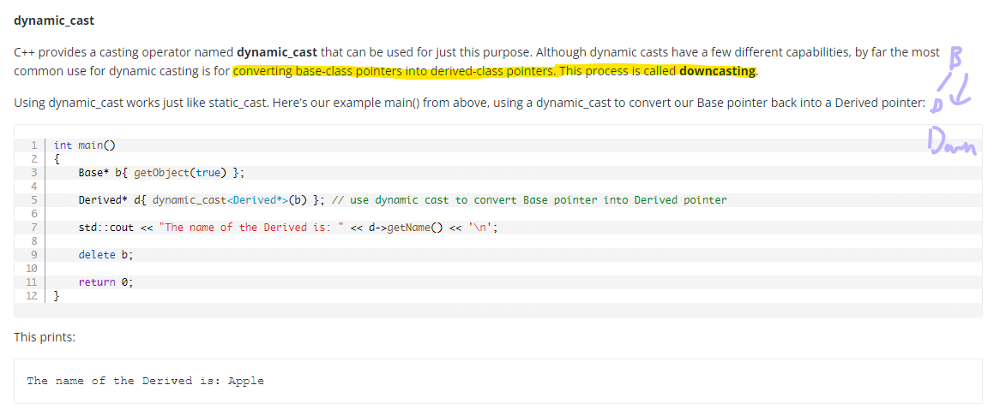
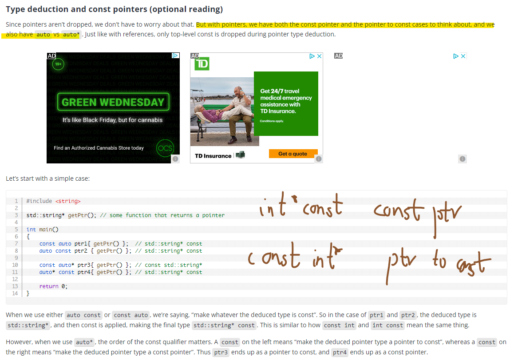
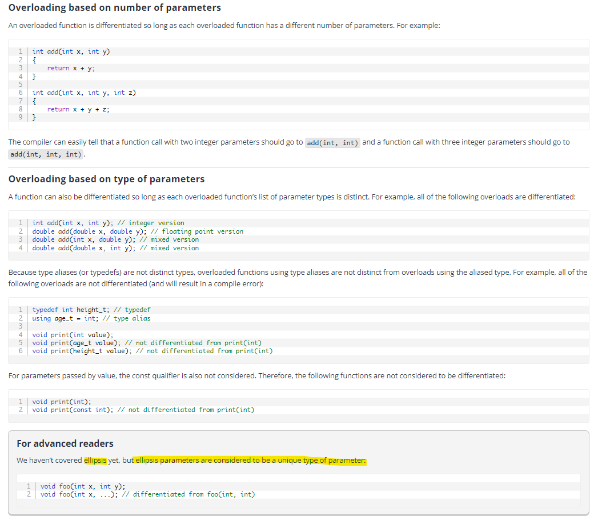

# C++ Basics

- [Source](https://www.learncpp.com/)

## [Compiler vs Interpreter](https://stackoverflow.com/questions/38491212/difference-between-compiled-and-interpreted-languages/38491646#38491646)

<p align="center">
  
</p>

<p align="center">
  
</p>

## [Uninitialized variables and undefined behavior](https://www.learncpp.com/cpp-tutorial/uninitialized-variables-and-undefined-behavior/)

<p align="center">
  
</p>

## Return by value && Pass by value

<p align="center">
  
</p>

<p align="center">
  
</p>

## [Forward declarations and definitions](https://www.learncpp.com/cpp-tutorial/forward-declarations/)

<p align="center">
  
</p>

## [The scope of defines](https://www.learncpp.com/cpp-tutorial/introduction-to-the-preprocessor/)

<p align="center">
  
</p>

<p align="center">
  
</p>

## [Angled brackets vs double quotes](https://www.learncpp.com/cpp-tutorial/header-files/#includemethod)

<p align="center">
  
</p>

## [Header guards](https://www.learncpp.com/cpp-tutorial/header-guards/)

<p align="center">
  
</p>

<p align="center">
  
</p>

<p align="center">
  
</p>

## [Object sizes and the sizeof operator](https://www.learncpp.com/cpp-tutorial/object-sizes-and-the-sizeof-operator/)

<p align="center">
  
</p>

<p align="center">
  
</p>

<p align="center">
  
</p>

<p align="center">
  
</p>

## [The controversy over unsigned numbers](https://www.learncpp.com/cpp-tutorial/unsigned-integers-and-why-to-avoid-them/)

<p align="center">
  
</p>

<p align="center">
  
</p>

<p align="center">
  
</p>

## [Fixed-width integers && Fast and least integers](https://www.learncpp.com/cpp-tutorial/fixed-width-integers-and-size-t/)

<p align="center">
  
</p>

## [type conversion and static_cast](https://www.learncpp.com/cpp-tutorial/introduction-to-type-conversion-and-static_cast/)

<p align="center">
  
</p>

## [Compile-time constants, constant expressions, and constexpr](https://www.learncpp.com/cpp-tutorial/compile-time-constants-constant-expressions-and-constexpr/)

<p align="center">
  
</p>

<p align="center">
  
</p>

<p align="center">
  
</p>

<p align="center">
  
</p>

<p align="center">
  
</p>

## [Constexpr and consteval functions](https://www.learncpp.com/cpp-tutorial/constexpr-and-consteval-functions/)

<p align="center">
  
</p>

<p align="center">
  
</p>

<p align="center">
  
</p>

<p align="center">
  
</p>

<p align="center">
  
</p>

<p align="center">
  
</p>

<p align="center">
  
</p>

## [Literals](https://www.learncpp.com/cpp-tutorial/literals/)

<p align="center">
  
</p>

<p align="center">
  
</p>

## [std::ws](https://www.learncpp.com/cpp-tutorial/introduction-to-stdstring/)

<p align="center">
  
</p>

<p align="center">
  
</p>

## [Introduction to std::string_view](https://www.learncpp.com/cpp-tutorial/introduction-to-stdstring_view/)

<p align="center">
  
</p>

<p align="center">
  
</p>

<p align="center">
  
</p>

<p align="center">
  
</p>

- Passing strings by ```const std::string&``` or ```std::string_view```?

> ```std::string_view```

<p align="center">
  
</p>

<p align="center">
  
</p>

<p align="center">
  
</p>

## Bit Manipulation

- Binary literals and digit separators

<p align="center">
  
</p>

- Bit flags and bit manipulation via ```std::bitset```

> Since all objects need to have unique memory addresses, this means ```objects must be at least one byte in size```.

For most variable types, this is fine. However, **for Boolean values, this is a bit wasteful (pun intended)**. Boolean types only have two states: true (1), or false (0). This set of states only requires one bit to store. **However, if a variable must be at least a byte, and a byte is 8 bits, that means a Boolean is using 1 bit and leaving the other 7 unused.**

<p align="center">
  
</p>

<p align="center">
  
</p>

- The bitwise operators

<p align="center">
  
</p>

<p align="center">
  
</p>

<p align="center">
  
</p>

<p align="center">
  
</p>

<p align="center">
  
</p>

- [Other](https://m-peko.github.io/craft-cpp/posts/different-ways-to-define-binary-flags/)

<p align="center">
  
</p>

## Scope, Duration, and Linkage

- Multiple namespace blocks are allowed

<p align="center">
  
</p>

<p align="center">
  
</p>

- Local variables

<p align="center">
  
</p>

<p align="center">
  
</p>

<p align="center">
  
</p>

<p align="center">
  
</p>

- [Variable shadowing](https://www.learncpp.com/cpp-tutorial/variable-shadowing-name-hiding/)

> Need to avoid

<p align="center">
  
</p>

<p align="center">
  
</p>

- Global variables

<p align="center">
  
</p>

- Internal linkage

<p align="center">
  
</p>

<p align="center">
  
</p>

- External linkage

<p align="center">
  
</p>

<p align="center">
  
</p>

<p align="center">
  
</p>

<p align="center">
  
</p>

<p align="center">
  
</p>

## [Sharing global constants across multiple files (using inline variables)](https://www.learncpp.com/cpp-tutorial/sharing-global-constants-across-multiple-files-using-inline-variables/)

<p align="center">
  
</p>

<p align="center">
  
</p>

## [Static local variables](https://www.learncpp.com/cpp-tutorial/static-local-variables/)

<p align="center">
  
</p>

<p align="center">
  
</p>

## [Scope, duration, and linkage summary](https://www.learncpp.com/cpp-tutorial/scope-duration-and-linkage-summary/)

## [The performance of inline code](learncpp.com/cpp-tutorial/inline-functions/)

<p align="center">
  
</p>

<p align="center">
  
</p>

<p align="center">
  
</p>

## [Unnamed and inline namespaces](https://www.learncpp.com/cpp-tutorial/unnamed-and-inline-namespaces/)

<p align="center">
  
</p>

<p align="center">
  
</p>

## [The [[fallthrough]] attribute](https://www.learncpp.com/cpp-tutorial/switch-fallthrough-and-scoping/)

<p align="center">
  
</p>

<p align="center">
  
</p>

<p align="center">
  
</p>

## [For loops with multiple counters](https://www.learncpp.com/cpp-tutorial/for-statements/)

<p align="center">
  
</p>

## [Random number generation](https://www.learncpp.com/cpp-tutorial/generating-random-numbers-using-mersenne-twister/)

- https://www.learncpp.com/cpp-tutorial/introduction-to-random-number-generation/

## [Type casting](https://www.learncpp.com/cpp-tutorial/explicit-type-conversion-casting-and-static-cast/)

- Avoid C-style casts

<p align="center">
  
</p>

<p align="center">
  
</p>

- [Dynamic casting](https://www.learncpp.com/cpp-tutorial/dynamic-casting/)

<p align="center">
  
</p>

<p align="center">
  
</p>

<p align="center">
  
</p>

<p align="center">
  
</p>

<p align="center">
  
</p>

<p align="center">
  
</p>

<p align="center">
  
</p>

<p align="center">
  
</p>

<p align="center">
  
</p>

- Const cast

<p align="center">
  
</p>

## [Type aliases](https://www.learncpp.com/cpp-tutorial/typedefs-and-type-aliases/)

<p align="center">
  
</p>

<p align="center">
  
</p>

<p align="center">
  
</p>

<p align="center">
  
</p>

<p align="center">
  
</p>

<p align="center">
  
</p>

<p align="center">
  
</p>

## [Type deduction](https://www.learncpp.com/cpp-tutorial/type-deduction-with-pointers-references-and-const/)

<p align="center">
  
</p>

<p align="center">
  
</p>

- Top-level const and low-level const

<p align="center">
  
</p>

<p align="center">
  
</p>

> Once initialized, a reference in C++ cannot be reseated, meaning it cannot be changed to reference another object.

> So no const reference, but has reference to a const object.

> ```const std::string&``` is low-level const (reference to a const object)

> ```const int* const ptr``` left is hight-level const(cannot re-point to another obj), right is low-level const(point to a const obj) 

<p align="center">
  
</p>

<p align="center">
  
</p>

<p align="center">
  
</p>

## [Function overload differentiation](https://www.learncpp.com/cpp-tutorial/function-overload-differentiation/)

<p align="center">
  
</p>

<p align="center">
  
</p>

<p align="center">
  
</p>

<p align="center">
  
</p>

- [Function overload resolution and ambiguous matches](https://www.learncpp.com/cpp-tutorial/function-overload-resolution-and-ambiguous-matches/)

## [Abbreviated function templates (c++ 20)](https://www.learncpp.com/cpp-tutorial/function-templates-with-multiple-template-types/)

<p align="center">
  
</p>

<p align="center">
  
</p>

## Stack && Heap

<p align="center">
  
</p>

## **图解 Git 工作原理**

From: https://mp.weixin.qq.com/s/YM2dNmmR_oKPO9hctTOhjg

- ++i will increment the value of i, and then return the incremented value.

```C++ 
i = 1;
j = ++i;
(i is 2, j is 2)
 ```
- i++ will increment the value of i, but return the original value that i held before being incremented.

```C++
i = 1;
j = i++;
(i is 2, j is 1)
 ```