# C++ object-oriented programming

## [Prefer the {}-initializer syntax](https://github.com/isocpp/CppCoreGuidelines/blob/master/CppCoreGuidelines.md#es23-prefer-the--initializer-syntax)

<p align="center">
  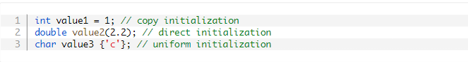
</p>

- ```{}-initializers``` do not allow narrowing conversions (and that is usually a good thing) and allow explicit constructors (which is fine, we're intentionally initializing a new variable). (Direct initialization allow narrowing type)

- [Copy initialization vs direct-initialization (from C++ 17, should be similar because of the change in copy elision)](https://stackoverflow.com/questions/1051379/is-there-a-difference-between-copy-initialization-and-direct-initialization)

## [Basic](https://www.learncpp.com/cpp-tutorial/welcome-to-object-oriented-programming/)

<p align="center">
  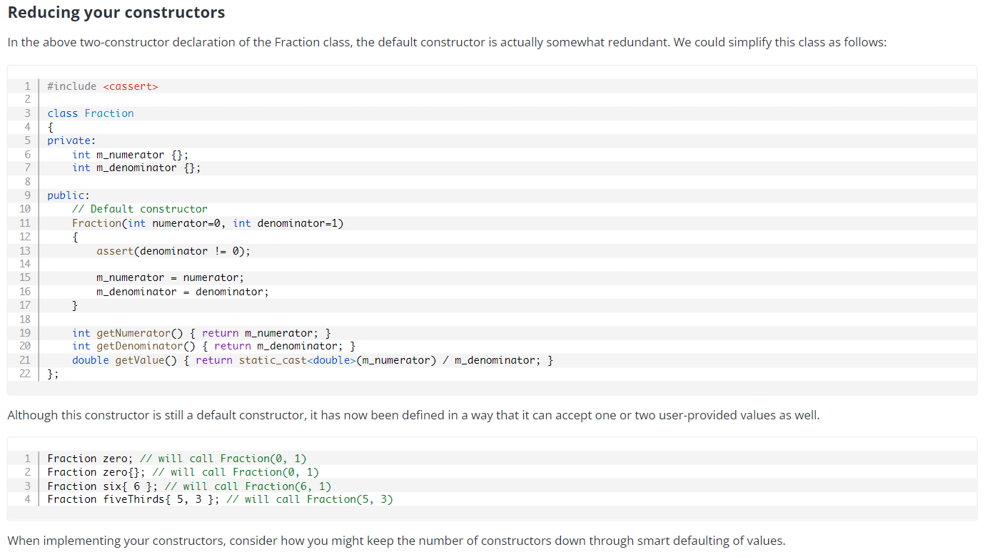
</p>

## Delegating constructors

<p align="center">
  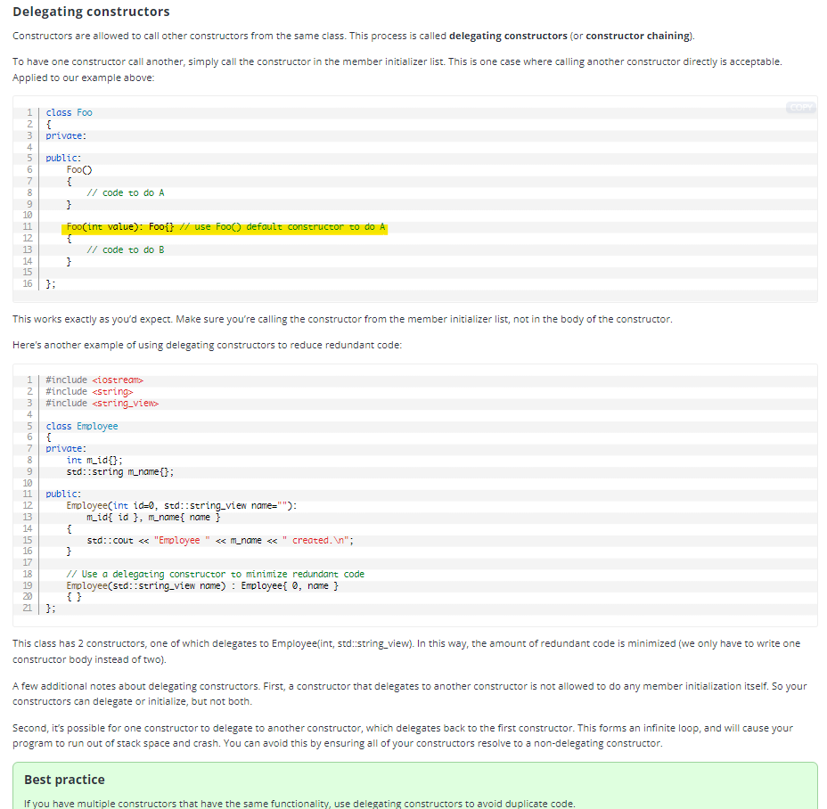
</p>

## RAII (Resource Acquisition Is Initialization)

<p align="center">
  
</p>

<p align="center">
  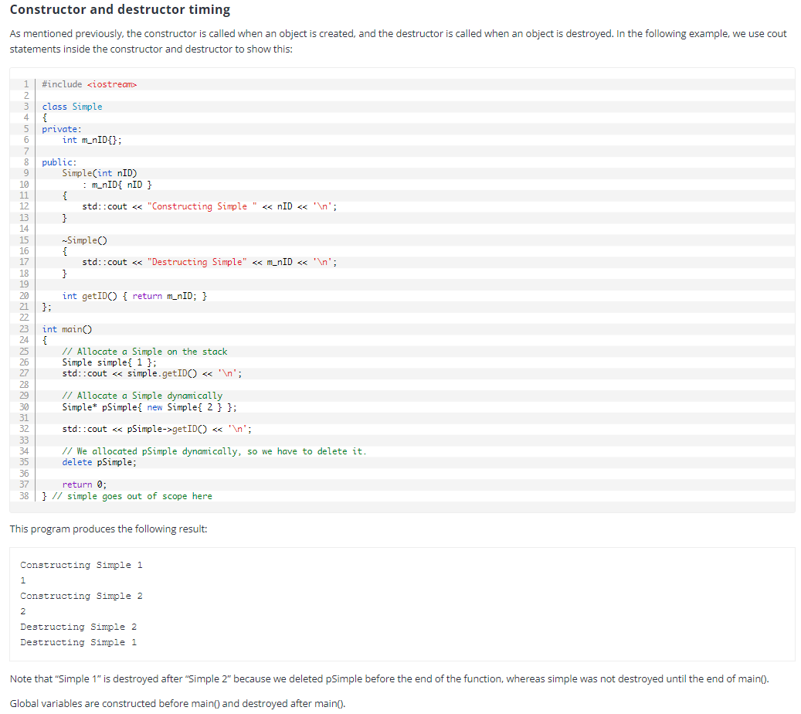
</p>

## The hidden ```*this``` pointer

<p align="center">
  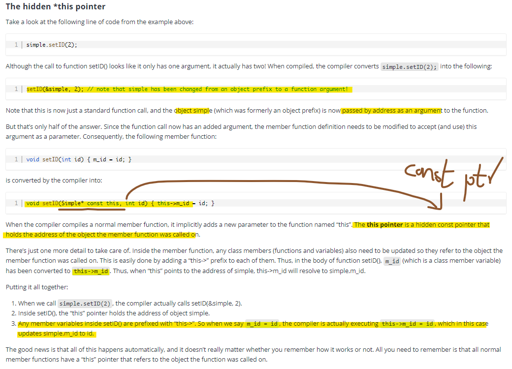
</p>

<p align="center">
  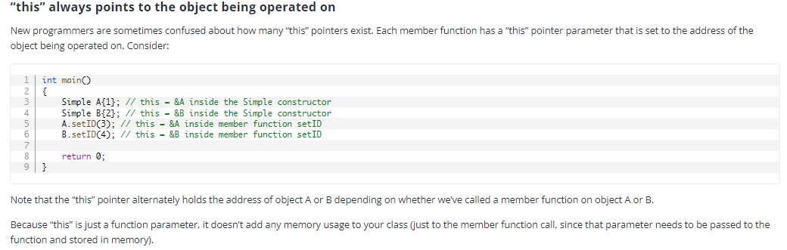
</p>

<p align="center">
  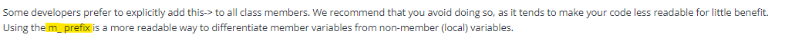
</p>

## Chaining member functions

<p align="center">
  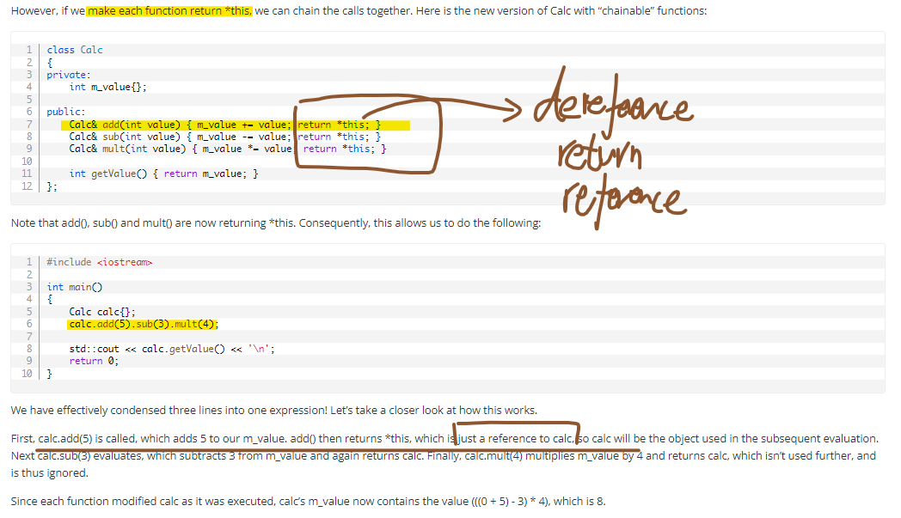
</p>

## Const member functions

<p align="center">
  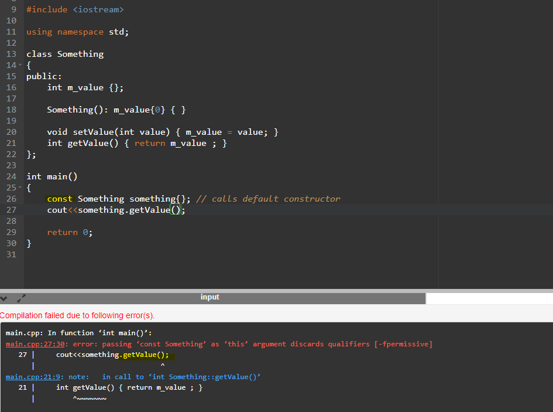
</p>

- It turns out that **const class objects** can only ***explicitly call const member functions***, and getValue() has not been marked as a const member function.

<p align="center">
  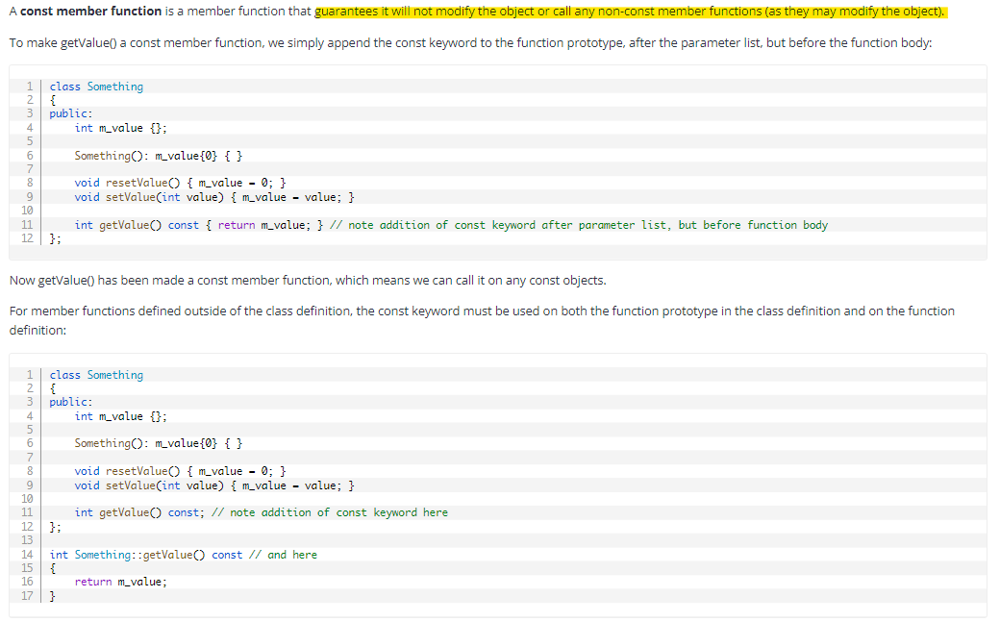
</p>

<p align="center">
  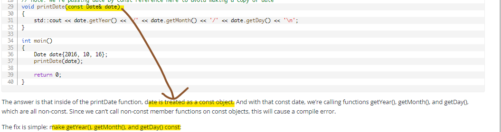
</p>

## Static members / member functions are not associated with class objects

<p align="center">
  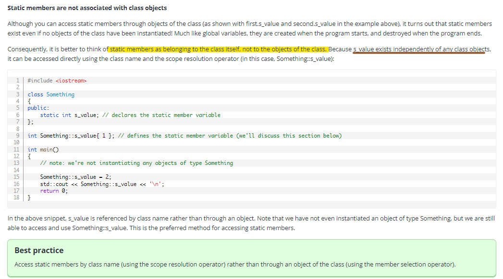
</p>

<p align="center">
  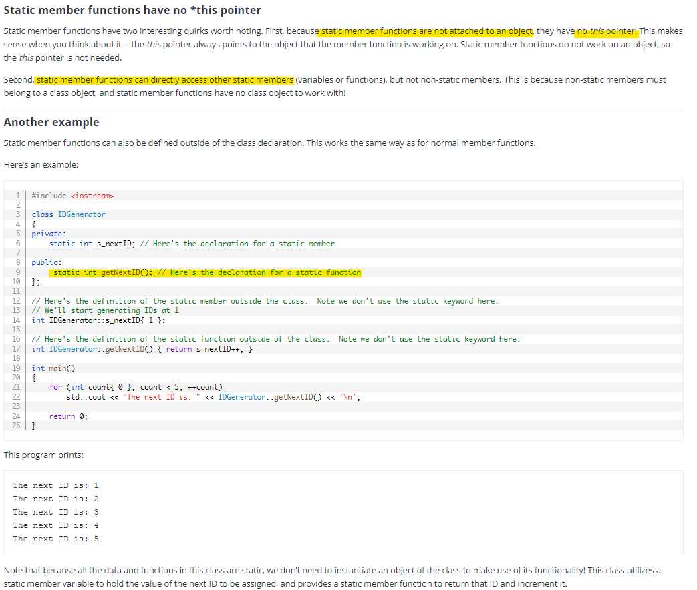
</p>

## Friend functions and classes

<p align="center">
  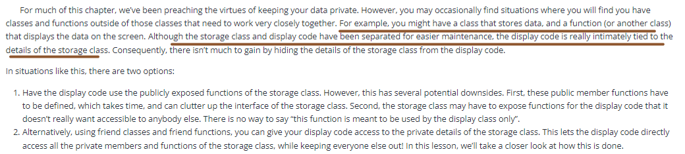
</p>

<p align="center">
  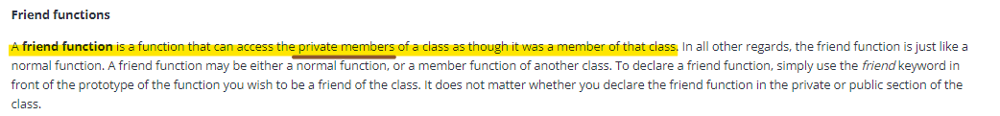
</p>

```c++
class Accumulator
{
private:
    int m_value { 0 };

public:
    void add(int value) { m_value += value; }

    // Make the reset() function a friend of this class
    friend void reset(Accumulator& accumulator);
};

// reset() is now a friend of the Accumulator class
void reset(Accumulator& accumulator)
{
    // And can access the private data of Accumulator objects
    accumulator.m_value = 0;
}

int main()
{
    Accumulator acc;
    acc.add(5); // add 5 to the accumulator
    reset(acc); // reset the accumulator to 0

    return 0;
}
```

- Multiple friends

```c++
#include <iostream>

class Humidity;

class Temperature
{
private:
    int m_temp {};

public:
    Temperature(int temp=0)
        : m_temp { temp }
    {
    }

    // Multiple friend
    friend void printWeather(const Temperature& temperature, const Humidity& humidity);
};

class Humidity
{
private:
    int m_humidity {};

public:
    Humidity(int humidity=0)
        : m_humidity { humidity }
    {
    }

    friend void printWeather(const Temperature& temperature, const Humidity& humidity);
};

void printWeather(const Temperature& temperature, const Humidity& humidity)
{
    std::cout << "The temperature is " << temperature.m_temp <<
       " and the humidity is " << humidity.m_humidity << '\n';
}

int main()
{
    Humidity hum{10};
    Temperature temp{12};

    printWeather(temp, hum);

    return 0;
}
```

<p align="center">
  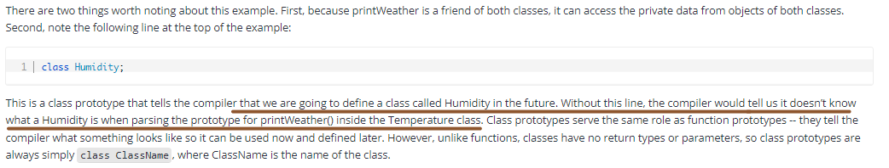
</p>

- Friend member functions

<p align="center">
  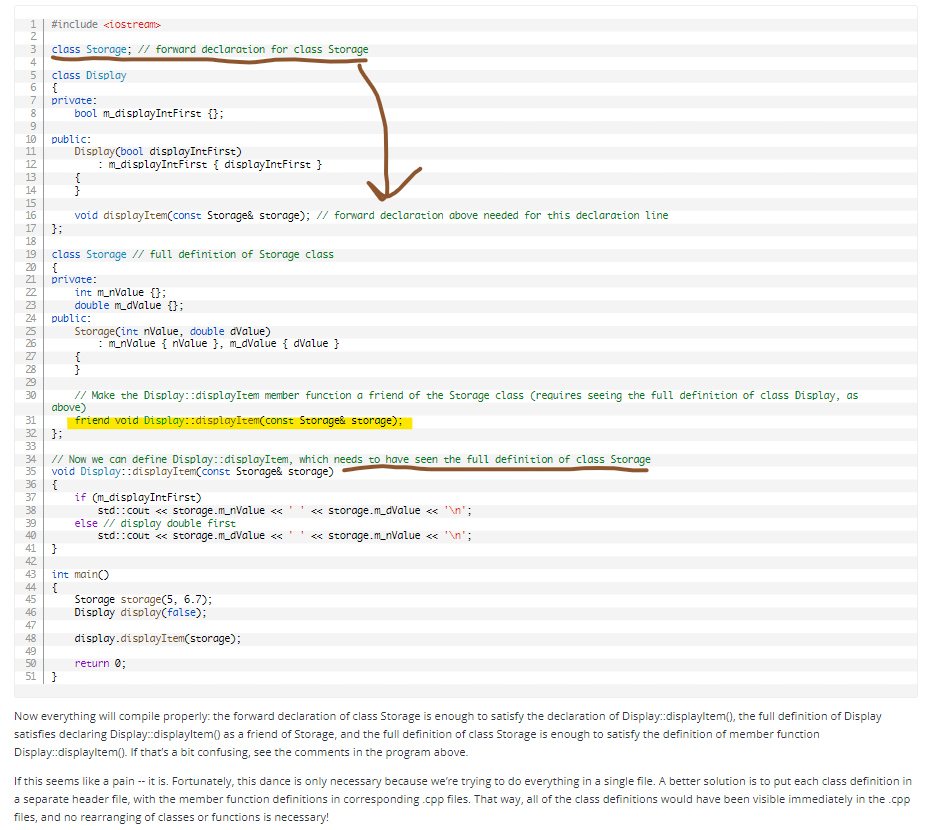
</p>

## Resolving overloaded operators

<p align="center">
  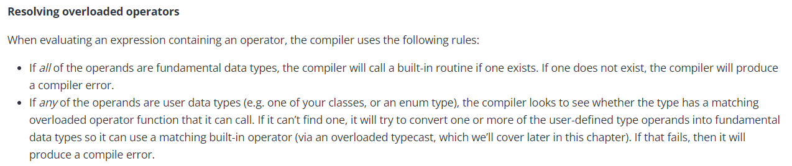
</p>

## Copy elision

- The copy constructor may be elided

```c++
#include <cassert>
#include <iostream>

class Fraction
{
private:
	int m_numerator{};
	int m_denominator{};

public:
    // Default constructor
    Fraction(int numerator=0, int denominator=1)
        : m_numerator{numerator}, m_denominator{denominator}
    {
        assert(denominator != 0);
    }

        // Copy constructor
	Fraction(const Fraction &fraction)
		: m_numerator{fraction.m_numerator}, m_denominator{fraction.m_denominator}
	{
		// no need to check for a denominator of 0 here since fraction must already be a valid Fraction
		std::cout << "Copy constructor called\n"; // just to prove it works
	}

	friend std::ostream& operator<<(std::ostream& out, const Fraction& f1);
};

std::ostream& operator<<(std::ostream& out, const Fraction& f1)
{
	out << f1.m_numerator << '/' << f1.m_denominator;
	return out;
}

int main()
{
	Fraction fiveThirds { Fraction { 5, 3 } };
	std::cout << fiveThirds;
	return 0;
}
```

<p align="center">
  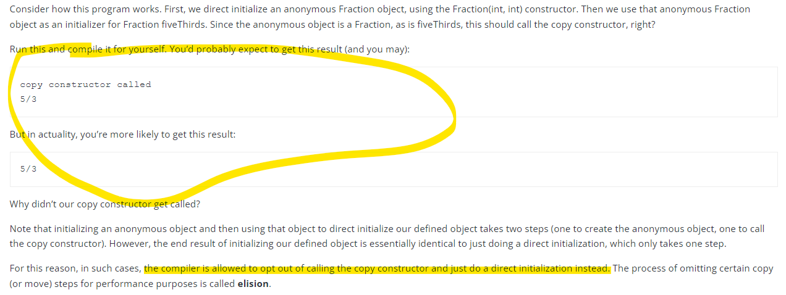
</p>

<p align="center">
  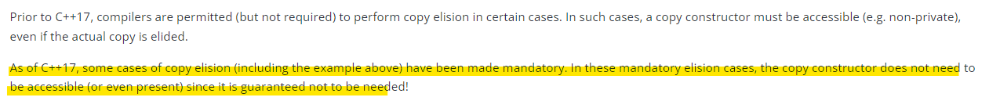
</p>

- https://leimao.github.io/blog/CPP-Copy-Elision/

## The ```explicit``` keyword

<p align="center">
  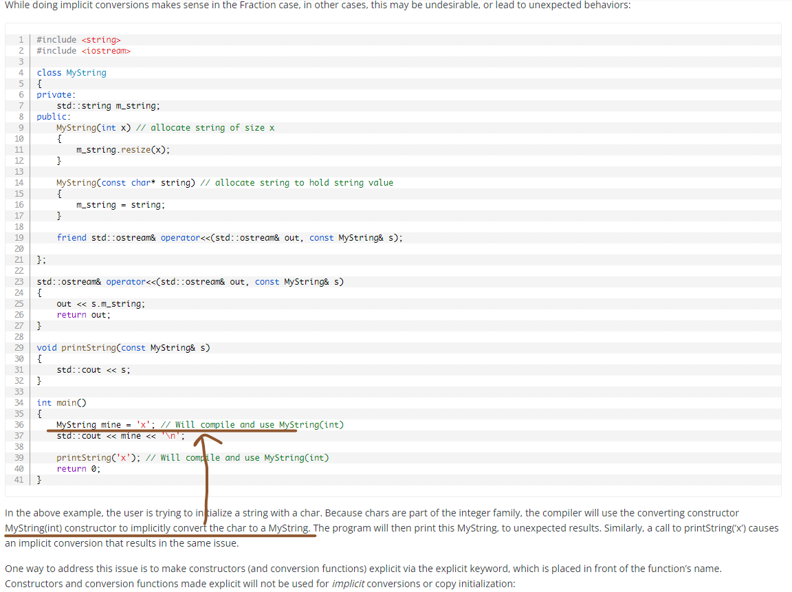
</p>

```c++
#include <string>
#include <iostream>

class MyString
{
private:
	std::string m_string;
public:
	// explicit keyword makes this constructor ineligible for implicit conversions
	explicit MyString(int x) // allocate string of size x
	{
		m_string.resize(x);
	}

	MyString(const char* string) // allocate string to hold string value
	{
		m_string = string;
	}

	friend std::ostream& operator<<(std::ostream& out, const MyString& s);

};

std::ostream& operator<<(std::ostream& out, const MyString& s)
{
	out << s.m_string;
	return out;
}

void printString(const MyString& s)
{
	std::cout << s;
}

int main()
{
	MyString mine = 'x'; // compile error, since MyString(int) is now explicit and nothing will match this
	std::cout << mine;

	printString('x'); // compile error, since MyString(int) can't be used for implicit conversions

	return 0;
}
```

<p align="center">
  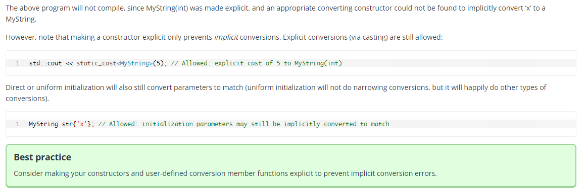
</p>

## Shallow vs. deep copying

- Shallow

<p align="center">
  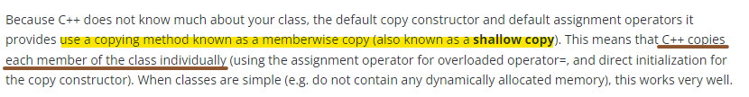
</p>

<p align="center">
  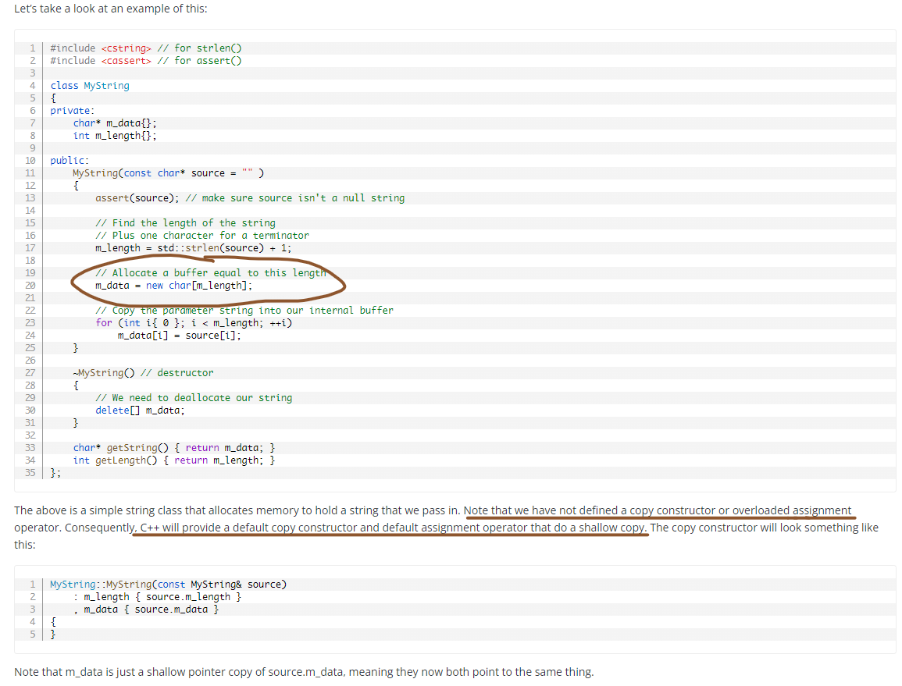
</p>

<p align="center">
  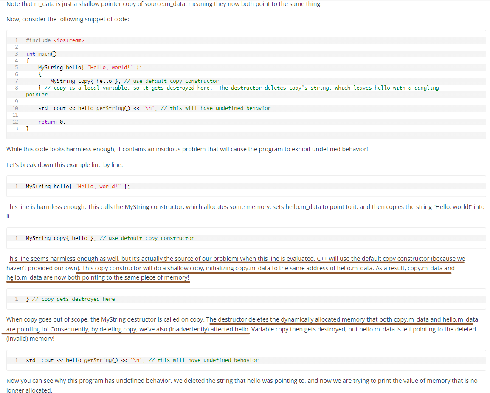
</p>

- Deep

<p align="center">
  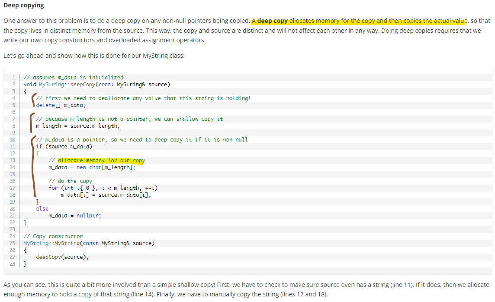
</p>