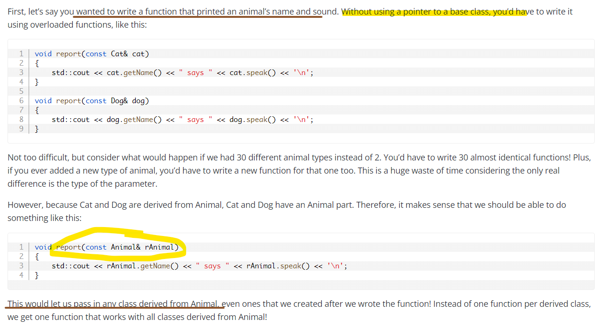

# C++ object-oriented programming

- A ***default constructor*** is a constructor that either has no parameters, or if it has parameters, all the parameters have default value

## [Prefer the {}-initializer syntax](https://github.com/isocpp/CppCoreGuidelines/blob/master/CppCoreGuidelines.md#es23-prefer-the--initializer-syntax)

<p align="center">
  
</p>

- ```{}-initializers``` do not allow narrowing conversions (and that is usually a good thing) and allow explicit constructors (which is fine, we're intentionally initializing a new variable). (Direct initialization allow narrowing type)

- [Copy initialization vs direct-initialization (from C++ 17, should be similar because of the change in copy elision)](https://stackoverflow.com/questions/1051379/is-there-a-difference-between-copy-initialization-and-direct-initialization)

## [Basic](https://www.learncpp.com/cpp-tutorial/welcome-to-object-oriented-programming/)

<p align="center">
  
</p>

## Delegating constructors

<p align="center">
  
</p>

## RAII (Resource Acquisition Is Initialization)

<p align="center">
  
</p>

<p align="center">
  
</p>

## The hidden ```*this``` pointer

<p align="center">
  
</p>

<p align="center">
  
</p>

<p align="center">
  
</p>

## Chaining member functions

<p align="center">
  
</p>

## Const member functions

<p align="center">
  
</p>

- It turns out that **const class objects** can only ***explicitly call const member functions***, and getValue() has not been marked as a const member function.

<p align="center">
  
</p>

<p align="center">
  
</p>

## Static members / member functions are not associated with class objects

<p align="center">
  
</p>

<p align="center">
  
</p>

## Friend functions and classes

<p align="center">
  
</p>

<p align="center">
  
</p>

```c++
class Accumulator
{
private:
    int m_value { 0 };

public:
    void add(int value) { m_value += value; }

    // Make the reset() function a friend of this class
    // This is not a member function
    friend void reset(Accumulator& accumulator);
};

// reset() is now a friend of the Accumulator class
void reset(Accumulator& accumulator)
{
    // And can access the private data of Accumulator objects
    accumulator.m_value = 0;
}

int main()
{
    Accumulator acc;
    acc.add(5); // add 5 to the accumulator
    reset(acc); // reset the accumulator to 0

    return 0;
}
```

- Multiple friends

```c++
#include <iostream>

class Humidity;

class Temperature
{
private:
    int m_temp {};

public:
    Temperature(int temp=0)
        : m_temp { temp }
    {
    }

    // Multiple friend
    friend void printWeather(const Temperature& temperature, const Humidity& humidity);
};

class Humidity
{
private:
    int m_humidity {};

public:
    Humidity(int humidity=0)
        : m_humidity { humidity }
    {
    }

    friend void printWeather(const Temperature& temperature, const Humidity& humidity);
};

void printWeather(const Temperature& temperature, const Humidity& humidity)
{
    std::cout << "The temperature is " << temperature.m_temp <<
       " and the humidity is " << humidity.m_humidity << '\n';
}

int main()
{
    Humidity hum{10};
    Temperature temp{12};

    printWeather(temp, hum);

    return 0;
}
```

<p align="center">
  
</p>

- Friend member functions

<p align="center">
  
</p>

## Resolving overloaded operators

<p align="center">
  
</p>

## Copy elision

- The copy constructor may be elided

```c++
#include <cassert>
#include <iostream>

class Fraction
{
private:
	int m_numerator{};
	int m_denominator{};

public:
    // Default constructor
    Fraction(int numerator=0, int denominator=1)
        : m_numerator{numerator}, m_denominator{denominator}
    {
        assert(denominator != 0);
    }

        // Copy constructor
	Fraction(const Fraction &fraction)
		: m_numerator{fraction.m_numerator}, m_denominator{fraction.m_denominator}
	{
		// no need to check for a denominator of 0 here since fraction must already be a valid Fraction
		std::cout << "Copy constructor called\n"; // just to prove it works
	}

	friend std::ostream& operator<<(std::ostream& out, const Fraction& f1);
};

std::ostream& operator<<(std::ostream& out, const Fraction& f1)
{
	out << f1.m_numerator << '/' << f1.m_denominator;
	return out;
}

int main()
{
	Fraction fiveThirds { Fraction { 5, 3 } };
	std::cout << fiveThirds;
	return 0;
}
```

<p align="center">
  
</p>

<p align="center">
  
</p>

- https://leimao.github.io/blog/CPP-Copy-Elision/

## The ```explicit``` keyword

<p align="center">
  
</p>

```c++
#include <string>
#include <iostream>

class MyString
{
private:
	std::string m_string;
public:
	// explicit keyword makes this constructor ineligible for implicit conversions
	explicit MyString(int x) // allocate string of size x
	{
		m_string.resize(x);
	}

	MyString(const char* string) // allocate string to hold string value
	{
		m_string = string;
	}

	friend std::ostream& operator<<(std::ostream& out, const MyString& s);

};

std::ostream& operator<<(std::ostream& out, const MyString& s)
{
	out << s.m_string;
	return out;
}

void printString(const MyString& s)
{
	std::cout << s;
}

int main()
{
	MyString mine = 'x'; // compile error, since MyString(int) is now explicit and nothing will match this
	std::cout << mine;

	printString('x'); // compile error, since MyString(int) can't be used for implicit conversions

	return 0;
}
```

<p align="center">
  
</p>

## Shallow vs. deep copying

- Shallow

<p align="center">
  
</p>

<p align="center">
  
</p>

<p align="center">
  
</p>

- Deep

<p align="center">
  
</p>

## Object relationships

- Composition

<p align="center">
  
</p>

- Aggregation

<p align="center">
  
</p>

```c++
#include <iostream>
#include <string>

class Teacher
{
private:
  std::string m_name{};

public:
  Teacher(const std::string& name)
      : m_name{ name }
  {
  }

  const std::string& getName() const { return m_name; }
};

class Department
{
private:
  const Teacher& m_teacher; // This dept holds only one teacher for simplicity, but it could hold many teachers

public:
  Department(const Teacher& teacher)
      : m_teacher{ teacher }
  {
  }
};

int main()
{
  // Create a teacher outside the scope of the Department
  Teacher bob{ "Bob" }; // create a teacher

  {
    // Create a department and use the constructor parameter to pass
    // the teacher to it.
    Department department{ bob };

  } // department goes out of scope here and is destroyed

  // bob still exists here, but the department doesn't

  std::cout << bob.getName() << " still exists!\n";

  return 0;
}
```

<p align="center">
  
</p>

- Composition vs Aggregation

<p align="center">
  
</p>

- ```std::reference_wrapper```

<p align="center">
  
</p>

```c++
class Department
{
private:
  std::vector<std::reference_wrapper<const Teacher>> m_teacher;

public:
  Department(const Teacher& teacher)
  {
      m_teacher.push_back(teacher);
  }
};
```

- Association

<p align="center">
  
</p>

```c++
#include <functional> // reference_wrapper
#include <iostream>
#include <string>
#include <vector>

// Since Doctor and Patient have a circular dependency, we're going to forward declare Patient
class Patient;

class Doctor
{
private:
	std::string m_name{};
	std::vector<std::reference_wrapper<const Patient>> m_patient{};

public:
	Doctor(const std::string& name) :
		m_name{ name }
	{
	}

	void addPatient(Patient& patient);

	// We'll implement this function below Patient since we need Patient to be defined at that point
	friend std::ostream& operator<<(std::ostream& out, const Doctor& doctor);

	const std::string& getName() const { return m_name; }
};

class Patient
{
private:
	std::string m_name{};
	std::vector<std::reference_wrapper<const Doctor>> m_doctor{}; // so that we can use it here

	// We're going to make addDoctor private because we don't want the public to use it.
	// They should use Doctor::addPatient() instead, which is publicly exposed
	void addDoctor(const Doctor& doctor)
	{
		m_doctor.push_back(doctor);
	}

public:
	Patient(const std::string& name)
		: m_name{ name }
	{
	}

	// We'll implement this function below to parallel operator<<(std::ostream&, const Doctor&)
	friend std::ostream& operator<<(std::ostream& out, const Patient& patient);

	const std::string& getName() const { return m_name; }

	// We'll friend Doctor::addPatient() so it can access the private function Patient::addDoctor()
	friend void Doctor::addPatient(Patient& patient);
};

void Doctor::addPatient(Patient& patient)
{
	// Our doctor will add this patient
	m_patient.push_back(patient);

	// and the patient will also add this doctor
	patient.addDoctor(*this);
}

std::ostream& operator<<(std::ostream& out, const Doctor& doctor)
{
	if (doctor.m_patient.empty())
	{
		out << doctor.m_name << " has no patients right now";
		return out;
	}

	out << doctor.m_name << " is seeing patients: ";
	for (const auto& patient : doctor.m_patient)
		out << patient.get().getName() << ' ';

	return out;
}

std::ostream& operator<<(std::ostream& out, const Patient& patient)
{
	if (patient.m_doctor.empty())
	{
		out << patient.getName() << " has no doctors right now";
		return out;
	}

	out << patient.m_name << " is seeing doctors: ";
	for (const auto& doctor : patient.m_doctor)
		out << doctor.get().getName() << ' ';

	return out;
}

int main()
{
	// Create a Patient outside the scope of the Doctor
	Patient dave{ "Dave" };
	Patient frank{ "Frank" };
	Patient betsy{ "Betsy" };

	Doctor james{ "James" };
	Doctor scott{ "Scott" };

	james.addPatient(dave);

	scott.addPatient(dave);
	scott.addPatient(betsy);

	std::cout << james << '\n';
	std::cout << scott << '\n';
	std::cout << dave << '\n';
	std::cout << frank << '\n';
	std::cout << betsy << '\n';

	return 0;
}
```

- Dependencies 

<p align="center">
  
</p>

- ```std::initializer_list```

```c++
IntArray array{ 5, 4, 3, 2, 1 }; // initializer list
```

<p align="center">
  
</p>

```c++
#include <cassert> // for assert()
#include <initializer_list> // for std::initializer_list
#include <iostream>

class IntArray
{
private:
	int m_length {};
	int* m_data {};

public:
	IntArray() = default;

	IntArray(int length)
		: m_length{ length }
		, m_data{ new int[length]{} }
	{

	}

	IntArray(std::initializer_list<int> list) // allow IntArray to be initialized via list initialization
		: IntArray(static_cast<int>(list.size())) // use delegating constructor to set up initial array
	{
		// Now initialize our array from the list
		int count{ 0 };
		for (auto element : list)
		{
			m_data[count] = element;
			++count;
		}
	}

	~IntArray()
	{
		delete[] m_data;
		// we don't need to set m_data to null or m_length to 0 here, since the object will be destroyed immediately after this function anyway
	}

	IntArray(const IntArray&) = delete; // to avoid shallow copies
	IntArray& operator=(const IntArray& list) = delete; // to avoid shallow copies

	int& operator[](int index)
	{
		assert(index >= 0 && index < m_length);
		return m_data[index];
	}

	int getLength() const { return m_length; }
};

int main()
{
	IntArray array{ 5, 4, 3, 2, 1 }; // initializer list
	for (int count{ 0 }; count < array.getLength(); ++count)
		std::cout << array[count] << ' ';

	return 0;
}
```

# Inheritance

<p align="center">
  
</p>

```c++
#include <iostream>

class Base
{
private: // our member is now private
    int m_id {};

public:
    Base(int id=0)
        : m_id{ id }
    {
    }

    int getId() const { return m_id; }
};

class Derived: public Base
{
private: // our member is now private
    double m_cost;

public:
    Derived(double cost=0.0, int id=0)
        : Base{ id } // Call Base(int) constructor with value id!
        , m_cost{ cost }
    {
    }

    double getCost() const { return m_cost; }
};

int main()
{
    Derived derived{ 1.3, 5 }; // use Derived(double, int) constructor
    std::cout << "Id: " << derived.getId() << '\n';
    std::cout << "Cost: " << derived.getCost() << '\n';

    return 0;
}
```

<p align="center">
  
</p>

- Order of construction and destruction 

<p align="center">
  
</p>

<p align="center">
  
</p>

- Access specifier

```c++
class Base
{
public:
    int m_public {}; // can be accessed by anybody
protected:
    int m_protected {}; // can be accessed by Base members, friends, and derived classes
private:
    int m_private {}; // can only be accessed by Base members and friends (but not derived classes)
};

class Derived: public Base
{
public:
    Derived()
    {
        m_public = 1; // allowed: can access public base members from derived class
        m_protected = 2; // allowed: can access protected base members from derived class
        m_private = 3; // not allowed: can not access private base members from derived class
    }
};

int main()
{
    Base base;
    base.m_public = 1; // allowed: can access public members from outside class
    base.m_protected = 2; // not allowed: can not access protected members from outside class
    base.m_private = 3; // not allowed: can not access private members from outside class

    return 0;
}
```

- Different kinds of inheritance, and their impact on access

```c++
// Inherit from Base publicly
class Pub: public Base
{
	// Public inheritance means:
    // Public inherited members stay public (so m_public is treated as public)
    // Protected inherited members stay protected (so m_protected is treated as protected)
    // Private inherited members stay inaccessible (so m_private is inaccessible)
};

// Inherit from Base protectedly
class Pro: protected Base
{
	// Protected inheritance means:
    // Public inherited members stay protected (so m_public is treated as protected)
    // Protected inherited members stay protected (so m_protected is treated as protected)
    // Private inherited members stay inaccessible (so m_private is inaccessible)
};

class Pri: private Base // note: private inheritance
{
    // Private inheritance means:
    // Public inherited members become private (so m_public is treated as private)
    // Protected inherited members become private (so m_protected is treated as private)
    // Private inherited members stay inaccessible (so m_private is inaccessible)
public:
    Pri()
    {
        m_public = 1; // okay: m_public is now private in Pri, not accessible outside
        m_protected = 2; // okay: m_protected is now private in Pri
        m_private = 3; // not okay: derived classes can't access private members in the base class
    }
};

class Def: Base // Defaults to private inheritance
{
};
```

<p align="center">
  
</p>

<p align="center">
  
</p>

## Multiple inheritance

<p align="center">
  
</p>

```c++
#include <string>
#include <string_view>

class Person
{
private:
    std::string m_name;
    int m_age{};

public:
    Person(std::string_view name, int age)
        : m_name{ name }, m_age{ age }
    {
    }

    const std::string& getName() const { return m_name; }
    int getAge() const { return m_age; }
};

class Employee
{
private:
    std::string m_employer;
    double m_wage{};

public:
    Employee(std::string_view employer, double wage)
        : m_employer{ employer }, m_wage{ wage }
    {
    }

    const std::string& getEmployer() const { return m_employer; }
    double getWage() const { return m_wage; }
};

// Teacher publicly inherits Person and Employee
class Teacher : public Person, public Employee
{
private:
    int m_teachesGrade{};

public:
    Teacher(std::string_view name, int age, std::string_view employer, double wage, int teachesGrade)
        : Person{ name, age }, Employee{ employer, wage }, m_teachesGrade{ teachesGrade }
    {
    }
};

int main()
{
    Teacher t{ "Mary", 45, "Boo", 14.3, 8 };

    return 0;
}
```

<p align="center">
  
</p>

```c++
// h/t to reader Waldo for this example
#include <string>

struct Point2D
{
	int x;
	int y;
};

class Box // mixin Box class
{
public:
	void setTopLeft(Point2D point) { m_topLeft = point; }
	void setBottomRight(Point2D point) { m_bottomRight = point; }
private:
	Point2D m_topLeft{};
	Point2D m_bottomRight{};
};

class Label // mixin Label class
{
public:
	void setText(const std::string_view str) { m_text = str; }
	void setFontSize(int fontSize) { m_fontSize = fontSize; }
private:
	std::string m_text{};
	int m_fontSize{};
};

class Button : public Box, public Label {};

int main()
{
	Button button{};
	button.Box::setTopLeft({ 1, 1 });
	button.Box::setBottomRight({ 10, 10 });
	button.Label::setText("Username: ");
	button.Label::setFontSize(6);
}
```

- [Curiously Recurring Template Pattern (CRTP)](https://en.cppreference.com/w/cpp/language/crtp)

> CRTP may be used to implement "compile-time polymorphism", when a base class exposes an interface, and derived classes implement such interface

<p align="center">
  
</p>

## Problems with multiple inheritance

- First, ambiguity can result when multiple base classes contain a function with the same name.

```c++
#include <iostream>

class USBDevice
{
private:
    long m_id {};

public:
    USBDevice(long id)
        : m_id { id }
    {
    }

    long getID() const { return m_id; }
};

class NetworkDevice
{
private:
    long m_id {};

public:
    NetworkDevice(long id)
        : m_id { id }
    {
    }

    long getID() const { return m_id; }
};

class WirelessAdapter: public USBDevice, public NetworkDevice
{
public:
    WirelessAdapter(long usbId, long networkId)
        : USBDevice { usbId }, NetworkDevice { networkId }
    {
    }
};

int main()
{
    WirelessAdapter c54G { 5442, 181742 };
    std::cout << c54G.getID(); // Which getID() do we call?

    return 0;
}
```

<p align="center">
  
</p>

- Second, and more serious is the diamond problem, which your author likes to call the “diamond of doom”. This occurs when a class multiply inherits from two classes which each inherit from a single base class. This leads to a diamond shaped inheritance pattern.

<p align="center">
  
</p>

- [Virtual base class](https://www.learncpp.com/cpp-tutorial/virtual-base-classes/)

<p align="center">
  
</p>

<p align="center">
  
</p>

# Virtual Functions

## Pointers and references to the base class of derived objects

<p align="center">
  
</p>

- Use for pointers and references to base classes (reason)

<p align="center">
  
</p>

<p align="center">
  
</p>

## Polymorphism and Virtual functions

<p align="center">
  
</p>

<p align="center">
  
</p>

<p align="center">
  
</p>

- The override specifier

<p align="center">
  
</p>

<p align="center">
  
</p>

- The final specifier

<p align="center">
  
</p>

- Covariant return types

<p align="center">
  
</p>

<p align="center">
  
</p>

## Virtual destructors, and overriding virtualization

- Virtual destructors

<p align="center">
  
</p>

<p align="center">
  
</p>

```c++
#include <iostream>
class Base
{
public:
    virtual ~Base() // note: virtual
    {
        std::cout << "Calling ~Base()\n";
    }
};

class Derived: public Base
{
private:
    int* m_array;

public:
    Derived(int length)
      : m_array{ new int[length] }
    {
    }

    virtual ~Derived() // note: virtual
    {
        std::cout << "Calling ~Derived()\n";
        delete[] m_array;
    }
};

int main()
{
    // delete base will print
    // Calling ~Derived()
    // Calling ~Base()
    Derived* derived { new Derived(5) };
    Base* base { derived };

    delete base;

    // delete derived will print
    // Calling ~Derived()
    // Calling ~Base()
    // Although virtual ~Base(), the ~Base() will still be called
    // since we have a base portion and a derived portion
    Derived* derived { new Derived(5) };

    delete derived;

    return 0;
}
```

- Ignoring virtualization

<p align="center">
  
</p>

```c++
    // Possible to do
    std::cout << derived.Derived::getName() << '\n';
    std::cout << derived.Base::getName() << '\n';
```

- Should we make all destructors virtual?

> "A base class destructor should be either public and virtual, or protected and nonvirtual.”

<p align="center">
  
</p>

## How virtual functions are implemented

<p align="center">
  
</p>

- Early binding (static binding)

<p align="center">
  
</p>

- Late binding (dynamic binding)

<p align="center">
  
</p>

```c++
#include <iostream>

int add(int x, int y)
{
    return x + y;
}

int subtract(int x, int y)
{
    return x - y;
}

int multiply(int x, int y)
{
    return x * y;
}

int main()
{
    int x{};
    std::cout << "Enter a number: ";
    std::cin >> x;

    int y{};
    std::cout << "Enter another number: ";
    std::cin >> y;

    int op{};
    do
    {
        std::cout << "Enter an operation (0=add, 1=subtract, 2=multiply): ";
        std::cin >> op;
    } while (op < 0 || op > 2);

    // Create a function pointer named pFcn (yes, the syntax is ugly)
    int (*pFcn)(int, int) { nullptr };

    // Set pFcn to point to the function the user chose
    switch (op)
    {
        case 0: pFcn = add; break;
        case 1: pFcn = subtract; break;
        case 2: pFcn = multiply; break;
    }

    // Call the function that pFcn is pointing to with x and y as parameters
    // This uses late binding
    std::cout << "The answer is: " << pFcn(x, y) << '\n';

    return 0;
}
```

<p align="center">
  
</p>

- The virtual table

<p align="center">
  
</p>

<p align="center">
  
</p>

<p align="center">
  
</p>

<p align="center">
  
</p>

<p align="center">
  
</p>

<p align="center">
  
</p>

## Pure virtual functions, abstract base classes, and interface classes

- Pure virtual functions, abstract base classes

<p align="center">
  
</p>

<p align="center">
  
</p>

<p align="center">
  
</p>

- Interface classes

<p align="center">
  
</p>

```c++
class IErrorLog
{
public:
    virtual bool openLog(const char* filename) = 0;
    virtual bool closeLog() = 0;

    virtual bool writeError(const char* errorMessage) = 0;

    virtual ~IErrorLog() {} // make a virtual destructor in case we delete an IErrorLog pointer, so the proper derived destructor is called
};
```

<p align="center">
  
</p>

## Object slicing

<p align="center">
  
</p>

<p align="center">
  
</p>

## ```dynamic_cast``` -> down casting

<p align="center">
  
</p>

<p align="center">
  
</p>

<p align="center">
  
</p>

<p align="center">
  
</p>

- ```dynamic_cast``` has runtime type checking, ```static_cast``` does not.

<p align="center">
  
</p>

<p align="center">
  
</p>