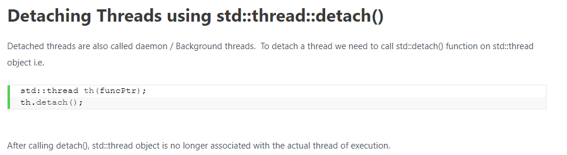
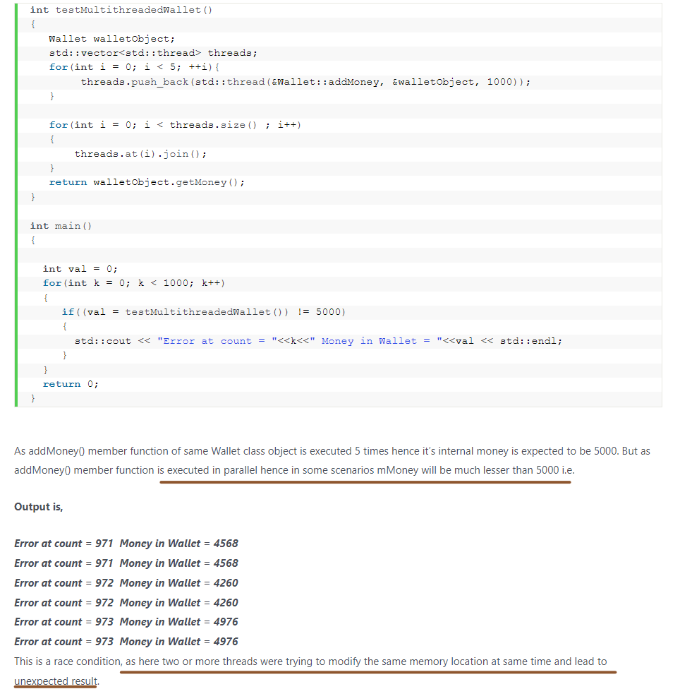
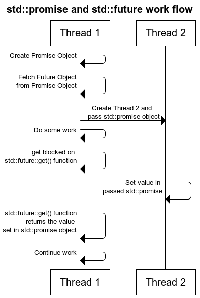

# C++ Concurrency

## Three Different ways to Create Threads

> std::thread

<p align="center">
  
</p>

- **Creating a thread using ```Function Pointer```**

```c++
#include <iostream>
#include <thread>
 
void thread_function()
{
    for(int i = 0; i < 10000; i++);
        std::cout<<"thread function Executing"<<std::endl;
}
 
int main()  
{
    
    std::thread threadObj(thread_function);
    for(int i = 0; i < 10000; i++);
        std::cout<<"Display From MainThread"<<std::endl;
    threadObj.join();    
    std::cout<<"Exit of Main function"<<std::endl;
    return 0;
}
```

- **Creating a thread using ```Function Objects```**

```c++
#include <iostream>
#include <thread>
class DisplayThread
{
public:
    void operator()()     
    {
        for(int i = 0; i < 10000; i++)
            std::cout<<"Display Thread Executing"<<std::endl;
    }
};
 
int main()  
{
    std::thread threadObj( (DisplayThread()) );
    for(int i = 0; i < 10000; i++)
        std::cout<<"Display From Main Thread "<<std::endl;
    std::cout<<"Waiting For Thread to complete"<<std::endl;
    threadObj.join();
    std::cout<<"Exiting from Main Thread"<<std::endl;
    return 0;
}
```

- **Creating a thread using ```Lambda functions```**

```c++
#include <iostream>
#include <thread>
int main()  
{
    int x = 9;
    std::thread threadObj([]{
            for(int i = 0; i < 10000; i++)
                std::cout<<"Display Thread Executing"<<std::endl;
            });
            
    for(int i = 0; i < 10000; i++)
        std::cout<<"Display From Main Thread"<<std::endl;
        
    threadObj.join();
    std::cout<<"Exiting from Main Thread"<<std::endl;
    return 0;
}
```

## Differentiating between threads

<p align="center">
  
</p>

## Joining Threads with ```std::thread::join()```

- Suppose Main Thread has to start 10 Worker Threads and after starting all these threads, main function will wait for them to finish. After joining all the threads main function will continue.

```c++
#include <iostream>
#include <thread>
#include <algorithm>
class WorkerThread
{
public:
    void operator()()     
    {
        std::cout<<"Worker Thread "<<std::this_thread::get_id()<<" is Executing"<<std::endl;
    }
};
int main()  
{
    std::vector<std::thread> threadList;
    for(int i = 0; i < 10; i++)
    {
        threadList.push_back( std::thread( WorkerThread() ) );
    }
    // Now wait for all the worker thread to finish i.e.
    // Call join() function on each of the std::thread object
    std::cout<<"wait for all the worker thread to finish"<<std::endl;
    std::for_each(threadList.begin(),threadList.end(), std::mem_fn(&std::thread::join));
    std::cout<<"Exiting from Main Thread"<<std::endl;
    return 0;
}
```

## Detaching Threads using ```std::thread::detach()```

<p align="center">
  
</p>

<p align="center">
  
</p>

```c++
#include <iostream>
#include <chrono>
#include <thread>
 
void independentThread() 
{
    std::cout << "Starting concurrent thread.\n";
    std::this_thread::sleep_for(std::chrono::seconds(2));
    std::cout << "Exiting concurrent thread.\n";
}
 
void threadCaller() 
{
    std::cout << "Starting thread caller.\n";
    std::thread t(independentThread);
    t.detach();
    std::this_thread::sleep_for(std::chrono::seconds(1));
    std::cout << "Exiting thread caller.\n";
}
 
int main() 
{
    threadCaller();
    std::this_thread::sleep_for(std::chrono::seconds(5));
}
```

- Possible output

```
Starting thread caller.
Starting concurrent thread.
Exiting thread caller.
Exiting concurrent thread.
```

> Case 1: Never call join() or detach() on std::thread object with no associated executing thread

<p align="center">
  
</p>

> Case 2 : Never forget to call either join or detach on a std::thread object with associated executing thread

<p align="center">
  
</p>

<p align="center">
  
</p>

##  Carefully Pass Arguments to Threads

```c++
#include <iostream>
#include <string>
#include <thread>
void threadCallback(int x, std::string str)
{
    std::cout<<"Passed Number = "<<x<<std::endl;
    std::cout<<"Passed String = "<<str<<std::endl;
}
int main()  
{
    int x = 10;
    std::string str = "Sample String";
    std::thread threadObj(threadCallback, x, str);
    threadObj.join();
    return 0;
}
```

<p align="center">
  
</p>

- How to pass ```references``` to std::thread

```c++
#include <iostream>
#include <thread>
void threadCallback(int const & x)
{
    int & y = const_cast<int &>(x);
    y++;
    std::cout<<"Inside Thread x = "<<x<<std::endl;
}
int main()
{
    int x = 9;
    std::cout<<"In Main Thread : Before Thread Start x = "<<x<<std::endl;
    std::thread threadObj(threadCallback, x);
    threadObj.join();
    std::cout<<"In Main Thread : After Thread Joins x = "<<x<<std::endl;
    return 0;
}
```

<p align="center">
  
</p>

```c++
#include <iostream>
#include <thread>
void threadCallback(int const & x)
{
    int & y = const_cast<int &>(x);
    y++;
    std::cout<<"Inside Thread x = "<<x<<std::endl;
}
int main()
{
    int x = 9;
    std::cout<<"In Main Thread : Before Thread Start x = "<<x<<std::endl;
    std::thread threadObj(threadCallback,std::ref(x));
    threadObj.join();
    std::cout<<"In Main Thread : After Thread Joins x = "<<x<<std::endl;
    return 0;
}
```

<p align="center">
  
</p>

## Assigning pointer to member function of a class as thread function

- Pass the pointer to member function as callback function and pass pointer to Object as second argument.

```c++
#include <iostream>
#include <thread>
class DummyClass {
public:
    DummyClass()
    {}
    DummyClass(const DummyClass & obj)
    {}
    void sampleMemberFunction(int x)
    {
        std::cout<<"Inside sampleMemberFunction "<<x<<std::endl;
    }
};
int main() {
 
    DummyClass dummyObj;
    int x = 10;
    // Hidden this pointer
    std::thread threadObj(&DummyClass::sampleMemberFunction,&dummyObj, x);
    threadObj.join();
    return 0;
}
```

## Race Condition

Race condition is a kind of a bug that occurs in multithreaded applications.

When two or more threads perform a set of operations in parallel, that ```access the same memory location```.  Also, one or more thread out of them modifies the data in that memory location, then this can lead to an unexpected results some times.

This is called race condition.

Race conditions are usually hard to find and reproduce because they don’t occur every time. They will occur only when relative order of execution of operations by two or more threads leads to an unexpected result. Let’s understand by an example.

<p align="center">
  
</p>

<p align="center">
  
</p>

- What happened?

<p align="center">
  
</p>

## Using ```mutex``` to fix Race Conditions

- ```std::mutex```

<p align="center">
  
</p>

<p align="center">
  
</p>

- ```std::lock_guard ```

> ```std::lock_guard``` is a class template, which implements the ```RAII``` for ```mutex```.

It wraps the mutex inside it’s object and locks the attached mutex in its constructor. When it’s destructor is called it releases the mutex.

```c++
class Wallet
{
    int mMoney;
    std::mutex mutex;
public:
    Wallet() :mMoney(0){}
    int getMoney()   {     return mMoney; }
    void addMoney(int money)
    {
        std::lock_guard<std::mutex> lockGuard(mutex);
        // In constructor it locks the mutex
        for(int i = 0; i < money; ++i)
        {
            // If some exception occurs at this
            // point then destructor of lockGuard
            // will be called due to stack unwinding.
            //
            mMoney++;
        }
        // Once function exits, then destructor
        // of lockGuard Object will be called.
        // In destructor it unlocks the mutex.
    }
 };
```

## Need of Event Handling

> Sometimes a thread needs to wait for an event to happen like a condition to become true or a task to be completed by another thread.

<p align="center">
  
</p>

<p align="center">
  
</p>

<p align="center">
  
</p>

- When Thread 1 is busy in some handshaking mechanism then Thread 2 will load the data parallel from XML. So, it will increase the performance of application.

> Option 1:

Make a Boolean global variable with default value false. Set its value to true in Thread 2 and Thread 1 will keep on checking its value in loop and as soon as it becomes true Thread 1 will continue with processing of data. But as it’s a global variable shared by both of the Threads it needs synchronization with mutex.

```c++
#include<iostream>
#include<thread>
#include<mutex>
class Application
{
 std::mutex m_mutex;
 bool m_bDataLoaded;
public:
 Application()
 {
 m_bDataLoaded = false;
 }
 void loadData()
 {
 // Make This Thread sleep for 1 Second
 std::this_thread::sleep_for(std::chrono::milliseconds(1000));
 std::cout<<"Loading Data from XML"<<std::endl;
 // Lock The Data structure
 std::lock_guard<std::mutex> guard(m_mutex);
 // Set the flag to true, means data is loaded
 m_bDataLoaded = true;
 }
 void mainTask()
 {
 std::cout<<"Do Some Handshaking"<<std::endl;
 // Acquire the Lock
 m_mutex.lock();
 // Check if flag is set to true or not
 while(m_bDataLoaded != true)
 {
  // Release the lock
  m_mutex.unlock();
  //sleep for 100 milli seconds
  std::this_thread::sleep_for(std::chrono::milliseconds(100));
  // Acquire the lock
  m_mutex.lock();
  }
  // Release the lock
  m_mutex.unlock();
  //Doc processing on loaded Data
  std::cout<<"Do Processing On loaded Data"<<std::endl;
 }
};
int main()
{
  Application app;
  std::thread thread_1(&Application::mainTask, &app);
  std::thread thread_2(&Application::loadData, &app);
  thread_2.join();
  thread_1.join();
  return 0;
}
```

<p align="center">
  
</p>

- **Disadvantages**

<p align="center">
  
</p>

## Condition Variables

<p align="center">
  
</p>

<p align="center">
  
</p>

```c++
#include <iostream>
#include <thread>
#include <functional>
#include <mutex>
#include <condition_variable>
using namespace std::placeholders;
class Application
{
  std::mutex m_mutex;
  std::condition_variable m_condVar;
  bool m_bDataLoaded;
public:
  Application()
  {
    m_bDataLoaded = false;
  }
  void loadData()
  {
   // Make This Thread sleep for 1 Second
   std::this_thread::sleep_for(std::chrono::milliseconds(1000));
   std::cout<<"Loading Data from XML"<<std::endl;
   // Lock The Data structure
   std::lock_guard<std::mutex> guard(m_mutex);
   // Set the flag to true, means data is loaded
   m_bDataLoaded = true;
   // Notify the condition variable
   m_condVar.notify_one();
  }
  bool isDataLoaded()
  {
    return m_bDataLoaded;
  }
  void mainTask()
  {
    std::cout<<"Do Some Handshaking"<<std::endl;
    // Acquire the lock
    std::unique_lock<std::mutex> mlock(m_mutex);
    // Start waiting for the Condition Variable to get signaled
    // Wait() will internally release the lock and make the thread to block
    // As soon as condition variable get signaled, resume the thread and
    // again acquire the lock. Then check if condition is met or not
    // If condition is met then continue else again go in wait.
    m_condVar.wait(mlock, std::bind(&Application::isDataLoaded, this));
    std::cout<<"Do Processing On loaded Data"<<std::endl;
  }
};
int main()
{
   Application app;
   std::thread thread_1(&Application::mainTask, &app);
   std::thread thread_2(&Application::loadData, &app);
   thread_2.join();
   thread_1.join();
   return 0;
}
```

- ```std::unique_lock<std::mutex>``` or ```std::lock_guard<std::mutex>```?

<p align="center">
  
</p>

## ```std::future``` , ```std::promise``` and Returning values from Thread

<p align="center">
  
</p>

<p align="center">
  
</p>

- Using ```std::future``` and ```std::promise```

> Promise set the value, future get the value

<p align="center">
  
</p>

<p align="center">
  
</p>

<p align="center">
  
</p>

```c++
#include <iostream>
#include <thread>
#include <future>
void initiazer(std::promise<int> * promObj)
{
    std::cout<<"Inside Thread"<<std::endl;
    
    // Promise set the value
    promObj->set_value(35);
}
int main()
{
    std::promise<int> promiseObj;
    std::future<int> futureObj = promiseObj.get_future();

    // Pass the promise to the thread
    std::thread th(initiazer, &promiseObj);

    // Future get the value
    std::cout<<futureObj.get()<<std::endl;
    
    th.join();
    return 0;
}
```

<p align="center">
  
</p>

## ```std::async```

<p align="center">
  
</p>

<p align="center">
  
</p>

<p align="center">
  
</p>

<p align="center">
  
</p>

```c++
#include <iostream>
#include <string>
#include <chrono>
#include <thread>
using namespace std::chrono;
std::string fetchDataFromDB(std::string recvdData)
{
    // Make sure that function takes 5 seconds to complete
    std::this_thread::sleep_for(seconds(5));
    //Do stuff like creating DB Connection and fetching Data
    return "DB_" + recvdData;
}
std::string fetchDataFromFile(std::string recvdData)
{
    // Make sure that function takes 5 seconds to complete
    std::this_thread::sleep_for(seconds(5));
    //Do stuff like fetching Data File
    return "File_" + recvdData;
}
int main()
{
    // Get Start Time
    system_clock::time_point start = system_clock::now();
    //Fetch Data from DB
    std::string dbData = fetchDataFromDB("Data");
    //Fetch Data from File
    std::string fileData = fetchDataFromFile("Data");
    // Get End Time
    auto end = system_clock::now();
    auto diff = duration_cast < std::chrono::seconds > (end - start).count();
    std::cout << "Total Time Taken = " << diff << " Seconds" << std::endl;
    //Combine The Data
    std::string data = dbData + " :: " + fileData;
    //Printing the combined Data
    std::cout << "Data = " << data << std::endl;
    return 0;
}
```

<p align="center">
  
</p>

```c++
#include <iostream>
#include <string>
#include <chrono>
#include <thread>
#include <future>
using namespace std::chrono;
std::string fetchDataFromDB(std::string recvdData)
{
    // Make sure that function takes 5 seconds to complete
    std::this_thread::sleep_for(seconds(5));
    //Do stuff like creating DB Connection and fetching Data
    return "DB_" + recvdData;
}
std::string fetchDataFromFile(std::string recvdData)
{
    // Make sure that function takes 5 seconds to complete
    std::this_thread::sleep_for(seconds(5));
    //Do stuff like fetching Data File
    return "File_" + recvdData;
}
int main()
{
    // Get Start Time
    system_clock::time_point start = system_clock::now();
    std::future<std::string> resultFromDB = std::async(std::launch::async, fetchDataFromDB, "Data");
    //Fetch Data from File
    std::string fileData = fetchDataFromFile("Data");
    //Fetch Data from DB
    // Will block till data is available in future<std::string> object.
    std::string dbData = resultFromDB.get();
    // Get End Time
    auto end = system_clock::now();
    auto diff = duration_cast < std::chrono::seconds > (end - start).count();
    std::cout << "Total Time Taken = " << diff << " Seconds" << std::endl;
    //Combine The Data
    std::string data = dbData + " :: " + fileData;
    //Printing the combined Data
    std::cout << "Data = " << data << std::endl;
    return 0;
}
```

<p align="center">
  
</p>

<p align="center">
  
</p>

> From: https://thispointer.com/c-11-multithreading-part-1-three-different-ways-to-create-threads/