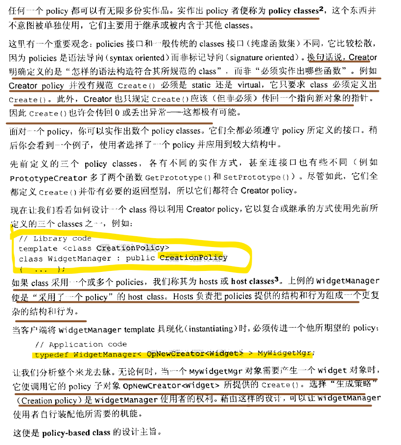

# Modern C++ Design

## **Policy-based class Design**

- **Multiple inheritance + template**

  

  

  

- **Template template parameter**

  

  

  

  

  

  

- Incomplement instantiation

  

  

- Multiple Policies Classes

  

  

  

  

  

  

- **Decomposite class into policy**

  

  

  

- [Make policy as a member](https://stackoverflow.com/questions/872675/policy-based-design-and-best-practices-c)

  

> I think this is fine just as the answer said, but in section 1.6, member will make accessing extra features hard since it is not inheritance.

