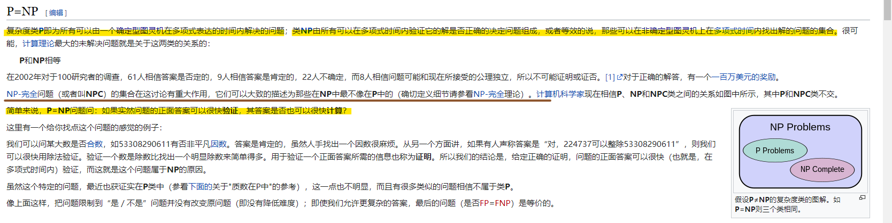
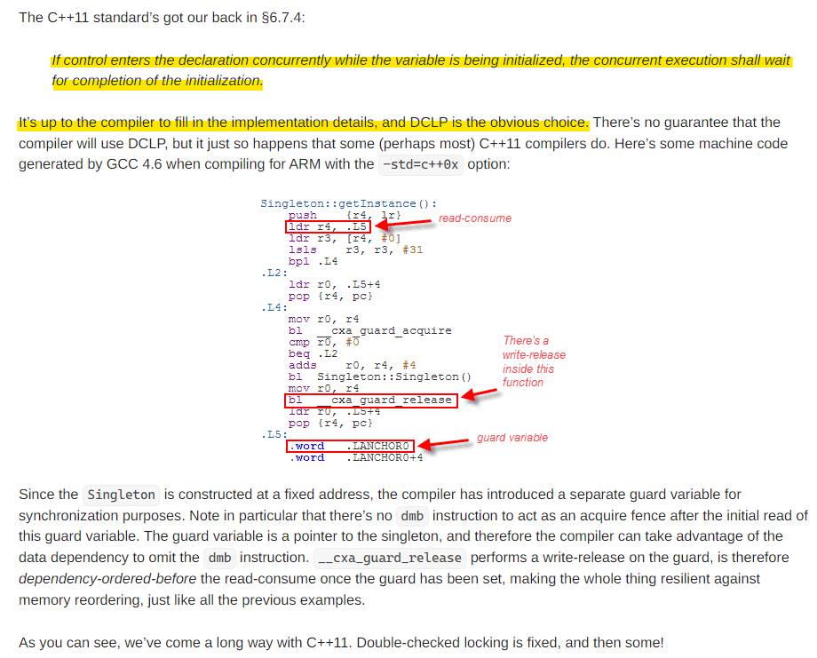
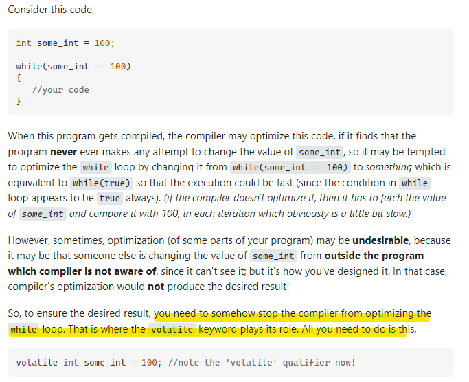
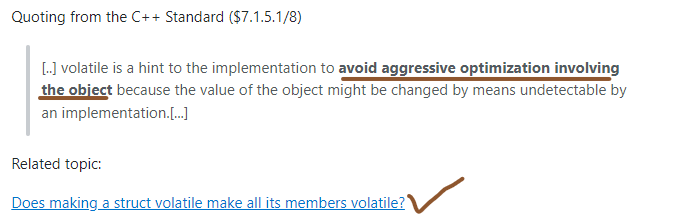
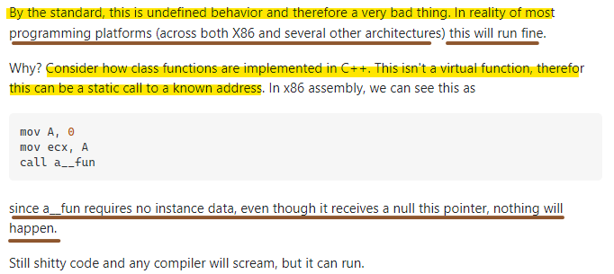

# C++ Advanced Knowledge

## **[CPU Branch Predictor](http://matt33.com/2020/04/16/cpu-branch-predictor/)**

> ***if-else*** 涉及到分支预测的概念。首先看一段经典的代码，并统计它的执行时间: 
```
    #include <algorithm>
    #include <ctime>
    #include <iostream>

    int main() {
        const unsigned ARRAY_SIZE = 50000;
        int data[ARRAY_SIZE];
        const unsigned DATA_STRIDE = 256;

        for (unsigned c = 0; c < ARRAY_SIZE; ++c) data[c] = std::rand() % DATA_STRIDE;

        std::sort(data, data + ARRAY_SIZE);

        {  // 测试部分
            clock_t start = clock();
            long long sum = 0;

            for (unsigned i = 0; i < 100000; ++i) {
                for (unsigned c = 0; c < ARRAY_SIZE; ++c) {
                    if (data[c] >= 128) sum += data[c];
                }
            }

            double elapsedTime = static_cast<double>(clock() - start) / CLOCKS_PER_SEC;

            std::cout << elapsedTime << "\n";
            std::cout << "sum = " << sum << "\n";
        }
        return 0;
    }
```

```
    ~/test$ g++ test_predict.cc ;./a.out
    7.95312
    sum = 480124300000
```
> 此程序的执行时间是7.9秒，如果把排序那一行代码注释掉，即
```
// std::sort(data, data + ARRAY_SIZE);
```
> 结果为
```
~/test$ g++ test_predict.cc ;./a.out
24.2188
sum = 480124300000
```
> 改动后的程序执行时间变为了24秒。其实只改动了一行代码，程序执行时间却有3倍的差距，而且看上去数组是否排序与程序执行速度貌似没什么关系，这里面其实涉及到CPU分支预测的知识点。

> 了解了分支预测的概念，我们回到最开始的问题，为什么同一个程序，排序和不排序的执行速度相差那么多。因为程序中有个if条件判断，对于不排序的程序，数据散乱分布，CPU进行分支预测比较困难，预测失败的频率较高，每次失败都会浪费10-20个时钟周期，影响程序运行的效率。而对于排序后的数据，CPU根据历史记录比较好判断即将走哪个分支，大概前一半的数据都不会进入if分支，后一半的数据都会进入if分支，预测的成功率非常高，所以程序运行速度很快。如何解决此问题？总体思路肯定是在程序中尽量减少分支的判断，方法肯定是具体问题具体分析了，对于该示例程序

> 使用位操作: 
```
    int t = (data[c] - 128) >> 31;
    sum += ~t & data[c];
```

> 其实Linux中有一些工具可以检测出分支预测成功的次数，有***valgrind***和***perf***，使用方式如图：


> 条件分支的使用会影响程序执行的效率，我们平时开发过程中应该尽可能减少在程序中随意使用过多的分支，能避免则避免。

From: https://www.zhihu.com/question/441518636/answer/1701252133

## **Usage of Macro** - **Loop unrolling**

- Unrolling a loop (usually) makes the code larger, because the body of the loop is repeated in the compiled executable. In an ideal situation, the compiler can optimize away code that is shared between iterations, but this isn't always possible.

- This increase in code size can force other code out of the instruction cache (L1, L2, L3), causing reduced performance. If the body of the loop and the code it calls no longer fits into cache, performance will be severely reduced.

> inline 无法代替宏的地方：
1. 循环展开：
```
    // loop unroll double
    #define LOOP_UNROLL_DOUBLE(action, actionx2, width) do { \
            unsigned long __width = (unsigned long)(width); \
            unsigned long __increment = __width >> 2; \
            for (; __increment > 0; __increment--) { \
                actionx2;	\
                actionx2;	\
            }	\
            switch (__width & 3) { \
            case 2: actionx2; break; \
            case 3: actionx2; \
            case 1: action; break; \
            }	\
        }	while (0)

    // loop unroll quatro
    #define LOOP_UNROLL_QUATRO(action, actionx2, actionx4, width) do { \
            unsigned long __width = (unsigned long)(width);	\
            unsigned long __increment = __width >> 2; \
            for (; __increment > 0; __increment--) { \
                actionx4;	\
            }	\
            switch (__width & 3) { \
            case 2: actionx2; break; \
            case 3: actionx2; \
            case 1: action; break; \
            }	\
        }	while (0)
```
> 假设你需要高速循环做一个事情，那么展开循环可以极大的减少***CPU分支***，并且充分利用CPU流水线的并行效果，比如你开发一个 FIR滤波器来处理信号，那么你的代码如果从 for (...) { .... } 变成循环展开的话，可以这么写
```
    LOOP_UNROLL_DOUBLE(
        {
            x = *src++;
            // do something with x and h and output to y
            *dst++ = y;
        },
        {
            x1 = *src++;
            x2 = *src++;
            // do something with x1 and h and output to y1
            // do something with x2 and h and output to y2
            *dst++ = y1;
            *dst++ = y2;
        },
        nsamples,
    );
```
> 如此写法将每个循环只计算一个 sample，变为每个循环同时计算两个sample，分开写代码，也能更好的利用 SIMD去加速同时多个 sample的计算过程，这就是利用循环展开来优化性能的用法，直接传 "{...}" 里面的运行代码给宏，宏不变，但是每处使用LOOP_UNROLL的地方 "{.. } " 中的代码都是不同的，inline是代替不了的，你总不至于传个函数指针过去吧，这是性能优化方面情况。
2. 函数组装
> 想象一下，你写图形图像的代码，现在你需要给像素合成实现 SRC_ATOP， SRC_OVER, SRC_IN, SRC_OUT, DST_ATOP, DST_OVER, DST_IN, DST_OUT, XOR, PLUS, ALLANON, TINT, DIFF, DARKEN, LIGHTEN, SCREEN, OVERLAY 等等 二十种像素合成的方法，你如果不用宏，那么你需要写多少个函数？20多个看起来类似的函数，你不得写疯了么？此时用函数指针其实是很浪费性能的事情，那么该如何写呢？你可以规定一系列用来计算composite的方法，接受两组 RGBA，生成新的，比如
```
    /* compositing */
    #define IBLEND_COMPOSITE(sr, sg, sb, sa, dr, dg, db, da, FS, FD) do { \
            (dr) = _ipixel_mullut[(FS)][(sr)] + _ipixel_mullut[(FD)][(dr)]; \
            (dg) = _ipixel_mullut[(FS)][(sg)] + _ipixel_mullut[(FD)][(dg)]; \
            (db) = _ipixel_mullut[(FS)][(sb)] + _ipixel_mullut[(FD)][(db)]; \
            (da) = _ipixel_mullut[(FS)][(sa)] + _ipixel_mullut[(FD)][(da)]; \
        }	while (0)

    /* premultiply: src over */
    #define IBLEND_OP_SRC_OVER(sr, sg, sb, sa, dr, dg, db, da) do { \
            IUINT32 FD = 255 - (sa); \
            IBLEND_COMPOSITE(sr, sg, sb, sa, dr, dg, db, da, 255, FD); \
        }	while (0)

    /* premultiply: dst atop */
    #define IBLEND_OP_DST_ATOP(sr, sg, sb, sa, dr, dg, db, da) do { \
            IUINT32 FS = 255 - (da); \
            IUINT32 FD = (sa); \
            IBLEND_COMPOSITE(sr, sg, sb, sa, dr, dg, db, da, FS, FD); \
        }	while (0)

    /* premultiply: dst in */
    #define IBLEND_OP_DST_IN(sr, sg, sb, sa, dr, dg, db, da) do { \
            IUINT32 FD = (sa); \
            IBLEND_COMPOSITE(sr, sg, sb, sa, dr, dg, db, da, 0, FD); \
        }	while (0)
```
> 然后用 #连接各种方法和格式，生成不同的函数，比如：
```
    #define IPIXEL_COMPOSITE_FN(name, opname) \
    static void ipixel_comp_##name(IUINT32 *dst, const IUINT32 *src, int w)\
    { \
        IUINT32 sr, sg, sb, sa, dr, dg, db, da; \
        for (; w > 0; dst++, src++, w--) { \
            _ipixel_load_card(src, sr, sg, sb, sa); \
            _ipixel_load_card(dst, dr, dg, db, da); \
            IBLEND_OP_##opname(sr, sg, sb, sa, dr, dg, db, da); \
            dst[0] = IRGBA_TO_A8R8G8B8(dr, dg, db, da); \
        } \
    }
```
> 然后开始生成我们的各种合成函数
```
    IPIXEL_COMPOSITE_PREMUL(pre_xor, XOR);
    IPIXEL_COMPOSITE_PREMUL(pre_plus, PLUS);
    IPIXEL_COMPOSITE_PREMUL(pre_src_atop, SRC_ATOP);
    IPIXEL_COMPOSITE_PREMUL(pre_src_in, SRC_IN);
    IPIXEL_COMPOSITE_PREMUL(pre_src_out, SRC_OUT);
    IPIXEL_COMPOSITE_PREMUL(pre_src_over, SRC_OVER);
    IPIXEL_COMPOSITE_PREMUL(pre_dst_atop, DST_ATOP);
    IPIXEL_COMPOSITE_PREMUL(pre_dst_in, DST_IN);
    IPIXEL_COMPOSITE_PREMUL(pre_dst_out, DST_OUT);
    IPIXEL_COMPOSITE_PREMUL(pre_dst_over, DST_OVER);
```
> 这样你相当于定义了：```ipixel_comp_pre_xor (...). ipixel_comp_pre_plus (...)``` 等好几个函数了，并且这些函数都是被你 “组装” 出来的，你并没有使用函数指针，也没有笨重的去写20多个函数。进一步如果你写图形图像你会发现你需要面对多种设备的像素格式，从 A8R8G8B8, A8B8G8R8 到 A1R5G5B5 , 主流需要处理的像素格式都有10多种。那么你可以把 “从不同格式读取 r,g,b,a”， 以及 “将 r,g,b,a组装成任意格式”，展开成很多个宏，然后不管你在这些像素格式里面做转换还是要做一些其他处理，你都可以用任意的 “像素读写” 宏 + “像素计算” 宏 组装成一个个具体需要的函数。所以用宏来解决性能问题，并且简化自己的程序设计往往能起到 inline不能起的作用，甚至能完成很多 template 所不能完成的任务
3. 数据结构和算法
> 具体可以参考 Linux Kernel的 ***include/linux/list.h*** 同样的应用，在 Kernel中，还有红黑树 ***rbtree.h，rbtree.c***中的实现，和 list很类似，大量的宏应用。Linux 用基础的宏实现的 list, rbtree等基础数据结构，用起来是相当方便的，有些地方比 std::list, std::map 都方便多了，比 STL性能高的同时，避免象模版一样为每种类型生成不同的代码，让你的二进制程序变得很臃肿。比如你在做题的时候，用上了这样的数据结构，你程序会比用 stl容器的代码更高效和精简，同时你不知道目标平台 STL是怎么实现的，你无法控制，明明我在这个平台写着很快的代码，为何换个平台又慢了，为了追求究极性能，这样重新定义数据结构，其实是可以理解的
4. 其他 inline 无法代替宏的地方
> 针对不同平台特性（比如整数是32还是64，lsb还是msb）写出的优化代码。泛型的模拟小型高频重复的代码片硬件操作的定义等等，很多情况，inline或者 template还是无法把宏给代替了，所以很多开源项目的代码里面，大量的出现各种宏，主要是出于这些方面的考虑。

From: https://www.zhihu.com/question/30659549/answer/49956788

## **[构建C/C++良好的工程结构](https://zhuanlan.zhihu.com/p/59450618)**

## **内存对齐**

> 字节对齐主要是为了提高内存的访问效率，比如intel 32位cpu，每个总线周期都是从偶地址开始读取32位的内存数据，如果数据存放地址不是从偶数开始，则可能出现需要两个总线周期才能读取到想要的数据，因此需要在内存中存放数据时进行对齐。

> 通常我们说字节对齐很多时候都是说struct结构体的内存对齐，比如下面的结构体:

```
    struct A{
        char a;
        int b;
        short c;
    }
```
> 在32位机器上char 占1个字节，int 占4个字节，short占2个字节，一共占用7个字节.但是实际真的是这样吗？

> 我们先看下面程序的输出:

```
#include <stdio.h>

    struct A{
        char a;
        int b;
        short c;
    };
    int main(){
        struct A a;
        printf("A: %ld\n", sizeof(a));
        return 0;
    }
```
> 测试输出的结果是**A: 12**, 比计算的7多了5个字节。这个就是因为编译器在编译的时候进行了内存对齐导致的。

> 内存对齐主要遵循下面三个原则:

1. 结构体变量的起始地址能够被其最宽的成员大小整除
2. 结构体每个成员相对于起始地址的偏移能够被其自身大小整除，如果不能则在前一个成员后面补充字节
3. 结构体总体大小能够被最宽的成员的大小整除，如不能则在后面补充字节
> 其实这里有点不严谨，编译器在编译的时候是可以指定对齐大小的，实际使用的有效对齐其实是取指定大小和自身大小的最小值，一般默认的对齐大小是4。
> 再回到上面的例子，如果默认的对齐大小是4，结构体a的起始地址为0x0000，能够被最宽的数据成员大小(这里是int， 大小为4，有效对齐大小也是4)整除，姑char a的从0x0000开始存放占用一个字节即0x0000~0x0001，然后是int b，其大小为4，故要满足2，需要从0x0004开始，所以在char a后填充三个字节，因此a对齐后占用的空间是0x0000~0x0003，b占用的空间是0x0004~0x0007, 然后是short c其大小是2，故从0x0008开始占用两个字节，即0x0008~0x0009。 此时整个结构体占用的空间是0x0000~0x0009， 占用10个字节，10%4 ！= 0, 不满足第三个原则，所以需要在后面补充两个字节，即最后内存对齐后占用的空间是0x0000~0x000B，一共12个字节。

From: https://www.zhihu.com/question/27862634/answer/208895189

### **```New``` Operator Overloading and std::allocator**

1. 对齐版本的 operator new 重载 
```
    void* operator new(std::size_t count, std::align_val_t al);
```
2. new 申请不到内存时，在默认情况下，是会一个循环，不断调用 std::get_new_handler 返回的函数指针，直到分配成功为止的。我觉得这也太坑了，顶多试三次就行了

> vector 最核心的需求是什么？是要求内存分配和对象的构造之间能解耦、解分配和对象的析构之间能解耦。说人话，就是需要先用 allocator.allocate() 方法从分配器中提前分配出内存块，等推迟到合适的时候，才在这个内存块上构造出对象。那些叫嚣 100 行写出的 vector，其实现都是根本不能用的，里面全是用的 new T[]。正规的写法必须要用到 placement new —— 这是重载 new 的最机智的利用。vector 的基本原理如下

```
    #include <new>
    #include <iostream>

    struct Foo
    {
        int i;

        Foo(int i) : i(i)
        {
            std::cout << "构造 " << i << std::endl;
        }
        ~Foo()
        {
            std::cout << "析构 " << i << std::endl;
        }
    };

    int main()
    {
        std::allocator<Foo> alloc;
        Foo * p = alloc.allocate(3);
        
        std::cout << "分配好缓冲区了" << std::endl;
        
        for (int i = 0; i < 3; ++i) {
            std::cout << "push_back 第 " << i << " 个元素" << std::endl;
            new (p + i) Foo(i);
        }
        for (int i = 0; i < 3; ++i) {
            std::cout << "pop_back 第 " << i << " 个元素" << std::endl;
            (p + 2 - i)->~Foo();
        }
        
        alloc.deallocate(p, 3);
        std::cout << "释放完缓冲区了" << std::endl;
    }
```

```
    输出：分配好缓冲区了
    push_back 第 0 个元素
    构造 0
    push_back 第 1 个元素
    构造 1
    push_back 第 2 个元素
    构造 2
    pop_back 第 0 个元素
    析构 2
    pop_back 第 1 个元素
    析构 1
    pop_back 第 2 个元素
    析构 0
```

> 释放完缓冲区了你以为 placement new 是 C++ 为其特殊设计的语法？不是的，placement new 只是一个函数调用而已。它只不过是
```
    void* operator new(std::size_t, void* p)
    {
        return p;
    }
```

- [Placement new](https://en.cppreference.com/w/cpp/language/new)

- [alignas](https://stackoverflow.com/questions/17091382/memory-alignment-how-to-use-alignof-alignas)

From: https://www.zhihu.com/question/470670449/answer/1984399361

## **如何理解 C++11 的六种 memory order and std::atomic?**
From: https://www.zhihu.com/question/24301047/answer/83422523
From: https://zhuanlan.zhihu.com/p/464207968
From: https://stackoverflow.com/questions/31978324/what-exactly-is-stdatomic

## **C++ Reflection**
From: https://www.zhihu.com/question/361153307/answer/1518952318
From: https://en.cppreference.com/w/cpp/keyword/reflexpr
From: https://stackoverflow.com/questions/37628/what-is-reflection-and-why-is-it-useful

## **Extern "C"**
From: https://zhuanlan.zhihu.com/p/430687729

## **Mutex && Condition Variable && read-write lock && Spinlock**

> 我们都听说过加锁 **(lock)** 或者解锁 **(unlock)**，当然学术一点地说法是获取 **(acquire)** 和释放 **(release)**。


> 恰好```pthread```包含这几种锁的API，而C++11只包含其中的部分。接下来我将通过```pthread```的API来展开回答

### **Mutex**

> ```mutex``` (互斥量) (mutual exclusive) 即互斥量（互斥体）。也便是常说的互斥锁。尽管名称不含lock，但是称之为锁，也是没有太大问题的。mutex无疑是最常见的多线程同步方式。其思想简单粗暴，多线程共享一个互斥量，然后线程之间去竞争。得到锁的线程可以进入临界区执行代码

```
    // 声明一个互斥量    
    pthread_mutex_t mtx;
    // 初始化 
    pthread_mutex_init(&mtx, NULL);
    // 加锁  
    pthread_mutex_lock(&mtx);
    // 解锁 
    pthread_mutex_unlock(&mtx);
    // 销毁
    pthread_mutex_destroy(&mtx);
```

> ```mutex```是睡眠等待（sleep waiting）类型的锁，当线程抢互斥锁失败的时候，线程会陷入休眠。优点就是节省CPU资源，缺点就是休眠唤醒会消耗一点时间。另外自从Linux 2.6版以后，mutex完全用futex的API实现了，内部系统调用的开销大大减小。值得一提的是，pthread的锁一般都有一个trylock的函数，比如对于互斥量
```
    ret = pthread_mutex_trylock(&mtx);
    if (0 == ret) { // 加锁成功
        ... 
        pthread_mutex_unlock(&mtx);
    } else if(EBUSY == ret){ // 锁正在被使用;
        ... 
    }
```
> ```pthread_mutex_trylock```用于以非阻塞的模式来请求互斥量。就好比各种IO函数都有一个```non-block```的模式一样，对于加锁这件事也有类似的非阻塞模式
> 当线程尝试加锁时，如果锁已经被其他线程锁定，该线程就会阻塞住，直到能成功```acquire```。但有时候我们不希望这样。```pthread_mutex_trylock```在被其他线程锁定时，会返回特殊错误码。加锁成返回0，仅当成功但时候，我们才能解锁在后面进行解锁操作
> C++11开始引入了多线程库<thread>，其中也包含了互斥锁的API：std::mutex.

> 此外，依据同一线程是否能多次加锁，把互斥量又分为如下两类
- 是：称为『递归互斥量』recursive mutex ，也称『可重入锁』reentrant lock
- 否：即『非递归互斥量』non-recursive mute），也称『不可重入锁』non-reentrant mutex
> 若同一线程对非递归的互斥量多次加锁，可能会造成死锁。递归互斥量则无此风险。C++11中有递归互斥量的API：```std::recursive_mutex```。对于pthread则可以通过给mutex添加PTHREAD_MUTEX_RECURSIVE 属性的方式来使用递归互斥量：

```
    // 声明一个互斥量
    pthread_mutex_t mtx;
    // 声明一个互斥量的属性变量
    pthread_mutexattr_t mtx_attr;

    // 初始化互斥量的属性变量
    pthread_mutexattr_init(&mtx_attr);
    // 设置递归互斥量的属性
    pthread_mutexattr_settype(&mtx_attr, PTHREAD_MUTEX_RECURSIVE);

    // 把属性赋值给互斥量
    pthread_mutext_init(&mtx, &mutext_attr);
```

> 然而对于```递归互斥量```或者说```可重入锁```的使用则需要克制。Stevens大神生前在《APUE》中说『使用好它是十分tricky的，仅当没有其他解决方案时才使用』[1]。可重入锁这个概念和称呼的走俏多半是Java语言的功劳。

### **Condition Variable**
> ```condition variable``` (条件变量) 请注意条件变量不是锁，它是一种线程间的通讯机制，并且几乎总是和互斥量一起使用的。所以互斥量和条件变量二者一般是成套出现的。比如C++11中也有条件变量的API：```std::condition_variable```。对于pthread：
```
    // 声明一个互斥量     
    pthread_mutex_t mtx;
    // 声明一个条件变量
    pthread_cond_t cond;
    ...

    // 初始化 
    pthread_mutex_init(&mtx, NULL);
    pthread_cond_init(&cond, NULL);

    // 加锁  
    pthread_mutex_lock(&mtx);
    // 加锁成功，等待条件变量触发
    pthread_cond_wait(&cond, &mtx);

    ...
    // 加锁  
    pthread_mutex_lock(&mtx);
    pthread_cond_signal(&cond);
    ...

    // 解锁 
    pthread_mutex_unlock(&mtx);
    // 销毁
    pthread_mutex_destroy(&mtx);
```

> ```pthread_cond_wait```函数会把条件变量和互斥量都传入。并且多线程调用的时候条件变量和互斥量一定要一一对应，不能一个条件变量在不同线程中wait的时候传入不同的互斥量。否则是未定义结果。

> 关于是先解锁互斥量还是先进行条件变量的通知，是另外一个比较大的议题。有种论断说：先解锁互斥量再通知条件变量可以减少多余的上下文切换，进而提高效率。这种说法是基于一种实现假设：先通知条件变量，再解锁。可能让其他等待条件变量的线程被唤醒了，但是此时互斥量还没解锁，从而再次陷入休眠。然而对于另外一些实现，比如Linux系统，则通过等待变形```(wait morphing) ```解决了这一问题。所以先通知再解锁也没用问题。

> 另外在使用条件变量的过程中有个**稍微违反直觉**的写法：那就是使用```while```而不是```if```来做判断状态是否满足。这样做的原因有二：
- 避免惊群；
- 避免某些情况下线程被**虚假唤醒**（即没有pthread_cond_signal就解除了阻塞。（Spurious wakeup）

> 例子：

- [cv.wait](https://en.cppreference.com/w/cpp/thread/condition_variable/wait)
- [std::lock_guard](https://en.cppreference.com/w/cpp/thread/lock_guard)
- [std::unique_lock](https://en.cppreference.com/w/cpp/thread/unique_lock)
```
    #include <iostream>
    #include <string>
    #include <thread>
    #include <mutex>
    #include <condition_variable>
    
    std::mutex m;
    std::condition_variable cv;
    std::string data;
    bool ready = false;
    bool processed = false;
    
    void worker_thread()
    {
        // Wait until main() sends data
        std::unique_lock<std::mutex> lk(m);
        cv.wait(lk, []{return ready;});
    
        // After the wait, we own the lock.
        std::cout << "Worker thread is processing data\n";
        data += " after processing";
    
        // Send data back to main()
        processed = true;
        std::cout << "Worker thread signals data processing completed\n";
    
        // Manual unlocking is done before notifying, to avoid waking up
        // the waiting thread only to block again (see notify_one for details)
        lk.unlock();
        cv.notify_one();
    }
    
    int main()
    {
        std::thread worker(worker_thread);
    
        data = "Example data";
        // send data to the worker thread
        {
            std::lock_guard<std::mutex> lk(m);
            ready = true;
            std::cout << "main() signals data ready for processing\n";
        }
        cv.notify_one();
    
        // wait for the worker
        {
            std::unique_lock<std::mutex> lk(m);
            cv.wait(lk, []{return processed;});
        }
        std::cout << "Back in main(), data = " << data << '\n';
    
        worker.join();
    }
```
- Output:

```
    main() signals data ready for processing
    Worker thread is processing data
    Worker thread signals data processing completed
    Back in main(), data = Example data after processing
```

> Note:
- In the initial processing of  ```cv.wait```, the thread **locks the mutex and then checks the predicate**.
- ```cv.wait``` causes the current thread to block until the condition variable is notified or a spurious wakeup occurs, optionally looping until some predicate is satisfied ```(bool(stop_waiting()) == true)```.

1. **Atomically unlocks lock**, blocks the current executing thread, and adds it to the list of threads waiting on *this. The thread will be unblocked when notify_all() or notify_one() is executed. It may also be unblocked spuriously. When unblocked, regardless of the reason, lock is reacquired and wait exits.
2.  Equivalent to
```
    while (!stop_waiting()) {
        wait(lock);
    }
```
- After the ```cv.wait```, we **own the lock**.
- **Lost wakeup**: The phenomenon of the lost wakeup is that the sender sends its notification before the receiver gets to its wait state. The consequence is that the notification is lost. The C++ standard describes condition variables as a simultaneous synchronisation mechanism: "The condition_variable class is a synchronisation primitive that can be used to block a thread, or multiple threads at the same time, ...". So the notification gets lost, and the receiver is waiting and waiting and...
- [**Spurious wakeup**](https://en.wikipedia.org/wiki/Spurious_wakeup): It may happen that the receiver wakes up, although no notification happened. ```At a minimum POSIX Threads and the Windows API can be victims of these phenomena```. Another case is: in between the time when the condition variable was signaled and when the waiting thread finally ran, another thread ran and changed the condition. There was a race condition between the threads, with the typical result that sometimes, the thread waking up on the condition variable runs first, winning the race, and sometimes it runs second, losing the race
- To become ***not the victim of these two issues***, you have to use an additional predicate as memory; or as the rule state it an additional condition.

#### **To summrize:**

> In the initial processing of wait, the thread locks the mutex and then checks the predicate ```[]{ return dataReady; }```.

> If the call of the predicated evaluates to

- **true**: the thread continues its work.
- **false**: condVar.wait() unlocks the mutex and puts the thread in a waiting (blocking) state

> If the condition_variable is in the waiting state and gets a notification or a spurious wakeup the following steps happen.

- The thread is unblocked and will reacquire the lock on the mutex. 
- The thread checks the predicate.
> If the call of the predicated evaluates to
- **true**: the thread continues its work.
- **false**: ```condVar.wait()``` unlocks the mutex and puts the thread in a waiting (blocking) state.

## Read-write Lock
> ```read-write lock```（读写锁）顾名思义『读写锁』就是对于临界区区分读和写。在读多写少的场景下，不加区分的使用互斥量显然是有点浪费的。此时便该上演读写锁的拿手好戏。
> 读写锁有一个别称叫『共享-独占锁』。不过单看『共享-独占锁』或者『读写锁』这两个名称，其实并未区分对于读和写，到底谁共享，谁独占。可能会让人误以为读写锁是一种更为泛化的称呼，其实不是。读写锁的含义是准确的：是一种 读共享，写独占的锁。
> 读写锁的特性：
- 当**读写锁**被加了**写锁**时，其他线程对该锁加**读锁或者写锁**都会**阻塞**（不是失败）。
- 当**读写锁**被加了**读锁**时，其他线程对该锁加**写锁**会**阻塞**，加**读锁**会**成功**。因而适用于多读少写的场景。

> Note:
- 大部分的读写锁实现, 会对尝试加锁的操作进行排队, *如果前面已经有尝试加写锁被阻塞了的话, 后续的加读锁也不会成功(虽然此时是处在被加读锁的状态), 这样做的目的主要是为了避免写饥饿*. 还有更精细的控制, 但是, 一般跟具体场景绑定.

```
    // 声明一个读写锁
    pthread_rwlock_t rwlock;
    ...
    // 在读之前加读锁
    pthread_rwlock_rdlock(&rwlock);

    ... 共享资源的读操作

    // 读完释放锁
    pthread_rwlock_unlock(&rwlock);

    // 在写之前加写锁
    pthread_rwlock_wrlock(&rwlock); 

    ... 共享资源的写操作

    // 写完释放锁
    pthread_rwlock_unlock(&rwlock);

    // 销毁读写锁
    pthread_rwlock_destroy(&rwlock);
```

> 其实加读锁和加写锁这两个说法可能会造成误导，让人误以为是有两把锁，其实```读写锁是一个锁```。所谓加读锁和加写锁，准确的说法可能是『给读写锁加读模式的锁定和加写模式的锁定』。

> 读写锁和互斥量一样也有trylock函数，也是以非阻塞地形式来请求锁，不会导致阻塞。

```
    pthread_rwlock_tryrdlock(&rwlock)
    pthread_rwlock_trywrlock(&rwlock)
```
> C++11中有互斥量、条件变量但是并没有引入读写锁。而在C++17中出现了一种新锁：[```std::shared_mutex```](https://en.cppreference.com/w/cpp/thread/shared_mutex)。用它可以模拟实现出读写锁

> 另外多读少写的场景有些特殊场景，可以用特殊的数据结构减少锁使用：

- 多读单写的线性数据。用数组实现环形队列，避免vector等动态扩张的数据结构，写在结尾，由于单写因而可以不加锁；读在开头，由于多读（避免重复消费）所以需要加一下锁（互斥量就行）。
- 多读单写的KV。可以使用双缓冲（double buffer）的数据结构来实现。double buffer同名的概念比较多，这里指的是foreground 和 backgroud 两个buffer进行切换的『0 - 1切换』技术。比如实现动态加载（热加载）配置文件的时候。可能会在切换间隙加一个短暂的互斥量，但是基本可以认为是lock free的。
- 无非也就是空间换时间的老套路了。

### **Spinlock**
> ```spinlock```（自旋锁）自旋之名颇为玄妙，第一次听闻常让人略觉高大。但和无数个好似『故意把简单概念复杂化』的计算机术语一样，自旋锁的本质简单的难以置信。
> 要了解自旋锁，首先了解自旋。**什么是自旋（spin）呢？更为通俗的一个词是『忙等待』（busy waiting）。最最通俗的一个理解，其实就是死循环……。** 

> 单看使用方法和使用互斥量的代码是差不多的。只不过自旋锁不会引起线程休眠。当共享资源的状态不满足的时候，自旋锁会不停地循环检测状态。因为不会陷入休眠，而是忙等待的方式也就不需要条件变量。

> 这是优点也是缺点。不休眠就不会引起上下文切换，但是会比较浪费CPU。

```
    // 声明一个自旋锁变量
    pthread_spinlock_t spinlock;

    // 初始化   
    pthread_spin_init(&spinlock, 0);

    // 加锁  
    pthread_spin_lock(&spinlock);

    // 解锁 
    pthread_spin_unlock(&spinlock);

    // 销毁  
    pthread_spin_destroy(&spinlock);
```

> ```pthread_spin_init```函数的第二个参数名为```pshared（int类型）```。表示的是是否能进程间共享自旋锁。这被称之为 ***Thread Process-Shared Synchronization***。互斥量的通过属性也可以把互斥量设置成进程间共享的。```pshared```有两个枚举值：
- **PTHREAD_PROCESS_PRIVATE：仅同进程下读线程可以使用该自旋锁**
- **PTHREAD_PROCESS_SHARED：不同进程下的线程可以使用该自旋锁**

> 在Linux上的glibc中这两个枚举值分别是0和1（Mac上不是）。所以通常也会看到直接传0的代码。***你可能觉得不使用宏，直接用数字硬编码不是一个好习惯。的确，妥妥的Magic Number，但还有一个有趣的事实你需要了解***：并不是所有实现都支持自旋锁设置两种pshared。比如：

```
int pthread_spin_init (pthread_spinlock_t *lock, int pshared) {
    /* Relaxed MO is fine because this is an initializing store.  */
    atomic_store_relaxed (lock, 0);
    return 0;
}
```

> 所以直接传0可能也无伤大雅。

> 自旋锁 VS 互斥量+条件变量 孰优孰劣？当你不知道在你的使用场景下这两种锁该用哪个的时候，那就是用互斥量吧！或者通过压测的判断。

From: https://www.zhihu.com/question/66733477/answer/1267625567

## **STL容器是否是线程安全的?**

> 一般说来，stl对于多线程的支持仅限于下列两点: 

1. 多个读取者是安全的。即多个线程可以同时读取一个容器中的内容。 即此时多个线程调用 容器的不涉及到写的接口都可以 eg ```find```, ```begin```, ```end``` 等.

2. 对不同容器的多个写入者是安全的。即多个线程对不同容器的同时写入合法。 但是对于同一容器当有线程写,有线程读时,如何保证正确? 需要程序员自己来控制，比如：线程A读容器某一项时，线程B正在移除该项。这会导致一下无法预知的错误。 通常的解决方式是用开销较小的临界区```（CRITICAL_SECTION）```来做同步。以下列方式同步基本上可以做到线程安全的容器(就是在有写操作的情况下仍能保证安全)。

- 每次调用容器的成员函数的期间需要锁定。
- 每个容器容器返回迭代器的生存期需要锁定。
- 每个容器在调用算法的执行期需要锁定。

> 当你调用map的任何接口时, 比如 ```end()```, ```begin()```, ```find()```等时, 可能会返回一个```iterator```, 如果有别的线程正在修改这个*map*, 你的```iterator```就变得无效了, 再用这个```iterator行为```就可能出问题. 或者在```find()```函数内部, 会访问到*map*内部的红黑树的数据结构, 而这个红黑树是有可能被别的线程调整的(比如别的现在往*map*中插入一个不存在的记录). 所以, 是危险的.

> Example:

> 可以通过固定```vector```的大小，避免动态扩容```（无push_back）```来做到```lock-free```！即在开始并发读写之前（比如初始化）的时候，给```vector```设置好大小。

```
    struct Data {
    ...
    };
    vector<Data> v;
    v.resize(1000);
```
> 注意是```resize```，不是```reserve```！可能大家平时用```reserve()```比较多，顾名思义，```reserve```就是预留内存。为的是避免内存重新申请以及容器内对象的拷贝。说白了，```reserve()```是给```push_back()```准备的！而```resize```除了预留内存以外，还会调用容器元素的构造函数，不仅分配了N个对象的内存，还会构造N个对象。

> 从这个层面上来说，```resize()```在时间效率上是比```reserve()```低的。但是在多线程的场景下，用```resize```再合适不过。你可以```resize```好N个对象，多线程不管是读还是写，都是通过容器的下标访问【operator[]】来访问元素，不要```push_back```新元素。所谓的『写操作』在这里不是插入新元素，而是修改旧元素。


> 如果N的最大个数是可以预期的就直接设置就好，如果没办法预期就再把```vector```搞成```ring buffer（环形队列）```来缓解压力。

From: https://www.cnblogs.com/ztteng/p/3411738.html <br/>
From: https://www.zhihu.com/question/29987589/answer/1483744520

## **C++ VTable (虚表)**

From: https://www.zhihu.com/question/389546003/answer/1194780618 <br/>
From: https://www.zhihu.com/question/29251261/answer/1297439131

## **What does auto&& tell us?**

From: https://stackoverflow.com/questions/13230480/what-does-auto-tell-us

## **P/NP问题**

<p align="center">
  
</p>

## [C++ Thread Safe Singleton](https://stackoverflow.com/questions/34457432/c11-singleton-static-variable-is-thread-safe-why)

- [Double-checked-locking and its problems](https://www.aristeia.com/Papers/DDJ_Jul_Aug_2004_revised.pdf)

- Using a C++11 Static Initializer

```c++
Singleton& Singleton::getInstance() {
    static Singleton instance;
    return instance;
}
```

<p align="center">
  
</p>

From: https://preshing.com/20130930/double-checked-locking-is-fixed-in-cpp11/

## ```volatile ```

<p align="center">
  
</p>

<p align="center">
  
</p>

## What will happen when I call a member function on a NULL object pointer?

```c++
class A
{
public:
    void fun()
    {
        std::cout << "fun" << std::endl;
    }
};

A* a = NULL;
a->fun();
```

<p align="center">
  
</p>

- **How class functions are implemented in C++**
- This isn't a virtual function, therefor this can be a ***static call to a known address***.

## Double CAS instruction，RCU (Read Copy Update)