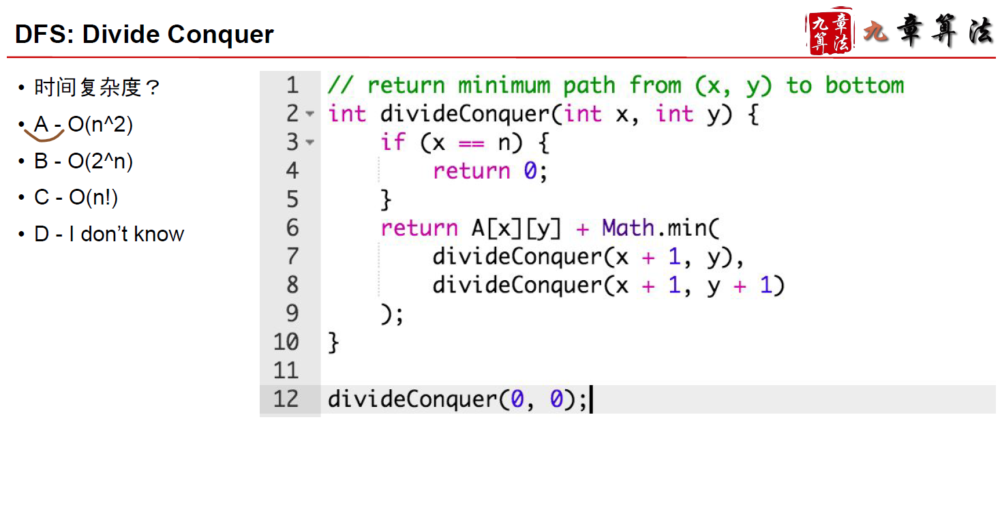
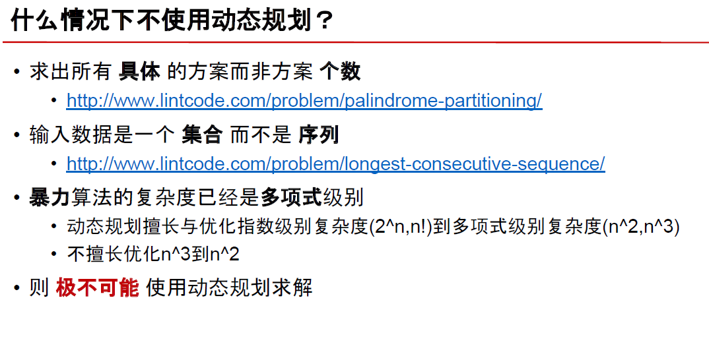

# Dynamic Programming

<p align="center">
  
</p>

<p align="center">
  
</p>

<p align="center">
  
</p>

> 最值型动态规划

> [Coin Change](https://leetcode.com/problems/coin-change/)

<p align="center">
  
</p>

```c++
class Solution {
public:
    int coinChange(vector<int>& coins, int amount) {
       // dp [i] here represents the min mumber of coins to reach amount i
       vector<int> dp(amount + 1, numeric_limits<int>::max());

       // Initially, 0 coins is required to have amount 0
       dp[0] = 0;

       for (int i = 1; i <= amount; ++ i) {
           for (auto& coin: coins) { 
               // We need i - coin, since we need compare dp[i - coin] + 1
               // (which is the newly calculated coin numbers to reach i by adding coin)
               // with the currently recorded min coins to reach i
               if (i - coin >= 0) {
                   // if dp [i] = numeric_limits<int>::max(),
                   // then there is no combinations to reach amount i
                   if (dp[i - coin] != numeric_limits<int>::max())
                        dp[i] = min(dp[i], dp[i - coin] + 1);
               }
           }
       }

       return dp[amount] == numeric_limits<int>::max() ? -1 : dp[amount];
    }
};
```

>[House Robber](https://leetcode.com/problems/house-robber/description/)

<p align="center">
  
</p>

```c++
class Solution {
public:
    int rob(vector<int>& nums) {
        if (nums.size() == 1)
            return nums[0];

        // dp[i] represents the max money that I can rob upto i house
        vector<int> dp (nums.size(), 0);
        dp[0] = nums[0];
        dp[1] = nums[1];

        // dp[i] would depend on dp[i - 2] or dp [i - 3]
        // since no adjacent houses, and we can switch lanes by depending on i - 3
        for (int i = 2; i < nums.size(); ++i) {
            if (i - 3 >= 0)
                dp[i] = max(nums[i] + dp[i - 2], nums[i] + dp[i - 3]);
            else
                dp[i] = nums[i] + dp[i - 2];
        }

        return max(dp[nums.size() - 1], dp[nums.size() - 2]);
    }
};
```

<p align="center">
  
</p>

<p align="center">
  
</p>

<p align="center">
  
</p>

- 记忆化搜索

<p align="center">
  
</p>

<p align="center">
  
</p>

<p align="center">
  
</p>

- 多重循环

```c++
class Solution {
public:
    int minimumTotal(vector<vector<int>>& triangle) {
        vector<vector<int>> dp = triangle;
        
        // 多重循环，自下而上
        //    2
        //   3 4
        //  6 5 7
        // 4 1 8 3
        // from 6,5,7
        for (int i = triangle.size() - 2; i >= 0; i --) {
            for (int j = 0; j < triangle[i].size(); j ++) {
                dp[i][j] = dp[i][j] + min(dp[i + 1][j], dp[i + 1][j + 1]);
            }
        }
        
        return dp[0][0];
    }
};
```

```c++
class Solution {
public:
    int minimumTotal(vector<vector<int>>& triangle) {
        vector<vector<int>> dp = triangle;
        
        // 多重循环，自上而下
        //    2
        //   3 4
        //  6 5 7
        // 4 1 8 3
        // From 2
        for (int i = 0; i < triangle.size() - 1; i ++) {
            for (int j = 0; j < triangle[i].size(); j ++) {
                // check if the next layer's element's value is changed or not
                // if changed, compare the min
                if (dp[i + 1][j] == triangle[i + 1][j])
                    dp[i + 1][j] = dp[i][j] + dp[i + 1][j];
                else
                    dp[i + 1][j] = min(dp[i + 1][j], dp[i][j] + triangle[i + 1][j]);
        
                // check if the next layer's element's value is changed or not
                // if changed, compare the min
                if (dp[i + 1][j + 1] == triangle[i + 1][j + 1])
                    dp[i + 1][j + 1] = dp[i][j] + dp[i + 1][j + 1];
                else
                    dp[i + 1][j + 1] = min(dp[i + 1][j + 1], dp[i][j] + triangle[i + 1][j + 1]);
            }
        }
        
        // Result resides on one of the element in the last layer
        int result{numeric_limits<int>::max()};
        for (int j = 0; j < triangle[triangle.size() - 1].size(); j ++) {
            result = min(result, dp[triangle.size() - 1][j]);
        } 
        
        return result;
    }
};
```

<p align="center">
  
</p>

<p align="center">
  
</p>

<p align="center">
  
</p>

- Minimum Path Sum

<p align="center">
  
</p>

```c++
class Solution {
public:
    int minPathSum(vector<vector<int>>& grid) {
        vector<vector<int>> dp = grid;
        vector<vector<bool>> visited (grid.size(), vector<bool>(grid[0].size(), false));
        
        for (int i = grid.size() - 1; i >= 0; i --) {
            for (int j = grid[i].size() - 1; j >= 0; j --) {
                if (i - 1 >= 0) {
                    if (!visited[i - 1][j]) {
                        dp[i - 1][j] = dp[i][j] + dp[i - 1][j];
                        visited[i - 1][j] = true;
                    } else
                        dp[i - 1][j] = min(dp[i][j] + grid[i - 1][j], dp[i - 1][j]);
                }
                
                 if (j - 1 >= 0) {
                    if (!visited[i][j - 1]) {
                        dp[i][j - 1] = dp[i][j] + dp[i][j - 1];
                        visited[i][j - 1] = true;
                    } else
                        dp[i][j - 1] = min(dp[i][j] + grid[i][j - 1], dp[i][j - 1]);
                 }
            }
        }
        
        return dp[0][0];
    }
};
```

- [Maximal Square](https://leetcode.com/problems/maximal-square/)

<p align="center">
  
</p>

```c++
class Solution {
public:
    int maximalSquare(vector<vector<char>>& matrix) {
        vector<vector<int>> dp (matrix.size(), vector<int>(matrix[0].size(), 0));
        
        int maxL {0};
        
        for (int i = 0; i < matrix.size(); i ++) {
            for (int j = 0; j < matrix[0].size(); j ++) {
                dp[i][j] = matrix[i][j] == '0' ? 0 : 1;
                if (dp[i][j] == 1)
                    maxL = 1;
            }
        }
        
        for (int i = 1; i < matrix.size(); i ++) {
            for (int j = 1; j < matrix[0].size(); j ++) {
                if (dp[i][j] > 0 && dp[i - 1][j] > 0 && dp[i][j - 1] > 0 && dp[i - 1][j - 1] > 0) {
                    if (dp[i - 1][j] == dp[i][j - 1] && dp[i][j - 1] == dp[i - 1][j - 1])
                        dp[i][j] = dp[i - 1][j - 1] + 1;
                    else
                        dp[i][j] = min({dp[i - 1][j], dp[i][j - 1], dp[i - 1][j - 1]}) + 1;
                    
                    maxL = max(maxL, static_cast<int>(pow(dp[i][j], 2.0)));
                }
            }
        }
        
        return maxL;
    }
};
```

- [Unique Paths](https://leetcode.com/problems/unique-paths/)

<p align="center">
  
</p>

> Always think from basic case ([1,1] in this question)

<p align="center">
  
</p>

<p align="center">
  
</p>


```c++
class Solution {
public:
    int uniquePaths(int m, int n) {
        vector<vector<int>> dpMa (m, vector<int>(n, 0));
        
        dpMa[0][0] = 1;
        
        for (int i = 0; i < m; i ++) {
            for (int j = 0; j < n; j++) {
                if (i - 1 >= 0) {
                    dpMa[i][j] = dpMa[i][j] + dpMa[i - 1][j];
                }
                if (j - 1 >= 0) {
                    dpMa[i][j] = dpMa[i][j] + dpMa[i][j - 1];
                }
            }
        }

        return dpMa[m - 1][n - 1];
    }
};
```

- [Climbing Stairs](https://leetcode.com/problems/climbing-stairs/)

<p align="center">
  
</p>

```c++
class Solution {
public:
    // Dumb solution
//     int climbStairs(int n) {
//         vector<int> divideV;
        
//         if (n == 1)
//             return 1;
//         if (n == 2)
//             return 2;
        
//         divideV.push_back(1);
//         divideV.push_back(2);
        
//         for (int i = 0;  i < n; i ++) {
//             auto currentSize = divideV.size();
//             for (int j = 0; j < currentSize; j ++) {
//                 if (divideV[j] + 1 <= n) {
//                     if (divideV[j] + 2 <= n) {
//                         divideV.push_back(divideV[j] + 2);
//                     }
//                     divideV[j] = divideV[j] + 1;
//                 }
//             }
//         }
        
//         return divideV.size();
//     }
    
    // DP
    // For the first stair : 1                            -> 1 solution
    // For the second stair: 1 + 1 or 2                   -> 2 solutions
    // For the third stair:  1 + 1 + 1 or 2 + 1 or 1 + 2  -> 3 solutions
    // For the forth stair: 
    // the solution equals to addition of the third stair and the second
    // because 1 step from the third stair and 2 steps from the second
    // -> 5 solutions
    int climbStairs(int n) {
        // Special case
        if (n == 1)
            return 1;
        
        int currentStairSolutions{0};
        int oneStepBehind {1};
        int twoStepBehind {1};
        
        for (int i = 2; i <= n; i ++) {
            currentStairSolutions = oneStepBehind + twoStepBehind;
            // Going up
            twoStepBehind = oneStepBehind;
            oneStepBehind = currentStairSolutions;
        }
        
        return currentStairSolutions;
    }
};
```

- [Longest Increasing Subsequence](https://leetcode.com/problems/longest-increasing-subsequence/)

<p align="center">
  
</p>

<p align="center">
  
</p>

```c++
class Solution {
public:
    int lengthOfLIS(vector<int>& nums) {
        vector<int> dp;
        dp.resize(nums.size());
        
        // Length for LIS
        for (int i = 0; i < nums.size(); i ++) {
            dp[i] = 1;
        }
        
        // [10,9,2,5,3,7,101,18]
        // 10 -> pass, 9 -> pass since 9 < 10
        // 2 ->pass, 2 < 10, 2 < 9
        // 5 -> dp[2] + 1 -> 2, 5 > 2, 5 < 9, 5 < 10
        // ...
        // 7 -> dp[3] + 1 -> 2 + 1 -> 3
        for (int i = 0; i < nums.size(); i ++) {
            for (int j = 0; j < i; j ++) {
                if (nums[i] > nums[j])
                    dp[i] = max(dp[i], dp[j] + 1);
            }
        }
        
        int result = 0;
        for (int i = 0; i < dp.size(); i ++) {
            result = max(result, dp[i]);
        }
        
        return result;
    }
};
```

- [Number of Longest Increasing Subsequence](https://leetcode.com/problems/number-of-longest-increasing-subsequence/description/)

<p align="center">
  
</p>

```c++
class Solution {
public:
    int findNumberOfLIS(vector<int>& nums) {
        vector<pair<int, int>> dp;
        dp.resize(nums.size());
        
        // Length for LIS
        // the second element in the pair is the number of LTS that
        // has the length of the first element
        for (int i = 0; i < nums.size(); i ++) {
            dp[i] = {1, 1};
        }
        
        // [10,9,2,5,3,7,101,18]
        // 10 -> pass, 9 -> pass since 9 < 10
        // 2 ->pass, 2 < 10, 2 < 9
        // 5 -> look 10, 9, 2       -> dp[2] + 1 -> 2, 5 > 2, 5 < 9, 5 < 10
        // ...
        // 7 -> look 10 9, 2, 5, 3, ->dp[3] + 1 -> 2 + 1 -> 3
        for (int i = 0; i < nums.size(); i ++) {
            for (int j = 0; j < i; j ++) {
                if (nums[i] > nums[j]) {
                    dp[i].first = max(dp[i].first, dp[j].first + 1);
                }
            }

            // Here, we find the max LTS length, we then have another loop find out
            // how many same max LTS it has when looping from element zero
            int counter = 0;
            for (int j = 0; j < i; j ++) {
                if (nums[i] > nums[j] && dp[i].first == dp[j].first + 1) {
                    counter = counter + dp[j].second;
                }
            }
            
            // Record
            dp[i].second = counter == 0 ? 1 : counter;
        }
        
        // Find the LTS
        int result = 0;
        for (int i = 0; i < dp.size(); i ++) {
            result = max(result, dp[i].first);
        }

        // Find the final result
        int count = 0;
        for (int i = 0; i < dp.size(); i ++) {
            if (dp[i].first == result) {
                count = count + dp[i].second;
            }
        }
        
        return count;
    }
};
```

- [Largest Divisible Subset](https://leetcode.com/problems/largest-divisible-subset/)

<p align="center">
  
</p>

```c++
class Solution {
public:
    vector<int> largestDivisibleSubset(vector<int>& nums) {
        sort(nums.begin(), nums.end());
        
        vector<vector<int>> dp;
        dp.resize(nums.size());
        
        for (int i = 0; i < nums.size(); i ++)
            dp[i] = {nums[i]};
        
        for(int i = 1; i < nums.size(); i ++) {
            for (int j = 0; j < i; j ++) {
                if (nums[i] % nums[j] == 0) {
                    if (dp[i].size() < dp[j].size() + 1) {
                        auto temp = dp[j];
                        temp.push_back(nums[i]);
                        dp[i] = temp;
                    }
                }
            }
        }
        
        int resultIndex{0};
        for (int i = 0; i < dp.size(); i ++) {
            if (dp[i].size() > dp[resultIndex].size())
                resultIndex = i;
        }
        
        return dp[resultIndex];
    }
};
```

- [Perfect Squares - Dynamic Programming - Leetcode 279](https://www.youtube.com/watch?v=HLZLwjzIVGo&ab_channel=NeetCode)

- [Integer Break](https://leetcode.com/problems/integer-break/description/?envType=study-plan&id=algorithm-ii)

<p align="center">
  
</p>

```c++
class Solution {
public:
    int integerBreak(int n) {
        int result = 0;

        for (int i = 1; i < n ; i ++) {
            int base = i;
            int mod = n % i;
            int power = n / i;

            if (mod == 1 && power - 1 != 0) {
                power = power - 1;
                mod =  mod + base;
            }

            if (mod > 0)
                result = max(static_cast<int>(pow(i, power) * mod), result);
            else
                result = max(static_cast<int>(pow(i, power)), result);
        }

        return result;
    }
};

// DP

/* DP
 * 从n = 2开始递推，递推到n = 4的时候，4可以拆分成1和3或2和2
 * 那么3要不要继续拆分呢？2要不要继续拆分呢？
 * 不需要。因为我们已经把拆分2或3能得到的最大值分别计算好存在dp[2]和dp[3]了
 * 所以我们只需要比较2和dp[2]、3和dp[3]谁更大就知道要不要继续拆分
 * 所以对每个n，我们只需要考虑拆分成两个数a b的情况，然后看比较a和dp[a]
 * 以及b和dp[b]谁大就用谁相乘，如果dp[a]>a，表示dp[a]继续拆分能得到比不拆分
 * 更大的值，那么就拆分a，对于dp[b]和b也一样
 */
class Solution {
public:
    int integerBreak(int n) {
        vector<int> dp(n + 1, 0);
        for(int i = 2; i <= n; i++) {
            for(int j = 1; j <= i / 2; j++) {
                dp[i] = max(dp[i], max(j, dp[j]) * max(i - j, dp[i - j]));
            }
        }
        return dp[n];
    }
};
```

From: https://zhuanlan.zhihu.com/p/91582909

- [Unique Binary Search Trees](https://leetcode.com/problems/unique-binary-search-trees/description/)

<p align="center">
  
</p>

```c++
class Solution {
public:
    int numTrees(int n) {
        vector<int> dp;
        dp.resize(n + 1);

        // We let dp[0] = 1 indicates that zero sub tree nodes give one
        dp[0] = 1;

        // dp[1] should be one as well,
        for(int i = 1; i <= n; i ++) {
            // k as number as root (- 1)
            for (int k = 0; k < i; k ++) {
                dp[i] = dp[i] + dp[k] * dp[i - k - 1] ;
            }
        }

        return dp[n];
    }
};
```

> [Word Break](https://leetcode.com/problems/word-break/description/)

```c++
class Solution {
public:
    /*
     * Recursion with memoization
     */
    
    // Memo should be here since no need to go over again when
    // rightPos sub problem is gone over
    // bool recurFind(int rightPos,
    //                string& s,
    //                vector<int>& memo,
    //                set<string>& wordDict) {
    //     if (rightPos == s.size())
    //         return true;
        
    //     if (memo[rightPos] != -1)
    //         return memo[rightPos];

    //     string currentWord;
    //     for (int i = rightPos; i < s.size(); ++ i) {
    //         currentWord = currentWord + s[i];

    //         if (wordDict.find(currentWord) != wordDict.end()) {
    //             if (recurFind(i + 1, s, memo, wordDict)) {
    //                 memo[i] = true;
    //                 return true;
    //             }
    //         }
    //     }

    //     memo[rightPos] = false;
    //     return false;
    // }

    // bool wordBreak(string s, vector<string>& wordDict) {
    //     set<string> uniqueDict;
    //     vector<int> memo (s.size(), -1);
    //     for (auto &item: wordDict)
    //         uniqueDict.insert(item);
        
    //     return recurFind(0, s, memo, uniqueDict);
    // }

    /*
     * DP
     */
    
    // Backward search
    // ----i--->
    // --j-|---->
    // sub str to compare is the str between i and j
    // catsandog
    // dp[0] represent null str -> initial state to be true
    bool wordBreak(string s, vector<string>& wordDict) {
        set<string> uniqueDict;
        vector<bool> dp (s.size() + 1, false);
        dp[0] = true;

        for (auto &item: wordDict)
            uniqueDict.insert(item);
        // As i goes, the truthness is store in dp for every position
        // When i reaches the end, if it finds a word between i and j that is\
        // in dict, it also need to check whether before this position, whether
        // it is true in dp so that we can say that the whole thing is correct
        for (int i = 1; i <= s.size(); ++ i) {
            for (int j = 0; j < i; ++ j) {
                if (dp[j] && uniqueDict.find(s.substr(j, i - j)) != uniqueDict.end()) {
                    dp[i] = true;
                    break;
                }
            }
        }

        return dp[s.size()];
    }
};
```