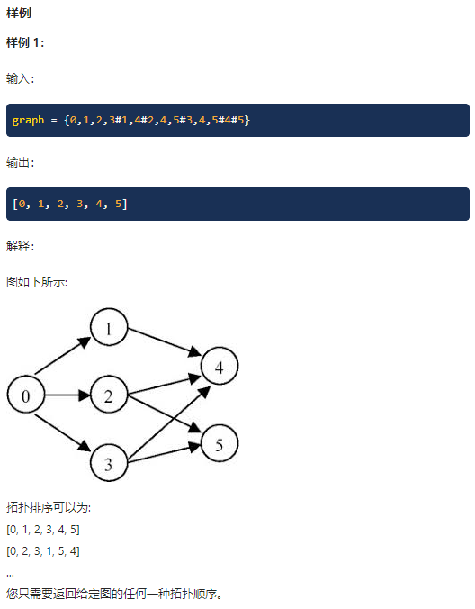
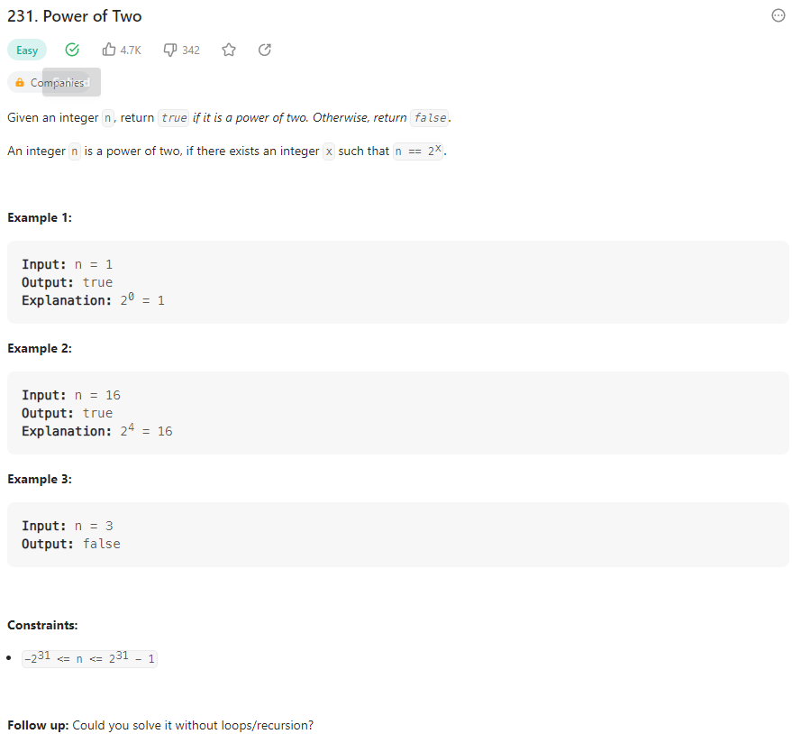
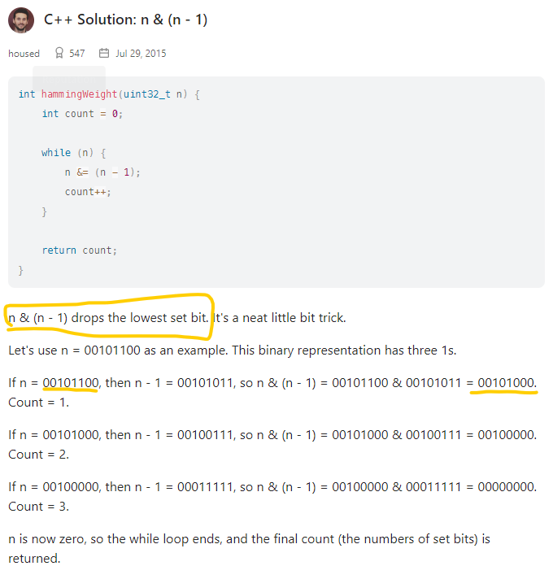
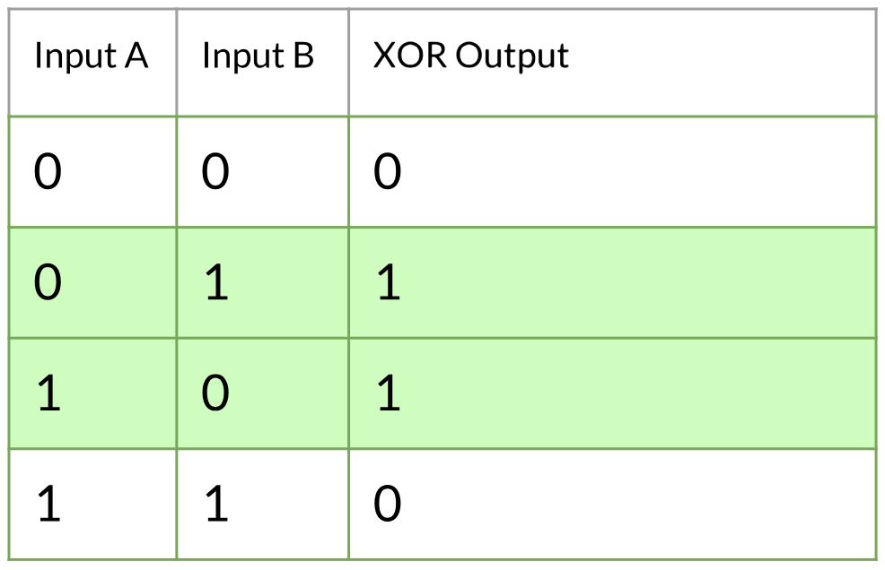
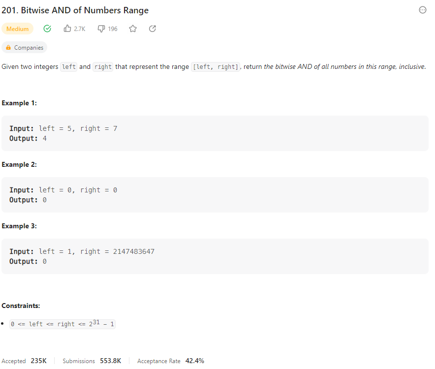
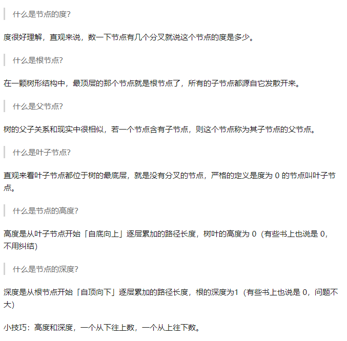
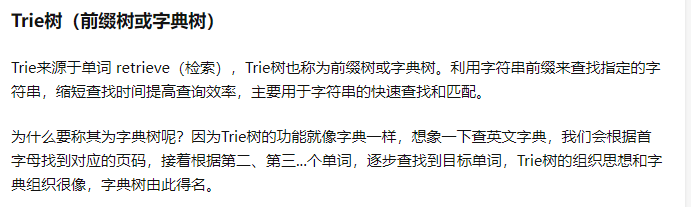
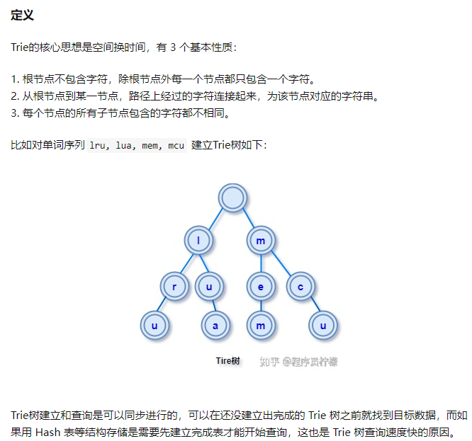

# Algorithm Note

## Binary Search

> Big O Notation and Time Complexity

- ```Time Complexity``` is a way of showing how the runtime of a function increases as the size of the input increases.

<p align="center">
  
</p>

<p align="center">
  
</p>

> For binary search

<p align="center">
  
</p>

<p align="center">
  
</p>

<p align="center">
  
</p>

- (8 / n), if ```n = 8```, ```T(n) = 2^3 * O(n) = O(log_2(n)) ```

<p align="center">
  
</p>

<p align="center">
  
</p>

- 也可以把```T(n)```想象成问题规模

- Quick sort， Merge sort -> ```O(nlogn)```

<p align="center">
  
</p>

<p align="center">
  
</p>

<p align="center">
  
</p>

1. ```start + 1 < end```

> We need it for stopping, for example, ```start = 0, end = 1```

> Then, we check ```vector[start]``` and ```vector[end]``` to see if they are the value we need.

2. ```start + (end - start) / 2```

<p align="center">
  
</p>

> If we use ```(start + end) / 2```, start + end might exceed the INT_MAX, result in negative value

```c++
class Solution {
public:
    int search(vector<int>& nums, int target) {
        int start {0};
        int end = nums.size() - 1;
        
        int result {-1};
        
        while(start + 1 < end) {
            int mid = start + (end - start) / 2;
            
            if (nums[mid] == target) {
                result = mid;
                break;
            } else if (nums[mid] > target)
                end = mid;
            else if (nums[mid] < target)
                start = mid;
        }
        
        if (nums[start] == target)
            result = start;
        if (nums[end] == target)
            result = end;
        
        return result;
    }
};
```

- [First Bad Version](https://leetcode.com/problems/first-bad-version/)

```c++
// The API isBadVersion is defined for you.
// bool isBadVersion(int version);

class Solution {
public:
    int firstBadVersion(int n) {
        if (n == 1)
            return n;

        int start {1};
        int end = {n};
        
        while(start + 1 < end) {
            int mid = start + (end - start) / 2;
            
            if (isBadVersion(mid))
                end = mid;
            else
                start = mid;
        }
        
        if (isBadVersion(start))
            return start;
        return end;
    }
};
```

- 动态数组实现方式 -》先有一个initial length -》不够的时候就double， 然后copy

<p align="center">
  
</p>

## Binary Tree & Divide Conquer

<p align="center">
  
</p>

> 理想高度 -> ```O(logn)（Balanced）``` -> 实际定义 h

> 最坏O(n)

<p align="center">
  
</p>

- Binary tree 寻找 -> O(1) -> if语句

<p align="center">
  
</p>

- 遍历

<p align="center">
  
</p>

> Inorder

```c++
/**
 * Definition for a binary tree node.
 * struct TreeNode {
 *     int val;
 *     TreeNode *left;
 *     TreeNode *right;
 *     TreeNode() : val(0), left(nullptr), right(nullptr) {}
 *     TreeNode(int x) : val(x), left(nullptr), right(nullptr) {}
 *     TreeNode(int x, TreeNode *left, TreeNode *right) : val(x), left(left), right(right) {}
 * };
 */
class Solution {
public:
    
    void traversal(TreeNode* root, vector<int>& result) {
        if (root == nullptr)
            return;
        
        traversal(root->left, result);
        result.push_back(root->val);
        traversal(root->right, result);
    }
    
    vector<int> inorderTraversal(TreeNode* root) {
        vector<int> result;
        
        traversal(root, result);
           
        return result;
    }
};
```

> Preorder

```c++
/**
 * Definition for a binary tree node.
 * struct TreeNode {
 *     int val;
 *     TreeNode *left;
 *     TreeNode *right;
 *     TreeNode() : val(0), left(nullptr), right(nullptr) {}
 *     TreeNode(int x) : val(x), left(nullptr), right(nullptr) {}
 *     TreeNode(int x, TreeNode *left, TreeNode *right) : val(x), left(left), right(right) {}
 * };
 */
class Solution {
public:
    void traversal(TreeNode* root, vector<int>& result) {
        if (root == nullptr)
            return;
        
        result.push_back(root->val);
        traversal(root->left, result);
        traversal(root->right, result);
    }
    
    vector<int> preorderTraversal(TreeNode* root) {
        vector<int> result;
        
        traversal(root, result);
           
        return result;
    }
};
```

- Non-recursion version

<p align="center">
  
</p>

<p align="center">
  
</p>

- Divide Conquer

<p align="center">
  
</p>

<p align="center">
  
</p>

<p align="center">
  
</p>

```c++
/**
 * Definition for a binary tree node.
 * struct TreeNode {
 *     int val;
 *     TreeNode *left;
 *     TreeNode *right;
 *     TreeNode() : val(0), left(nullptr), right(nullptr) {}
 *     TreeNode(int x) : val(x), left(nullptr), right(nullptr) {}
 *     TreeNode(int x, TreeNode *left, TreeNode *right) : val(x), left(left), right(right) {}
 * };
 */

int g_depth = std::numeric_limits<int>::min();

class Solution {
public:
    // Divide Conquer
    int maxDepthDivCon(TreeNode* root, int depth) {
        if (root == nullptr)
            return depth;
        
        int leftMax = maxDepthDivCon(root->left, depth + 1);
        int rightMax = maxDepthDivCon(root->right, depth + 1);
        
        return leftMax > rightMax ? leftMax : rightMax;
    }
    
    // Traverse
    void maxDepthTraverse(TreeNode* root, int depth) {
        if (root == nullptr) {
            g_depth = depth > g_depth ? depth : g_depth;
            return;
        }
        
        maxDepthTraverse(root->left, depth + 1);
        maxDepthTraverse(root->right, depth + 1);
    }
    
    int maxDepth(TreeNode* root) {
        // Divide Conquer
        //return maxDepthDivCon(root, 0);
        
        // Traverse
        maxDepthTraverse(root, 0);
        int result = g_depth;
        g_depth = std::numeric_limits<int>::min();
        return result;
    }
};
```

<p align="center">
  
</p>

```c++
class Solution {
public:
    void binaryTreePathsTraverse(TreeNode* root, string result, vector<string>& result_list) {
        if (root == nullptr)
            return;

        if (root->left == nullptr && root->right == nullptr) {
            result_list.push_back(result + to_string(root->val));
            return;
        }
        
        binaryTreePathsTraverse(root->left, result + to_string(root->val) + "->", result_list);
        binaryTreePathsTraverse(root->right, result + to_string(root->val) + "->", result_list);
    }
    
    vector<string> binaryTreePaths(TreeNode* root) {
        vector<string> to_return;
        
        binaryTreePathsTraverse(root, "", to_return);
        
        return to_return;
    }
};
```

> [Balanced Binary Tree](https://leetcode.com/problems/balanced-binary-tree/)

<p align="center">
  
</p>

```c++
class Solution {
public:
    pair<bool, int> isBalancedTraversal(TreeNode* root, int currentDepth) {
        if (root == nullptr)
            return {true, currentDepth - 1};
        
        auto leftSubDepth = isBalancedTraversal(root->left, currentDepth + 1);
        auto rightSubDepth = isBalancedTraversal(root->right, currentDepth + 1);
    
        if (abs(leftSubDepth.second - rightSubDepth.second) > 1 || !leftSubDepth.first || !rightSubDepth.first)
            return {false, 0};
        else
            return {true, max(leftSubDepth.second, rightSubDepth.second)};
    }

    bool isBalanced(TreeNode* root) {
        return isBalancedTraversal(root, 0).first;
    }
};
```

> [Construct Binary Tree from Preorder and Inorder Traversal](https://leetcode.com/problems/construct-binary-tree-from-preorder-and-inorder-traversal/description/)

<p align="center">
  
</p>

<p align="center">
  
</p>

- Preorder has the root hidden for the subtree in inorder array

```c++
class Solution {
public:
    void buildTreeRecu(TreeNode* currentRoot,
                       vector<int> leftSubTree,
                       vector<int> rightSubTree,
                       int preRootIndex,
                       vector<int>& preorder) {
        TreeNode* newLeftRoot = nullptr;
        TreeNode* newRightRoot = nullptr;

        // For the left subtree, preorder[preRootIndex] will always be the root,
        // need to find out where in the leftsubtree array the root is,
        // futher divide up the tree
        if (leftSubTree.size() > 0) {
            newLeftRoot = new TreeNode(preorder[preRootIndex]);

            currentRoot->left = newLeftRoot;

            int newLeftRootIndex = -1;
            for (int i = 0; i < leftSubTree.size(); i ++) {
                if (leftSubTree[i] == preorder[preRootIndex]) {
                    newLeftRootIndex = i;
                    break;
                }
            }

            if (newLeftRootIndex >= 0)
                buildTreeRecu(newLeftRoot, 
                    std::vector<int>(leftSubTree.begin(), leftSubTree.begin() + newLeftRootIndex),
                    std::vector<int>(leftSubTree.begin() + newLeftRootIndex + 1, leftSubTree.end()),
                    preRootIndex + 1,
                    preorder);
        }

        // For right subtree, preorder[preRootIndex + leftSubTree.size()] will always be the root
        if (rightSubTree.size() > 0 && preRootIndex + leftSubTree.size() < preorder.size()) {
            newRightRoot = new TreeNode(preorder[preRootIndex + leftSubTree.size()]);

            currentRoot->right = newRightRoot;

            int newRightRootIndex = -1;
            for (int i = 0; i < rightSubTree.size(); i ++) {
                if (rightSubTree[i] == preorder[preRootIndex + leftSubTree.size()]) {
                    newRightRootIndex = i;
                    break;
                }
            }

            if (newRightRootIndex >= 0)
                buildTreeRecu(newRightRoot, 
                    std::vector<int>(rightSubTree.begin(), rightSubTree.begin() + newRightRootIndex),
                    std::vector<int>(rightSubTree.begin() + newRightRootIndex + 1, rightSubTree.end()),
                    preRootIndex + leftSubTree.size() + 1,
                    preorder);
        }
    }

    TreeNode* buildTree(vector<int>& preorder, vector<int>& inorder) {
        TreeNode* root = new TreeNode(preorder[0]);

        int rootIndex = -1;
        for (int i = 0; i < inorder.size(); i ++) {
            if (inorder[i] == preorder[0]) {
                rootIndex = i;
                break;
            }
        }

        if (rootIndex >= 0)
            buildTreeRecu(root, 
                        std::vector<int>(inorder.begin(), inorder.begin() + rootIndex),
                        std::vector<int>(inorder.begin() + rootIndex + 1, inorder.end()),
                        1,
                        preorder);
        
        return root;
    }
};
```

- Binary Search Tree

<p align="center">
  
</p>

<p align="center">
  
</p>

> [Validate Binary Search Tree](https://leetcode.com/problems/validate-binary-search-tree/)

<p align="center">
  
</p>

- **Inorder traverse to get sorted array is not enough!!!**

```c++
class Solution {
public:
    // pair<long, long>
    // Max value, Min value
    pair<bool, pair<long, long>> isValidBSTDivCon(TreeNode* root) {
        if (root == nullptr)
            return {true, {numeric_limits<long>::min(), numeric_limits<long>::max()}};
        
        auto leftIsValid = isValidBSTDivCon(root->left);
        auto rightIsValid = isValidBSTDivCon(root->right);
        
        if (!leftIsValid.first || !rightIsValid.first)
            return {false, {0, 0}};
        else if (root->val > leftIsValid.second.first && root->val < rightIsValid.second.second) {
            return {true, {max(rightIsValid.second.first, static_cast<long>(root->val)), 
                           min(leftIsValid.second.second,  static_cast<long>(root->val))}};
        }
                    
        return {false, {0, 0}};
    }
    
    bool isValidBST(TreeNode* root) {
        return isValidBSTDivCon(root).first;
    }
};
```

- [Sorted Array to Balanced BST](https://www.geeksforgeeks.org/sorted-array-to-balanced-bst/)

<p align="center">
  
</p>

- [Convert a normal BST to Balanced BST](https://www.geeksforgeeks.org/convert-normal-bst-balanced-bst/)

<p align="center">
  
</p>

<p align="center">
  
</p>

```py
from math import log2

# The idea is to find the middle element of the array and make it the root of the tree,
# then perform the same operation on the left subarray for the root’s left child
# and the same operation on the right subarray for the root’s right child.
def constructBBST(nodeList, insertIndex, resultList, maxListLen):
    # Stop condition
    if insertIndex > maxListLen - 1 or len(nodeList) == 0:
        return

    midIndex = int(len(nodeList) / 2)
    midNode = nodeList[midIndex]
    # If the resultList has less element to hold the node, append -1 up to the index pos
    if insertIndex > len(resultList) - 1:
        for i in range(insertIndex - len(resultList) + 1):
            resultList.append(-1)
    resultList[insertIndex] = midNode

    # Left
    constructBBST(nodeList[0:midIndex], 2 * insertIndex + 1, resultList, maxListLen)
    # Right
    constructBBST(nodeList[midIndex + 1:len(nodeList)], 2 * insertIndex + 2, resultList, maxListLen)


def optbst(t):
    validNodesList = []
    resultList = []

    for node in t:
        if node != -1:
            validNodesList.append(node)

    # Find out maximum length for recursion stop condition
    validHeight = int(log2(len(validNodesList)))
    maxListLen = (2 ** (validHeight + 1)) - 1

    # Need to sort the list to use constructBBST
    validNodesList.sort()

    # Recursion construct BBST
    constructBBST(validNodesList, 0, resultList, maxListLen)

    return resultList
```

- [Unique Binary Search Trees II](https://leetcode.com/problems/unique-binary-search-trees-ii/description/)

<p align="center">
  
</p>

```c++
class Solution {
public:
    vector<TreeNode*> buildSubTreeDAC(int start, int end) {
        // start > end, means no elements available for the subtree construction
        // need to return size of one nullptr for base case to work (double for-loop)
        if (start > end)
            return {nullptr};

        vector<TreeNode*> result;
        // i here means the root element we select
        // anything before i should be in left sub tree
        // anything after i should be in right sub tree

        // Divide and conquerer
        for (int i = start; i <= end; ++ i) {
            auto leftSubTrees = buildSubTreeDAC(start, i - 1);
            auto rightSubTrees = buildSubTreeDAC(i + 1, end);

            // Because on base case we return {nullptr}, this will exe once
            for(int j = 0; j < leftSubTrees.size(); ++j) {
                for(int k = 0; k < rightSubTrees.size(); ++k) {
                    TreeNode* root = new TreeNode(i);
                    // Base case here, left and right are all nullptrs
                    root->left = leftSubTrees[j];
                    root->right = rightSubTrees[k];

                    result.push_back(root);
                }
            }
        }

        return result;
    }

    vector<TreeNode*> generateTrees(int n) {
        return buildSubTreeDAC(1, n);
    }
};
```

> [Sol](https://leetcode.com/problems/unique-binary-search-trees-ii/solutions/1849266/c-detailed-explanation-recursive-tree-with-comments/?orderBy=most_votes)

## Two Pointers

<p align="center">
  
</p>

<p align="center">
  
</p>

> Note that the ```vector<int> result``` is important here, we cannnot do the operation in one array to achieve O(n)

```c++
class Solution {
public:
    vector<int> sortedSquares(vector<int>& nums) {
        // For [-4,-1,0,3,10], positive number are alreay sorted
        // and its order will not change from squaring
        // we need to care about the negative number

        int left {0};
        int right {static_cast<int>(nums.size()) - 1};
        int resultPos = right;
        vector<int> result;
        result.resize(nums.size());

        // Use result as a container, maintain the record location of result
        // Move right and left pointer accordingly
        while(left <= right) {
            if (pow(nums[right], 2) > pow(nums[left], 2)) {
                result[resultPos] = pow(nums[right], 2);
                right --;
                resultPos --;
            } else {
                result[resultPos] = pow(nums[left], 2);
                left ++;
                resultPos--;
            }
        }

        // This method works only because nteger array nums sorted in non-decreasing order

        return result;
    }
};
```

- Three step rotation

<p align="center">
  
</p>

> ```kMod = k % nums.size()```

```c++
class Solution {
public:
    // Three step rotate
    // 1,2,3,4 | 5,6,7
    // 4,3,2,1 | 7,6,5
    // 5,6,7,1 | 2,3,4
    void rotate(vector<int>& nums, int k) {
        if (k == nums.size())
            return;
        
        int kMod = k % nums.size();
        int rotateMidPos{static_cast<int>(nums.size()) - kMod};
        
        // left rotate two pointer
        int leftRotateLeftPos{0};
        int leftRotateRightPos{rotateMidPos - 1};
        
        // right rotate two pointer
        int rightRotateLeftPos{rotateMidPos};
        int rightRotateRightPos{static_cast<int>(nums.size()) - 1};
        
        // mid rotate two pointer
        int midRotateLeftPos{0};
        int midRotateRightPos{static_cast<int>(nums.size()) - 1};
        
        while(leftRotateLeftPos < leftRotateRightPos) {
            auto temp = nums[leftRotateRightPos];
            nums[leftRotateRightPos] = nums[leftRotateLeftPos];
            nums[leftRotateLeftPos] = temp;
            
            leftRotateLeftPos ++;
            leftRotateRightPos --;
        }
        
        while(rightRotateLeftPos < rightRotateRightPos) {
            auto temp = nums[rightRotateRightPos];
            nums[rightRotateRightPos] = nums[rightRotateLeftPos];
            nums[rightRotateLeftPos] = temp;
            
            rightRotateLeftPos ++;
            rightRotateRightPos --;
        }
        
        while(midRotateLeftPos < midRotateRightPos) {
            auto temp = nums[midRotateRightPos];
            nums[midRotateRightPos] = nums[midRotateLeftPos];
            nums[midRotateLeftPos] = temp;
            
            midRotateLeftPos ++;
            midRotateRightPos --;
        }
    }
};
```

- Two sum O(n)

<p align="center">
  
</p>

> Sort + Two Pointer -> Sort : O(nlogn), Two Pointer O(n)

<p align="center">
  
</p>

<p align="center">
  
</p>

```c++
class Solution {
public:
    vector<int> twoSum(vector<int>& numbers, int target) {
        int pointerLeft {0};
        int pointerRight {static_cast<int>(numbers.size()) - 1};
        
        for (int i = 0; i < numbers.size(); i ++) {
            auto val = numbers[pointerLeft] + numbers[pointerRight];
            if (val > target)
                pointerRight --;
            else if (val == target)
                return {pointerLeft + 1, pointerRight + 1};
            else
                pointerLeft ++;
        }
        
        return {};
    }
};
```

<p align="center">
  
</p>

- Three sum O(n(n-1)) = O(n^2)

<p align="center">
  
</p>

```c++
class Solution {
public:
    /**
     * @param numbers: Give an array numbers of n integer
     * @return: Find all unique triplets in the array which gives the sum of zero.
     *          we will sort your return value in output
     */
    vector<vector<int>> threeSum(vector<int> &numbers) {
        vector<vector<int>> result;

        // Need to be sorted to use two pointer
        sort(numbers.begin(), numbers.end());

        for (int i = 0; i < numbers.size(); i ++) {
            // Avoid duplicate
            if (i != 0 && numbers[i] == numbers[i - 1])
                continue;

            auto twoSumResult = twoSum(numbers, i, -numbers[i]);

            if (twoSumResult.size() > 0) {
                for(auto j : twoSumResult) {
                    j.push_back(numbers[i]);
                    result.push_back(j);
                }
            }
        }

        return result;
    }

    vector<vector<int>> twoSum(vector<int> &numbers,
                               int ignoreIndex,
                               int target) {
        // Two sum starts at ignoreIndex, anything before are not needed
        int leftPos {ignoreIndex};
        int rightPos {static_cast<int>(numbers.size()) - 1};

        vector<vector<int>> result;

        while(leftPos < rightPos) {
            auto val = numbers[leftPos] + numbers[rightPos];
            if (val > target)
                rightPos --;
            else if (val < target)
                leftPos ++;
            else {
                result.push_back({numbers[leftPos], numbers[rightPos]});

                // Avoid duplicate
                auto resultLeft = numbers[leftPos];
                auto resultRight = numbers[rightPos];

                while (leftPos < rightPos && numbers[leftPos] == resultLeft) {
                    leftPos ++;
                }

                while (leftPos < rightPos && numbers[rightPos] == resultRight) {
                    rightPos --;
                }
            }
        }

        return result;
    }
};
```

- [Quick select](https://www.geeksforgeeks.org/quickselect-algorithm/)

<p align="center">
  
</p>

<p align="center">
  
</p>

```c++
class Solution {
public:
    int findKthLargest(vector<int>& nums, int k) {
        // Use n - k to find the smallest n - k element
        // -> k th largest element
        return partition(nums, 0, 
                         static_cast<int>(nums.size() - 1), 
                         static_cast<int>(nums.size() - k));
    }
    
    int partition(vector<int>& nums, int start, 
                   int end, int k) {
        int left = start, right = end;
        int pivot = nums[left + (right - left) / 2];
            
        cout << pivot << endl;

        // Need to consider = case
        // consider 3, 5, 6, 4
        // 5 as the pivot
        while(left <= right) {
            while (left <= right && nums[left] < pivot) {
                left ++;
            }
            
            while (left <= right && nums[right] > pivot) {
                right --;
            }
            
            if (left <= right) {
                auto temp = nums[right];
                nums[right] = nums[left];
                nums[left] = temp;
                
                left ++;
                right --;
            }
        }

        // Right's value is always greater than left by one
        // So. right -> left side,
        //     left  -> right side
        if (right >= k)
            return partition(nums, start, right, k);
        if (left <= k)
            return partition(nums, left, end, k);
        return nums[k];
    }
};
```
> Better Partition

```c++
// CPP program for implementation of QuickSelect
#include <bits/stdc++.h>
using namespace std;
  
// Standard partition process of QuickSort().
// It considers the last element as pivot
// and moves all smaller element to left of
// it and greater elements to right
int partition(int arr[], int l, int r)
{
    int x = arr[r], i = l;
    for (int j = l; j <= r - 1; j++) {
        if (arr[j] <= x) {
            swap(arr[i], arr[j]);
            i++;
        }
    }
    swap(arr[i], arr[r]);
    return i;
}
  
// This function returns k'th smallest 
// element in arr[l..r] using QuickSort 
// based method.  ASSUMPTION: ALL ELEMENTS
// IN ARR[] ARE DISTINCT
int kthSmallest(int arr[], int l, int r, int k)
{
    // If k is smaller than number of 
    // elements in array
    if (k > 0 && k <= r - l + 1) {
  
        // Partition the array around last 
        // element and get position of pivot 
        // element in sorted array
        int index = partition(arr, l, r);
  
        // If position is same as k
        if (index - l == k - 1)
            return arr[index];
  
        // If position is more, recur 
        // for left subarray
        if (index - l > k - 1) 
            return kthSmallest(arr, l, index - 1, k);
  
        // Else recur for right subarray
        return kthSmallest(arr, index + 1, r, 
                            k - index + l - 1);
    }
  
    // If k is more than number of 
    // elements in array
    return INT_MAX;
}
  
// Driver program to test above methods
int main()
{
    int arr[] = { 10, 4, 5, 8, 6, 11, 26 };
    int n = sizeof(arr) / sizeof(arr[0]);
    int k = 3;
    cout << "K-th smallest element is " 
        << kthSmallest(arr, 0, n - 1, k);
    return 0;
}
```

- Middle of the Linked List (Fast and Slow Pointer)

<p align="center">
  
</p>

```c++
class Solution {
public:
    ListNode* middleNode(ListNode* head) {
        ListNode* slow = head;
        ListNode* fast = head;
        while(fast->next != NULL){
            fast = fast->next;
            slow = slow->next;
            if(fast->next != NULL)
                fast = fast->next;
        }
        return slow;
    }
};
```

- Remove Nth Node From End of List

<p align="center">
  
</p>

```c++
/**
 * Definition for singly-linked list.
 * struct ListNode {
 *     int val;
 *     ListNode *next;
 *     ListNode() : val(0), next(nullptr) {}
 *     ListNode(int x) : val(x), next(nullptr) {}
 *     ListNode(int x, ListNode *next) : val(x), next(next) {}
 * };
 */
class Solution {
public:
    ListNode* removeNthFromEnd(ListNode* head, int n) {
        if (head->next == nullptr)
            return nullptr;
        
        // Tail
        ListNode* endPtr {nullptr};
        // Ptr to remove needed element
        ListNode* removePtr {nullptr};
        // Ptr to the element before the remove needed element
        ListNode* removePPtr {nullptr};
        int counter {0};
        
        endPtr = head;
        removePtr = head;
        removePPtr = head;
        
        // Move the removePtr once the counter hit the condition
        // Eventually, when the tail hits the end,
        // removePtr should be the nth element from the end of the list 
        while (endPtr->next != nullptr) {
            counter ++;
            
            endPtr = endPtr->next;
            if (counter >= n)
                removePtr = removePtr->next;
            if (counter > n)
                removePPtr = removePPtr->next;
        }
        
        // Corner case for [1,2] n = 2 (remove the head)
        if (counter < n)
            return head->next;
        
        removePtr = removePtr->next;
        removePPtr->next = removePtr;
        
        return head;
    }
};
```

- [Container With Most Water](https://leetcode.com/problems/container-with-most-water/description/?envType=study-plan&id=algorithm-ii)

<p align="center">
  
</p>

```c++
class Solution {
public:
    int maxArea(vector<int>& height) {
        int left {0};
        int right {static_cast<int>(height.size()) - 1};
        int result {0};

        // left - > 0
        // right -> size - 1
        // When left height is smaller than right height, to increase the area, we can only move left ++
        // When right height is smaller than left height, to increase the area , we can only move right --
        while(left != right) {
            result = max(result, (right - left) * min(height[left], height[right]));

            if (height[left] > height[right])
                right --;
            else
                left ++;
        }

        return result;
    }
};
```

> [Sort Colors](https://leetcode.com/problems/sort-colors/description/)

<p align="center">
  
</p>

- One pass with no extra space

```c++
class Solution {
public:
    void sortColors(vector<int>& nums) {
        int zeroP {0};
        int twoP {static_cast<int>(nums.size()) - 1};
        int currentP {0};

        // zeroP and currentP need to be updated since
        // zeroP means the first element non-zero
        while (zeroP < nums.size() && nums[zeroP] == 0) {
            ++ zeroP;
            ++ currentP;
        }

        while(currentP <= twoP) {
            // Swap to two pointer positions
            if (nums[currentP] == 2) {
                auto temp = nums[twoP];
                nums[twoP] = 2;
                nums[currentP] = temp;
                -- twoP;
                
                // Update positions only when temp = 1
                // or swaped value is zero and currentP == zeroP
                if (temp == 1 || (currentP == zeroP && temp == 0))
                    ++ currentP;
            } else if (nums[currentP] == 0) {
                auto temp = nums[zeroP];
                nums[zeroP] = 0;
                nums[currentP] = temp;
                ++ zeroP;
                
                if (temp == 1 || (currentP == zeroP && temp == 0))
                    ++ currentP;
            } else {
                // current value is one
                ++ currentP;
            }
        }
    }
};
```

> [Trapping Rain Water](https://leetcode.com/problems/trapping-rain-water/description/)

<p align="center">
  
</p>

<p align="center">
  
</p>

<p align="center">
  
</p>

- Two pointer solution is based on this method

<p align="center">
  
</p>

```c++
    int trap(vector<int>& height) {
        int left {0};
        int right {static_cast<int>(height.size()) - 1};
        int maxL {height[left]};
        int maxR {height[right]};

        int result {0};

        while(left <= right) {
            // Move the left pointer if maxL < maxR
            if (maxL < maxR) {
                // If the current maxL > height[left], add it to result
                if (maxL - height[left] > 0)
                    result = result + maxL - height[left];
                ++ left;

                // Update the maxL
                maxL = max(maxL, height[left - 1]);
            } else {
                if (maxR - height[right] > 0)
                    result = result + maxR - height[right];
                -- right;

                maxR = max(maxR, height[right + 1]);
            }
        }

        return result;
    }
```

- https://www.youtube.com/watch?v=ZI2z5pq0TqA&ab_channel=NeetCode

> [Best Time to Buy and Sell Stock](https://leetcode.com/problems/best-time-to-buy-and-sell-stock/description/)

<p align="center">
  
</p>

```c++
class Solution {
public:
    int maxProfit(vector<int>& prices) {
        if (prices.size() == 1)
            return 0;

        int minIndex{0};
        int maxIndex{1};
        int result {0};

        while(maxIndex < prices.size()) {
            if (prices[maxIndex] < prices[minIndex]) {
                minIndex = maxIndex;
            } else {
                result = max(result, prices[maxIndex] - prices[minIndex]);
            }

            ++ maxIndex;
        }

        return result;
    }
};
```

## **BFS - Breadth First Search - Queue**

<p align="center">
  
</p>

> Queue

<p align="center">
  
</p>

<p align="center">
  
</p>

- [Binary Tree Level Order Traversal](https://leetcode.com/problems/binary-tree-level-order-traversal/)

<p align="center">
  
</p>

```c++
/**
 * Definition for a binary tree node.
 * struct TreeNode {
 *     int val;
 *     TreeNode *left;
 *     TreeNode *right;
 *     TreeNode() : val(0), left(nullptr), right(nullptr) {}
 *     TreeNode(int x) : val(x), left(nullptr), right(nullptr) {}
 *     TreeNode(int x, TreeNode *left, TreeNode *right) : val(x), left(left), right(right) {}
 * };
 */
class Solution {
public:
    vector<vector<int>> levelOrder(TreeNode* root) {
        // Return for empty root
        if (!root)
            return {};
        
        // Result vec
        vector<vector<int>> result;
        // BFS Queuq
        queue<TreeNode*> bfsQueue;
        
        // Push root in as initial state
        bfsQueue.push(root);
        
        // Queque will deal with one level per loop,
        // it will pop out the level nodes in one loop,
        // and get the next level nodes in, when there are
        // no other nodes, kill the loop
        while(bfsQueue.size() != 0) {
            
            // Current level node result
            vector<int> levelVector {};
            
            // !!!!!!!!!!!!!!!!
            // Current leel size!!!!!
            // This is important to keep track of how many nodes per level!!!!!!
            // !!!!!!!!!!!!!!!!
            int currentLevelSize = bfsQueue.size();
            
            // Loop the current level,
            // Push in the next level node,
            // pop out the current level node 
            for (int i = 0; i < currentLevelSize; i ++) {
                auto currentNode = bfsQueue.front();
                
                levelVector.push_back(currentNode->val);
                
                bfsQueue.pop();
                
                if (currentNode->left)
                    bfsQueue.push(currentNode->left);
                if (currentNode->right)
                    bfsQueue.push(currentNode->right);
            }
            
            // Push level result in final result
            result.push_back(levelVector);
        }
        
        return result;
    }
};
```

- Serialization

<p align="center">
  
</p>

<p align="center">
  
</p>

<p align="center">
  
</p>

```c++
/**
 * Definition for a binary tree node.
 * struct TreeNode {
 *     int val;
 *     TreeNode *left;
 *     TreeNode *right;
 *     TreeNode(int x) : val(x), left(NULL), right(NULL) {}
 * };
 */
class Codec {
public:

    // Encodes a tree to a single string.
    // Assume null to be -1 in string
    string serialize(TreeNode* root) {
        if (!root)
            return {};
        
        string result;
        queue<TreeNode*> bfsQueue;
        
        bfsQueue.push(root);
        
        while(bfsQueue.size() > 0) {
            string currentLevel {};
            auto currentBFSLevelSize = bfsQueue.size();
            
            bool allNull {true};
            for (int i = 0; i < currentBFSLevelSize; i++) {
                auto queueFront = bfsQueue.front();
                
                if (!queueFront)
                    currentLevel = currentLevel + "-1_";
                else {
                    allNull = false;
                    
                    currentLevel = currentLevel + to_string(queueFront->val) + "_";
                        
                    if (queueFront->left != nullptr)
                        bfsQueue.push(queueFront->left);
                    else
                        bfsQueue.push(nullptr);

                    if (queueFront->right != nullptr)
                        bfsQueue.push(queueFront->right);
                    else
                        bfsQueue.push(nullptr);
                }

                bfsQueue.pop();
            }
            
            if (!allNull)
                result = result + currentLevel;
        }
        
        return result;
    }

    // Decodes your encoded data to tree.
    // Assume null to be -1 in string 
    TreeNode* deserialize(string data) {
        if (data.size() == 0)
            return nullptr;

        TreeNode* root = new TreeNode(-1);
        int stringDataIndex {0};
        int stringDataSubIndex {0};
        int stringMaxIndex {static_cast<int>(data.size() - 1)};
        queue<TreeNode*> bfsQueue;
        
        // Init
        while (data[stringDataIndex] != '_')
            stringDataIndex ++;
        root->val = stoi(data.substr(stringDataSubIndex, stringDataIndex - stringDataSubIndex));
        stringDataIndex ++;
        stringDataSubIndex = stringDataIndex;
        
        bfsQueue.push(root);
        
        while(bfsQueue.size() > 0) {
            auto currentLevelSize = bfsQueue.size();
            
            for (int i = 0; i < currentLevelSize; i ++) {
                auto currentItem = bfsQueue.front();
                bfsQueue.pop();

                if (stringDataIndex <= stringMaxIndex) {
                    if (data[stringDataIndex] == '-') {
                        currentItem->left = nullptr;
                        stringDataIndex = stringDataIndex + 3;
                        stringDataSubIndex = stringDataIndex;
                    } else {
                        while (data[stringDataIndex] != '_')
                            stringDataIndex ++;

                        if (data[stringDataIndex] == '_') {
                            TreeNode* item = new TreeNode(stoi(data.substr(stringDataSubIndex, 
                                                                           stringDataIndex - stringDataSubIndex)));
                            bfsQueue.push(item);
                            currentItem->left = item;
                            stringDataIndex = stringDataIndex + 1;
                            stringDataSubIndex = stringDataIndex;
                        }
                    }
                    
                    if (data[stringDataIndex] == '-') {
                        currentItem->right = nullptr;
                        stringDataIndex = stringDataIndex + 3;
                        stringDataSubIndex = stringDataIndex;
                    } else {
                        while (data[stringDataIndex] != '_')
                            stringDataIndex ++;

                        if (data[stringDataIndex] == '_') {
                            TreeNode* item = new TreeNode(stoi(data.substr(stringDataSubIndex, 
                                                                           stringDataIndex - stringDataSubIndex)));
                            bfsQueue.push(item);
                            currentItem->right = item;
                            stringDataIndex = stringDataIndex + 1;
                            stringDataSubIndex = stringDataIndex;
                        }
                    }
                }
            }
        }

        return root;
    }
};

// Your Codec object will be instantiated and called as such:
// Codec* ser = new Codec();
// Codec* deser = new Codec();
// string tree = ser->serialize(root);
// TreeNode* ans = deser->deserialize(tree);
// return ans;
```

<p align="center">
  
</p>

```c++
class Solution {
public:
    int maxAreaOfIsland(vector<vector<int>>& grid) {
        if (grid[0].size() <= 0)
            return 0;
        
        int result {0};
        vector<vector<bool>> islandIndexSet;
        queue<pair<int,int>> bfsQueue;
        
        // Set up map for iterated elements
        // Cannot use string set since string might collide
        islandIndexSet.resize(grid.size());
        for (int i = 0; i < grid.size(); i ++) {
            islandIndexSet[i].resize(grid[0].size());
            for (int j = 0; j < grid[0].size(); j ++) {
                islandIndexSet[i][j] = false;
            }
        }
        
        // Double for loop to go over the island
        for (int i = 0; i < grid.size(); i ++) {
            for (int j = 0; j < grid[0].size(); j ++) {
                
                // BFS on the island land that is not recorded
                if (grid[i][j] == 1 && islandIndexSet[i][j] == false) {
                    
                    int tempResult {1};
                    islandIndexSet[i][j] = true;
                    bfsQueue.push({i, j});
                    
                    // BFS here no need to record per level
                    while(bfsQueue.size() > 0) {
                        auto currentIndex = bfsQueue.front();
                        bfsQueue.pop();

                        // Top
                        if (currentIndex.first - 1 >= 0 &&
                            !islandIndexSet[currentIndex.first - 1][currentIndex.second] &&
                            grid[currentIndex.first - 1][currentIndex.second] == 1) {
                            tempResult ++;
                            
                            islandIndexSet[currentIndex.first - 1][currentIndex.second] = true;
                            bfsQueue.push({currentIndex.first - 1, currentIndex.second});
                        }
                        
                        // Bottom
                        if (currentIndex.first + 1 < grid.size() &&
                            !islandIndexSet[currentIndex.first + 1][currentIndex.second] &&
                            grid[currentIndex.first + 1][currentIndex.second] == 1) {
                            tempResult ++;
                            
                            islandIndexSet[currentIndex.first + 1][currentIndex.second] = true;
                            bfsQueue.push({currentIndex.first + 1, currentIndex.second});
                        }
                        
                        // Left
                        if (currentIndex.second - 1 >= 0 &&
                            ! islandIndexSet[currentIndex.first][currentIndex.second - 1] &&
                            grid[currentIndex.first][currentIndex.second - 1] == 1) {
                            tempResult ++;
                            
                            islandIndexSet[currentIndex.first][currentIndex.second - 1] = true;
                            bfsQueue.push({currentIndex.first, currentIndex.second - 1});
                        }
                        
                        // Right
                        if (currentIndex.second + 1 < grid[0].size() &&
                            !islandIndexSet[currentIndex.first][currentIndex.second + 1] &&
                            grid[currentIndex.first][currentIndex.second + 1] == 1) {
                            tempResult ++;
                            
                            islandIndexSet[currentIndex.first][currentIndex.second + 1] = true;
                            bfsQueue.push({currentIndex.first, currentIndex.second + 1});
                        }
                    }
                    
                    result = max(tempResult, result);
                }
            }
        }
        
        return result;
    }
};
```

- BFS in Graph

<p align="center">
  
</p>

> Record the node visited

<p align="center">
  
</p>

- Valid Tree

<p align="center">
  
</p>

> N vertices, N - 1 edges

> Vertices are connected

- Adjacency list

<p align="center">
  
</p>

- [Clone Graph](https://leetcode.com/problems/clone-graph/)

<p align="center">
  
</p>

```c++
/*
// Definition for a Node.
class Node {
public:
    int val;
    vector<Node*> neighbors;
    Node() {
        val = 0;
        neighbors = vector<Node*>();
    }
    Node(int _val) {
        val = _val;
        neighbors = vector<Node*>();
    }
    Node(int _val, vector<Node*> _neighbors) {
        val = _val;
        neighbors = _neighbors;
    }
};
*/

class Solution {
public:
    Node* cloneGraph(Node* node) {
        if (!node)
            return nullptr;
        
        // Root clone node
        Node* rootClone = new Node(node->val);
        // BFS queue for original graph
        queue<Node*> bfsQueueOG;
        // BFS queue for clone graph
        queue<Node*> bfsQueueCG;
        // Record visited node to avoid duplication in queue,
        // value will be the created clone node corresponded
        // to the key (int)
        map<int, Node*> visitedNodeCloneMap;
        
        // Init
        bfsQueueOG.push(node);
        bfsQueueCG.push(rootClone);
        visitedNodeCloneMap[node->val] = rootClone;
        
        while(bfsQueueOG.size() > 0) {
            auto currentNode = bfsQueueOG.front();
            auto currentCloneNode = bfsQueueCG.front();
            
            bfsQueueOG.pop();
            bfsQueueCG.pop();
            
            // Iterate neighbors
            for (auto i: currentNode->neighbors) {
                Node* neighborNode;
                
                // Check if the neighborNode is visited or not
                // so that we decided whether we need to
                // iterate its neighbors and clone the node
                if (visitedNodeCloneMap.find(i->val) == visitedNodeCloneMap.end()) {
                    // Clone if not cloned yet
                    neighborNode = new Node(i->val);
                    
                    // Next level
                    bfsQueueOG.push(i);
                    bfsQueueCG.push(neighborNode);
                    
                    visitedNodeCloneMap[i->val] = neighborNode;
                } else {
                    // If it is visited, then used the clone node in the map
                    neighborNode = visitedNodeCloneMap[i->val];
                }
                
                // Record neighbors in the clone node
                currentCloneNode->neighbors.push_back(neighborNode);
            }
        }

        return rootClone;
    }
};
```

<p align="center">
  
</p>

## Topological Sorting

<p align="center">
  
</p>

> 排的是拓扑序 - topo order - 依赖关系

> Directed graph

<p align="center">
  
</p>

> Indegree - 入度, the starting node of the topological order should have indegree zero

> Indegree zero means that no directed edge is **pointing to** the node -> no dependecies

> bfs until the node has zero ingegree, record in the list

<p align="center">
  
</p>

- Course Schedule

<p align="center">
  
</p>

```c++
class Solution {
public:
    bool canFinish(int numCourses, vector<vector<int>>& prerequisites) {
        if (prerequisites.size() == 0)
            return true;
        
        // Topological sorting
        
        // Indegree Map - key : course, value : indegree
        map<int, int> indegreeMap;
        // Queue bfs
        queue<int> bfsQueue;
        // Couse Taken set
        set<int> courseTakenSet;

        // Fill map with course
        for (int i = 0; i < numCourses; i ++) {
            indegreeMap[i] = 0;
        }
        
        // Record Indegree - all the pairs prerequisites[i] are unique.
        for (const auto& i : prerequisites) {
            indegreeMap[i[0]] = indegreeMap[i[0]] + 1;
        }
        
        // Fill bfsQueue and courseTakenSet with a node with indegree 0
        for (auto& i : indegreeMap) {
            if (i.second == 0) {
                bfsQueue.push(i.first);
                courseTakenSet.insert(i.first);
                break;
            }
        }

        // BFS loop
        while(bfsQueue.size() > 0) {
            auto currentCourse = bfsQueue.front();

            bfsQueue.pop();

            // Change the indegree map when the currentCourse is taken
            for (const auto& i : prerequisites) {
                if (i[1] == currentCourse)
                    indegreeMap[i[0]] = indegreeMap[i[0]] - 1;
            }

            // Put all indegree zero courses into the queue to loop
            for (auto& i : indegreeMap) {
                // Avoid duplication by usinfg set
                if (i.second == 0 && courseTakenSet.find(i.first) == courseTakenSet.end()) {
                    bfsQueue.push(i.first);
                    courseTakenSet.insert(i.first);
                }
            }
        }

        // Final check to see if all indegree is zero
        bool allCourseCouldBeTaken {true};
        for (auto& i : indegreeMap) {
            if (i.second != 0)
                allCourseCouldBeTaken = false;
        }

        return allCourseCouldBeTaken;
    }
};
```

<p align="center">
  
</p>

```c++
class Solution {
public:
    int ladderLength(string beginWord, string endWord, vector<string>& wordList) {
        // Use HashSet to reduce the search cost
        bool endWordIn {false};
        set<string> wordListSet;
        
        // Return if the endWord is not in the wordList
        for (auto& i :wordList) {
            if (i == endWord) {
                endWordIn = true;
            }
            wordListSet.insert(i);
        }
        
        if (!endWordIn)
            return 0;
        
        // Actual BFS
        int result {1};
        queue<string> bfsSearchQueue;
        set<string> onceInList;
        
        // Init
        bfsSearchQueue.push(beginWord);
        onceInList.insert(beginWord);
        
        // BFS Loop
        while(bfsSearchQueue.size() > 0) {
            auto currentLevelSize = bfsSearchQueue.size();
            
            // Level loop
            for(int i = 0; i < currentLevelSize; i ++) {
                auto currentString = bfsSearchQueue.front();
                
                bfsSearchQueue.pop();
                
                // String change char loop
                for (int currentCharIndex = 0; currentCharIndex < currentString.size(); currentCharIndex++) {
                    
                    // 97 -> 'a'
                    // 26 char loop
                    for (int asciiChar = 97; asciiChar <= 122; asciiChar ++) {
                        // Same char, continue
                        if (static_cast<char>(asciiChar) == currentString[currentCharIndex])
                            continue;
                        
                        auto modifiedString = currentString;
                        modifiedString[currentCharIndex] = static_cast<char>(asciiChar);
                        
                        // Visited, then continue, reduce redudant string
                        if (onceInList.find(modifiedString) != onceInList.end())
                            continue;
                        // Return if mutated string is the endWord
                        if (modifiedString == endWord)
                            return result + 1;
                        
                        // Check if it is in the wordListSet
                        if (wordListSet.find(modifiedString) != wordListSet.end()) {
                            bfsSearchQueue.push(modifiedString);
                            onceInList.insert(modifiedString);
                        }
                    }
                }
            }
            
            result ++;
        }
        
        return 0;
    }
};
```

- [01 Matrix](https://leetcode.com/problems/01-matrix/description/)

<p align="center">
  
</p>

```c++
class Solution {
public:
    vector<vector<int>> updateMatrix(vector<vector<int>>& mat) {
        vector<vector<int>> result(mat.size(), vector(mat[0].size(), numeric_limits<int>::max()));

        queue<pair<int, int>> bfsQueue;

        // We use bfs starting from zero to reach one so that
        // we do not need to have a bfs for each "one"
        // result map would be filled with zero and int max value

        // Starting from zero, bfsQueue will only push only if its nearby items have a val
        // larger than the currentVal + 1

        // For example, currentVal = 0, if its nearby items hold all int_max, then,
        // their value would be replaced by currentVal + 1, and their index are going to be push
        // into the queue as the new "zeros"

        // if currentVal = 2, it means it is coming from the "new zeros", we do the same iteration
        // Finally, it will make sure that all values contain the min distance to zero
        for (int i = 0; i < mat.size(); ++i) {
            for (int j = 0; j < mat[i].size(); ++j) {
                if (mat[i][j] == 0) {
                    result[i][j] = 0;
                    bfsQueue.push({i, j});
                }
            }
        }

        while(bfsQueue.size() > 0) {
            auto currentZeroPair = bfsQueue.front();
            bfsQueue.pop();

            auto currentVal = result[currentZeroPair.first][currentZeroPair.second];
            // Top
            if (currentZeroPair.first - 1 >= 0) {
                auto val = result[currentZeroPair.first - 1][currentZeroPair.second];
                if (currentVal + 1 < val) {
                    bfsQueue.push({currentZeroPair.first - 1, currentZeroPair.second});
                    result[currentZeroPair.first - 1][currentZeroPair.second] = min(val, currentVal + 1);
                }
            }

            // Bottom
            if (currentZeroPair.first + 1 < result.size()) {
                auto val = result[currentZeroPair.first + 1][currentZeroPair.second];
                if (currentVal + 1 < val) {
                    bfsQueue.push({currentZeroPair.first + 1, currentZeroPair.second});
                    result[currentZeroPair.first + 1][currentZeroPair.second] = min(val, currentVal + 1);
                }
            }

            // Left
            if (currentZeroPair.second - 1 >= 0) {
                auto val = result[currentZeroPair.first][currentZeroPair.second - 1];
                if (currentVal + 1 < val) {
                    bfsQueue.push({currentZeroPair.first, currentZeroPair.second - 1});
                    result[currentZeroPair.first][currentZeroPair.second - 1] = min(val, currentVal + 1);
                }
            }

            // Rght
            if (currentZeroPair.second + 1 < result[0].size()) {
                auto val = result[currentZeroPair.first][currentZeroPair.second + 1];
                if (currentVal + 1 < val) {
                    bfsQueue.push({currentZeroPair.first, currentZeroPair.second + 1});
                    result[currentZeroPair.first][currentZeroPair.second + 1] = min(val, currentVal + 1);
                }
            }
        }

        return result;
    }
};
```

> [Network Delay Time](https://leetcode.com/problems/network-delay-time/description/)

<p align="center">
  
</p>

```c++
class Solution {
public:
    int networkDelayTime(vector<vector<int>>& times, int n, int k) {
        // Both adj list and bfsQueue will store time
        // Adj list store time to reach the neigbour node
        // bfsQueue store the time spend to reach the node
        vector<vector<pair<int, int>>> adjWithTimeList (n, vector<pair<int, int>>());
        // This array is also important to store all min time to reach different node
        // if there are uninitialized value, return -1
        vector<int> timeArrival (n, numeric_limits<int>::max());
        queue<pair<int, int>> bfsQueueWithCurrentNodeTime;

        for(auto& node: times) {
            adjWithTimeList[node[0] - 1].push_back({node[1] - 1, node[2]});
        }
        
        bfsQueueWithCurrentNodeTime.push({k - 1, 0});
        timeArrival[k - 1] = 0;

        int result {numeric_limits<int>::min()};
        while(bfsQueueWithCurrentNodeTime.size() > 0) {
            auto currentPair = bfsQueueWithCurrentNodeTime.front();

            bfsQueueWithCurrentNodeTime.pop();

            // No need to check repeated node since "if" check for us
            for (auto& adjNode: adjWithTimeList[currentPair.first]) {
                if (timeArrival[adjNode.first] > currentPair.second + adjNode.second) {
                    timeArrival[adjNode.first] = currentPair.second + adjNode.second;
                    bfsQueueWithCurrentNodeTime.push({adjNode.first, timeArrival[adjNode.first]});
                }
            }
        }

        for (auto& time: timeArrival) {
            if (time == numeric_limits<int>::max())
                return -1;
            result = max(result, time);
        }
        return result;
    }
};
```

## DFS (Depth First Search)

<p align="center">
  
</p>

<p align="center">
  
</p>

> [Minimum Time to Collect All Apples in a Tree](https://leetcode.com/problems/minimum-time-to-collect-all-apples-in-a-tree/description/)

<p align="center">
  
</p>

```c++
class Solution {
public:
    void dfsRecu(unordered_set<int>& nodeInThePath,
                 unordered_set<int> currentPath,
                 int currentIndex,
                 vector<bool>& hasApple,
                 vector<vector<int>>& adj) {
        if (hasApple[currentIndex]) {
            for (auto& item: currentPath)
                nodeInThePath.insert(item);
        }
        
        for(int i = 0; i < adj[currentIndex].size(); ++i) {
            if (currentPath.find(adj[currentIndex][i]) == nodeInThePath.end()) {
                currentPath.insert(adj[currentIndex][i]);
                dfsRecu(nodeInThePath, currentPath, adj[currentIndex][i], hasApple, adj);
                currentPath.erase(adj[currentIndex][i]);
            }
        }
    }

    int minTime(int n, vector<vector<int>>& edges, vector<bool>& hasApple) {
        unordered_set<int> nodeInThePath;
        nodeInThePath.insert(0);

        vector<vector<int>> adj(n);

        for (auto& edge: edges) {
            adj[edge[0]].push_back(edge[1]);
            adj[edge[1]].push_back(edge[0]);
        }

        dfsRecu(nodeInThePath, {0}, 0, hasApple, adj);

        return (nodeInThePath.size() - 1) * 2;
    }
};
```

- Combination

<p align="center">
  
</p>

<p align="center">
  
</p>

<p align="center">
  
</p>

<p align="center">
  
</p>

```c++
class Solution {
public:
    // DFS recursiom
    // currentCom record the current comnination item
    //
    // startIndex indicates that the loop should start
    // from the current loop element to avoid duplication
    //
    // depth means the k callstack
    void findCombination(vector<int> currentCom,
                         int n,
                         int k,
                         int startIndex,
                         int depth,
                         vector<vector<int>>& result){
        // Stop Condition
        if (depth == k)
            return;
        
        for (int i = startIndex; i <= n; i ++) {
            currentCom.push_back(i);

            if (currentCom.size() == k)
                result.push_back(currentCom);

            findCombination(currentCom, n, k, i + 1, depth + 1, result);

            currentCom.erase(currentCom.end() - 1);
        }
    }
    
    vector<vector<int>> combine(int n, int k) {
        vector<vector<int>> result;
        
        // DFS
        findCombination({}, n, k, 1, 0, result);
        
        return result;
    }
};
```
- Combination Sum

<p align="center">
  
</p>

```c++
class Solution {
public:
    void combinationSumDFS(int sum,
                           int target,
                           int startingIndex,
                           vector<int> currentCom,
                           const vector<int>& candidates,
                           vector<vector<int>>& result) {
        // Stop condition
        // This is needed instead of directly return from if (currentSum == target)
        // Since if target == 8, 4,4 -> still need 4, 2, 2
        if (sum >= target)
            return;
        
        for (int i = startingIndex; i < candidates.size(); i++) {
            auto currentSum = sum + candidates[i];
            
            // Larger -> continue the loop
            if (currentSum > target)
                continue;
            
            // Not, larger common code for other case
            sum = currentSum;
            currentCom.push_back(candidates[i]);
            
            // Record when equal
            if (currentSum == target)
                result.push_back(currentCom);
            
            // DFS call
            combinationSumDFS(sum, target, i, currentCom,
                              candidates, result);
            
            // Trace back
            currentCom.pop_back();
            sum = sum - candidates[i];
        }
    }
    
    vector<vector<int>> combinationSum(vector<int>& candidates, int target) {
        vector<vector<int>> result;
        
        combinationSumDFS(0, target, 0, {}, candidates, result);
        
        return result;
    }
};
```

<p align="center">
  
</p>

- How to avoid duplicate -> e.g. [1, 1, 1, 1, 2], target 4 -> avoid 1',1''',1''''2 and 1'',1''',1'''' 2

```c++
    // Sort the candidate, so that [1, 1, 1, 2], target 4
    // 1', and 1'', and 1''' can be distinguished
    sort(candidates.begin(), candidates.end());
    
    void combinationSumDFS(int sum,
                           int target,
                           int startingIndex,
                           vector<int> currentCom,
                           const vector<int>& candidates,
                           vector<vector<int>>& result) {
        // Stop condition
        // This is needed instead of directly return from if (currentSum == target)
        // Since if target == 8, 4,4 -> still need 4, 2, 2
        if (sum >= target)
            return;
        
        for (int i = startingIndex; i < candidates.size(); i++) {
            // [1, 1, 1, 2], target 4
            // 1', and 1'', and 1''' can be distinguished
            // check if 1'' == 1'
            // and i != startingIndex means the second for loop
            // 1', 1'', 1''' will be taken in DFS,
            // Avoid 1',1'',1''' in the second for (non dfs) loop
            if (i != startingIndex && candidates[i] == candidates[i - 1])
                continue;
            
            auto currentSum = sum + candidates[i];
            
            // Larger -> continue the loop
            if (currentSum > target)
                continue;
            
            // Not, larger common code for other case
            sum = currentSum;
            currentCom.push_back(candidates[i]);
            
            // Record when equal
            if (currentSum == target)
                result.push_back(currentCom);
            
            // DFS call
            combinationSumDFS(sum, target, i + 1, currentCom,
                              candidates, result);
            
            // Trace back
            currentCom.pop_back();
            sum = sum - candidates[i];
        }
    }
```

- Good recursion example

<p align="center">
  
</p>

```c++
class Solution {
public:
    void recurHelper(
        int depth,
        int index,
        const string& s,
        string currentS,
        vector<string>& result) {
        
        if(depth == s.size()) {
            result.push_back(currentS);
            return;
        }
        
        int asciiNum = static_cast<int>(s[index]);
        
        // Upper case
        if (asciiNum >= 65 && asciiNum <= 90) {
            recurHelper(depth + 1, index + 1, s, currentS + static_cast<char>(asciiNum + 32), result);
        } else if (asciiNum >= 97 && asciiNum <= 122) {
            recurHelper(depth + 1, index + 1, s, currentS + static_cast<char>(asciiNum - 32), result);
        }
        
        recurHelper(depth + 1, index + 1, s, currentS + static_cast<char>(asciiNum), result);
    }
    
    vector<string> letterCasePermutation(string s) {
        vector<string> result;
        
        recurHelper(0, 0, s, {}, result);
        
        return result;
    }
};
```

> https://leetcode.com/problems/reverse-linked-list/

<p align="center">
  
</p>

- Permutation

<p align="center">
  
</p>

<p align="center">
  
</p>

```c++
class Solution {
public:
    void permuteRecu(vector<int> currentItem, 
                     vector<int>& nums, vector<vector<int>>& result,
                    int depth) {
        if (depth == nums.size())
            return;
        
        for(int i = 0; i < nums.size(); i ++) {
            auto it = find (currentItem.begin(), currentItem.end(), nums[i]);
            if (it == currentItem.end()) {
                currentItem.push_back(nums[i]);
                if (currentItem.size() == nums.size()) {
                    result.push_back(currentItem);
                    break;
                }
                
                permuteRecu(currentItem, nums, result, depth + 1);
            
                currentItem.pop_back();
            }
        }
    }
    
    vector<vector<int>> permute(vector<int>& nums) {
        vector<vector<int>> result;
        
        permuteRecu({}, nums, result, 0);
        
        return result;
    }
};
```

- Permutation II (remove duplicate)

<p align="center">
  
</p>

```c++
class Solution {
public:
    void findPermuteUnique(int depth,
                           vector<int> currentItem,
                           vector<int>& nums,
                           vector<vector<int>>& result,
                           vector<bool>& visited) {
        if (currentItem.size() == nums.size()) {
            result.push_back(currentItem);
            return;
        }
        
        for (int i = 0; i < nums.size(); i ++) {
            // Remove duplicate
            //[1`, 1``, 2]
            // 1` -> 1`,1` (1 ` visited, continue) -> 1`, 1``, (visited[i - 1] == 1) recorded
            // 1`` -> 1``, 1`, visited[i - 1] == 0, continue
            if (i != 0 && nums[i] == nums[i - 1] && visited[i - 1] == 0) {
                continue;
            }
            
            if (!visited[i]) {
                currentItem.push_back(nums[i]);
                visited[i] = true;

                findPermuteUnique(depth + 1, currentItem, nums, result, visited);

                currentItem.pop_back();
                visited[i] = false;
            }
        }
    }
    
    vector<vector<int>> permuteUnique(vector<int>& nums) {
        vector<vector<int>> result;
        vector<bool> visited (nums.size(), false);
        
        sort(nums.begin(), nums.end());
        
        findPermuteUnique(0, {}, nums, result, visited);
        
        return result;
    }
};
```

- N queen

<p align="center">
  
</p>

```c++
class Solution {
public:
    vector<vector<string>> ret;
    bool is_valid(vector<string> &board, int row, int col){
        // check col
        for(int i=row;i>=0;--i)
            if(board[i][col] == 'Q') return false;
        // check left diagonal
        for(int i=row,j=col;i>=0&&j>=0;--i,--j)
            if(board[i][j] == 'Q') return false;
        //check right diagonal
        for(int i=row,j=col;i>=0&&j<board.size();--i,++j)
            if(board[i][j] == 'Q') return false;
        return true;
    }
    void dfs(vector<string> &board, int row){
        // exit condition
        if(row == board.size()){
            ret.push_back(board);
            return;
        }
        // iterate every possible position
        for(int i=0;i<board.size();++i){
            if(is_valid(board,row,i)){
                // make decision
                board[row][i] = 'Q';
                // next iteration
                dfs(board,row+1);
                // back-tracking
                board[row][i] = '.';
            }
        }
    }
    vector<vector<string>> solveNQueens(int n) {
		// return empty if n <= 0
        if(n <= 0) return {{}};
        vector<string> board(n,string(n,'.'));
        dfs(board,0);
        return ret;
    }
};
```

<p align="center">
  
</p>

> ```Hashmap or HashSet find string -> O(L)```

- [Word Ladder II](https://www.jiuzhang.com/solutions/word-ladder-ii)

- Subset II (Find the representitive -> need sorted)

<p align="center">
  
</p>

```c++
class Solution {
public:
    void findSubset(int currentIndex,
                    vector<int> currentItem,
                    const vector<int>& nums,
                    vector<vector<int>>& result) {
        for (int i = currentIndex; i < nums.size(); i ++) {
            // Find the representitive
            // i != currentIndex means [1 ,2` ,2``, 2```] -> [1, 2`, 2```] -> second iteration of [1, 2`] loop
            // nums[i] == nums[i - 1] to remove the duplicate
            if (i != currentIndex && nums[i] == nums[i - 1])
                continue;
            
            currentItem.push_back(nums[i]);
            result.push_back(currentItem);

            findSubset(i + 1, currentItem, nums, result);

            currentItem.pop_back();
        }
    }
    
    vector<vector<int>> subsetsWithDup(vector<int>& nums) {
        vector<vector<int>> result;
        result.push_back({});
        
        // Find the representitive method has to be sorted
        sort(nums.begin(), nums.end());
        
        findSubset(0, {}, nums, result);
        
        return result;
    }
};
```

- [Generate Parentheses](https://leetcode.com/problems/generate-parentheses/description/)

<p align="center">
  
</p>

```c++
class Solution {
public:
    void generateParenthesisDFS(int n,
                                int currentDepth,
                                string currentItem,
                                int lef,
                                int rig,
                                vector<string>& result) {
        // Lef means the number of "("
        // Rig means the number of  ")"
        // lef + rig is the final depth of the call stack (n * 2)
        if (currentDepth == n * 2) {
            result.push_back(currentItem);
            return;
        }

        // First add "(" will make sure that ")" always happens after "("
        // The number of "(" is by max n
        // The number of ")" should be smaller than lef (not n since we need to have lef first)
        if (lef < n)
            generateParenthesisDFS(n, currentDepth + 1, currentItem + "(", lef + 1, rig, result);

        if (rig < lef)
            generateParenthesisDFS(n, currentDepth + 1, currentItem + ")", lef, rig + 1, result);
    }

    vector<string> generateParenthesis(int n) {
        vector<string> result;

        generateParenthesisDFS(n, 0, {}, 0, 0, result);

        return result;
    }
};
```

## DFS + BFS

> [All Nodes Distance K in Binary Tree](https://leetcode.com/problems/all-nodes-distance-k-in-binary-tree/)

<p align="center">
  
</p>

- DFS to find adjList, BFS level order traversal

```c++
/**
 * Definition for a binary tree node.
 * struct TreeNode {
 *     int val;
 *     TreeNode *left;
 *     TreeNode *right;
 *     TreeNode(int x) : val(x), left(NULL), right(NULL) {}
 * };
 */
class Solution {
public:
    void dfsAdjConstruct(TreeNode* root, unordered_map<int, vector<int>>& adjList){
        if (!root)
            return;

        if (root->left) {
            adjList[root->val].push_back(root->left->val);
            adjList[root->left->val].push_back(root->val);
            dfsAdjConstruct(root->left, adjList);
        }

        if (root->right) {
            adjList[root->val].push_back(root->right->val);
            adjList[root->right->val].push_back(root->val);
            dfsAdjConstruct(root->right, adjList);
        }
    }

    vector<int> distanceK(TreeNode* root, TreeNode* target, int k) {
        // Covert to adj list (dfs) and bfs on the target node
        unordered_map<int, vector<int>> adjList;
        vector<int> result;
        
        // Unique set to prevent adding duplicated into the queue
        unordered_set<int> uniqueNodeSet;

        dfsAdjConstruct(root, adjList);

        queue<int> bfsQueue;
        bfsQueue.push(target->val);
        uniqueNodeSet.insert(target->val);

        int distance{0};
        while(bfsQueue.size() > 0 && distance < k) {
            auto currentLevelSize = bfsQueue.size();
            
            for(int i = 0; i < currentLevelSize; ++ i) {
                auto currentItem = bfsQueue.front();

                bfsQueue.pop();

                for(auto& node: adjList[currentItem]) {
                    if (uniqueNodeSet.find(node) == uniqueNodeSet.end()) {
                        bfsQueue.push(node);
                        uniqueNodeSet.insert(node);
                    }
                }
            }
            
            ++ distance;
        }
        
        // Now the queue stops at kth level
        // Extract the result
        while(bfsQueue.size() > 0) {
            result.push_back(bfsQueue.front());
            bfsQueue.pop();
        }
        
        return result;
    }
};
```

> [Number of Nodes in the Sub-Tree With the Same Label](https://leetcode.com/problems/number-of-nodes-in-the-sub-tree-with-the-same-label/description/)

<p align="center">
  
</p>

```c++
class Solution {
public:
    // Cannot use string since too big, vector is quick enough

    // We go through all the connected unvisited node for the currentNode,
    // merge all of its char counting vectors and record in result
    vector<int> dfs(vector<vector<int>>& adjList, 
                                 unordered_set<int>& visitedNode,
                                 int currentNode,
                                 vector<int>& result,
                                 string& labels){
        
        vector<int> countMap (26,0);
        ++ countMap[static_cast<int>(labels[currentNode]) - 97];

        visitedNode.insert(currentNode);
        for (auto& node: adjList[currentNode]) {
            if (visitedNode.find(node) == visitedNode.end()) {
                visitedNode.insert(node);
                auto countMapRe = dfs(adjList, visitedNode, node, result, labels);
                for (int i = 0; i < countMapRe.size(); ++i)
                    countMap[i] = countMap[i] + countMapRe[i];
            }
        }

        result[currentNode] = countMap[static_cast<int>(labels[currentNode]) - 97];
        
        return countMap;
    }

    vector<int> countSubTrees(int n, vector<vector<int>>& edges, string labels) {
        vector<int> result (n, 0);
        vector<vector<int>> adjList(n, vector<int>(0));
        unordered_set<int> visitedNode;

        // Construct adj
        for(auto& edge: edges) {
            adjList[edge[0]].push_back(edge[1]);
            adjList[edge[1]].push_back(edge[0]);
        }           

        dfs(adjList, visitedNode, 0, result, labels);
        return result;
    }
};
```

## Hash and Heap

### Hash

- Hash function

<p align="center">
  
</p>

<p align="center">
  
</p>

- Open hashing vs Closed hashing

<p align="center">
  
</p>

> Closed hashing - collision -> take other cell

> Open hashing - collision -> take the same cell (**linked list**)

> **Open hasing is generally better**

<p align="center">
  
</p>

> After rehashing, the computed hash value from hash funtion might change, we need to rehash all elements again

- Least Recently Used (LRU Cache, the timing be used is the longest) 

> (Least Frequently Used is the number of times being used is the smallest)

<p align="center">
  
</p>

<p align="center">
  
</p>

> C++ ```std::list```

- ```std::list``` is a container that supports constant time insertion and removal of elements from anywhere in the container. Fast random access is not supported. It is usually implemented as a ***doubly-linked list***.

- ***Iterators*** are used to **point at the memory addresses** of STL containers.

<p align="center">
  
</p>

<p align="center">
  
</p>

- **The following solution works since ```list<int>::iterator``` remain functional when element around it changes**

```c++
class LRUCache {
public:
    int m_capacity;
    list<int> m_keyLRUList;
    unordered_map<int, pair<int, list<int>::iterator>> m_keyValueIterMap;

    LRUCache(int capacity) {
        m_capacity = capacity;
        m_keyLRUList.clear();
        m_keyValueIterMap.clear();
    }
    
    int get(int key) {
        if (m_keyValueIterMap.find(key) != m_keyValueIterMap.end()) {
            m_keyLRUList.erase(m_keyValueIterMap[key].second);
            m_keyLRUList.push_back(key);

            m_keyValueIterMap[key].second = -- m_keyLRUList.end();

            return m_keyValueIterMap[key].first;
        }

        return -1;
    }
    
    void put(int key, int value) {
        if (m_capacity == 0)
            return;

        if (m_keyValueIterMap.find(key) == m_keyValueIterMap.end()) {
            if (m_capacity == m_keyLRUList.size()) {
                int lruKey = m_keyLRUList.front();
                m_keyLRUList.pop_front();
                m_keyValueIterMap.erase(lruKey);
            }
            m_keyLRUList.push_back(key);
            m_keyValueIterMap[key] = {value, -- m_keyLRUList.end()};
        } else {
            m_keyLRUList.erase(m_keyValueIterMap[key].second);
            m_keyLRUList.push_back(key);

            m_keyValueIterMap[key] = {value, -- m_keyLRUList.end()};
        }
    }
};

/**
 * Your LRUCache object will be instantiated and called as such:
 * LRUCache* obj = new LRUCache(capacity);
 * int param_1 = obj->get(key);
 * obj->put(key,value);
 */
```

> [LFU Cache](https://leetcode.com/problems/lfu-cache/description/)

<p align="center">
  
</p>

<p align="center">
  
</p>

```c++
struct LFUCacheNode{
    int value;
    list<int>::iterator iter;
    int frequency;
};

class LFUCache {
public:
    int m_capacity;
    int m_size;
    int m_lowestFre;
    // Map storing key and its value, iter in the coorsponding frequency list, and frequency
    unordered_map<int, LFUCacheNode> m_keyNodeMap;
    // Map to store frequency and its list of keys in LRU order (front is LRU)
    unordered_map<int, list<int>> m_frequencyKeyListMap;

    LFUCache(int capacity) {
        m_capacity = capacity;
        m_size = 0;
        m_lowestFre = 0;
        m_keyNodeMap.clear();
        m_frequencyKeyListMap.clear();
    }
    
    int get(int key) {
        if (m_keyNodeMap.find(key) != m_keyNodeMap.end()) {
            int newFre = m_keyNodeMap[key].frequency + 1;
            if (m_lowestFre == m_keyNodeMap[key].frequency && m_frequencyKeyListMap[m_lowestFre].size() == 1)
                m_lowestFre = newFre;
            
            // Erase old frequecy storage for key
            m_frequencyKeyListMap[m_keyNodeMap[key].frequency].erase(m_keyNodeMap[key].iter);
            // Add the key to new frequency list
            m_frequencyKeyListMap[newFre].push_back(key);

            // Update info
            m_keyNodeMap[key].frequency = newFre;
            m_keyNodeMap[key].iter = --  m_frequencyKeyListMap[newFre].end();

            return m_keyNodeMap[key].value;
        }

        return -1;
    }
    
    void put(int key, int value) {
        if (m_capacity == 0)
            return;

        if (m_keyNodeMap.find(key) == m_keyNodeMap.end()) {
            if (m_size < m_capacity) {
                m_frequencyKeyListMap[1].push_back(key);
                m_keyNodeMap[key] = {value, -- m_frequencyKeyListMap[1].end(), 1};
                ++ m_size;
            } else {
                // m_lowestFre is used here since we need to know where is the current
                // LFU element's frequency

                // Erase old frequecy storage for key
                m_keyNodeMap.erase(m_frequencyKeyListMap[m_lowestFre].front());
                m_frequencyKeyListMap[m_lowestFre].pop_front();

                 // Add the key to new frequency list
                m_frequencyKeyListMap[1].push_back(key);

                // Add new info
                m_keyNodeMap[key] = {value, -- m_frequencyKeyListMap[1].end(), 1};
            }

            m_lowestFre = 1;
        } else {
            int newFre = m_keyNodeMap[key].frequency + 1;
            if (m_lowestFre == m_keyNodeMap[key].frequency && m_frequencyKeyListMap[m_lowestFre].size() == 1)
                m_lowestFre = newFre;

            // Erase old frequecy storage for key
            m_frequencyKeyListMap[m_keyNodeMap[key].frequency].erase(m_keyNodeMap[key].iter);
            // Add the key to new frequency list
            m_frequencyKeyListMap[newFre].push_back(key);

            // Update info
            m_keyNodeMap[key].frequency = newFre;
            m_keyNodeMap[key].iter =  -- m_frequencyKeyListMap[newFre].end();
            m_keyNodeMap[key].value = value;
        }
    }
};

/**
 * Your LFUCache object will be instantiated and called as such:
 * LFUCache* obj = new LFUCache(capacity);
 * int param_1 = obj->get(key);
 * obj->put(key,value);
 */
```

- ```std::set``` , ```std::map``` is **Red-black tree**
- ```std::unordered_set```, ```std::unordered_map``` is **Hashing**

<p align="center">
  
</p>

> [Copy List with Random Pointer](https://leetcode.com/problems/copy-list-with-random-pointer/)

<p align="center">
  
</p>

```c++
/*
// Definition for a Node.
class Node {
public:
    int val;
    Node* next;
    Node* random;
    
    Node(int _val) {
        val = _val;
        next = NULL;
        random = NULL;
    }
};
*/

class Solution {
public:
    Node* copyRandomList(Node* head) {
        if (!head)
            return head;
        
        Node* copyHead = nullptr;
        Node* returnHead = nullptr;
        map<Node*, Node*> nodeReltionMap;

        while(head) {
            if (!copyHead) {
                copyHead = new Node(head->val);
                returnHead = copyHead;
                nodeReltionMap[head] = copyHead;
            }

            if (head->next) {
                if (nodeReltionMap.find(head->next) == nodeReltionMap.end()) {
                    Node* nextItem = new Node(head->next->val);
                    copyHead->next = nextItem;
                    nodeReltionMap[head->next] = copyHead->next;
                } else {
                    copyHead->next = nodeReltionMap[head->next];
                }
            }

            if (head->random) {
                if (nodeReltionMap.find(head->random) == nodeReltionMap.end()) {
                    Node* randomItem = new Node(head->random->val);
                    copyHead->random = randomItem;
                    nodeReltionMap[head->random] = copyHead->random;
                } else {
                    copyHead->random = nodeReltionMap[head->random];
                }
            }

            head = head->next;
            copyHead = copyHead->next;
        }

        return returnHead;
    }
};
```

### Heap

<p align="center">
  
</p>

<p align="center">
  
</p>

- [```std::priority_queue```](https://en.cppreference.com/w/cpp/container/priority_queue)

> Max-heap by default

<p align="center">
  
</p>

<p align="center">
  
</p>

<p align="center">
  
</p>

```c++
class Solution {
public:
    int nthUglyNumber(int n) {
        // Min heap to meake sure the top is minimum value
        priority_queue<long long, vector<long long>,greater<long long>> minHeap;
        set<long long> uniqueSet;
        
        // Push one into the quque
        minHeap.push(1);
        uniqueSet.insert(1);
        
        // Counter to be n -> pop n times from quque
        int counter{0};
        while(true) {
            // Currrent minimum item
            auto currentItem {minHeap.top()};
            minHeap.pop();
            
            // Return when reaches the n times
            counter ++;
            if(counter == n)
                return currentItem;
            
            // Current minimum to calculate new ugly number
            // First loop -> pop 1
            // 1 -> 2, 1 -> 3, 1 -> 5
            // Second loop -> pop 2
            // 2 -> 2 * 2 = 4, 2 -> 2 * 3 = 6, 2 -> 2 * 5 = 10
            // ...
            // The nth poped item should be the nth ugly number
            for (int j = 0; j < 3; j ++) {   
                auto tempItem = currentItem;
                
                if (j == 0)
                    tempItem = tempItem * 2;
                else if (j == 1)
                    tempItem = tempItem * 3;
                else if (j == 2)
                    tempItem = tempItem * 5;
                
                // Not in set, add to queue
                if (uniqueSet.find(tempItem) == uniqueSet.end()) {
                    uniqueSet.insert(tempItem);
                    minHeap.push(tempItem);
                }
            }
        }
        
        return minHeap.top();
    }
};
```

<p align="center">
  
</p>

```c++
class Solution {
public:
    /*
    Compare	-	A Compare type providing a strict weak ordering. Note that the Compare parameter 
                is defined such that it returns true if its first argument comes before its second 
                argument in a weak ordering. But because the priority queue outputs largest elements 
                first, the elements that "come before" are actually output last. That is, the front of 
                the queue contains the "last" element according to the weak ordering imposed by Compare.
    */
    struct cmp {
        bool operator()(const pair<string, int>& A, 
                        const pair<string, int>& B) {
            // Sort the words with the same frequency by their lexicographical order.
            if (A.second == B.second) {
                int index{0};
                
                while(A.first[index] == B.first[index])
                    index ++;
                
                // Ascii code for 'a' < 'z', so we need 'a', return false
                return static_cast<int>(A.first[index]) < static_cast<int>(B.first[index]) ?
                    false : true;
            }
            
            // Frequency A > B, we need A, return false
            return A.second > B.second ? false : true;
        }
    };
    
    vector<string> topKFrequent(vector<string>& words, int k) {
        map<string, int> recordMap;
        vector<string> result;
        
        // Record frequency
        for (auto & i : words) {
            if (recordMap.find(i) == recordMap.end()) {
                recordMap[i] = 0;
            } else
                recordMap[i] = recordMap[i] + 1;
        }
        
        // Use functor
        priority_queue<pair<string, int>, vector<pair<string, int>>, cmp> pQ (recordMap.begin(), recordMap.end());
        
        for (int i = 0; i < k; i ++) {
            result.push_back(pQ.top().first);
            pQ.pop();
        }
        
        return result;
    }
};
```

- [Merge k Sorted Lists](https://leetcode.com/problems/merge-k-sorted-lists/)

- [Minimum Number of Arrows to Burst Balloons](https://leetcode.com/problems/minimum-number-of-arrows-to-burst-balloons/description/)

<p align="center">
  
</p>

```c++
class Solution {
public:
    /*
    Compare	-	A Compare type providing a strict weak ordering. Note that the Compare parameter 
                is defined such that it returns true if its first argument comes before its second 
                argument in a weak ordering. But because the priority queue outputs largest elements 
                first, the elements that "come before" are actually output last. That is, the front of 
                the queue contains the "last" element according to the weak ordering imposed by Compare.
    */
    // Here we sort the array by -> small xend to large xend
    struct cmp {
        bool operator()(const vector<int>& A, 
                        const vector<int>& B) {
            return A[1] > B[1]; 
        }
    };

    // We do not need to care about the left boundary
    // For the right boundary, we firstly sort from small xend to large xend
    
    // A balloon can be merged with another balloon if the current xend of the balloon,
    // is larger than then the xstart of another balloon

    // If the xstart of another balloon is larger than the current xend of the balloon,
    // we update the current maximum xend, and add new arrow number
    int findMinArrowShots(vector<vector<int>>& points) {
        priority_queue<vector<int>, vector<vector<int>>, cmp> pQ (points.begin(), points.end());
        int result {1};
        int right {pQ.top()[1]};

        pQ.pop();

        for (int i = 1; i < points.size(); ++ i) {
            vector<int> currentItem = pQ.top();
            if (currentItem[0] > right) {
                right = currentItem[1];
                ++ result;
            }

            pQ.pop();
        }
        return result;
    }
};
```

## Sliding Window

> [Longest Substring Without Repeating Characters](https://leetcode.com/problems/longest-substring-without-repeating-characters/description/)

<p align="center">
  
</p>

```c++
class Solution {
public:
    // O (n ^ 3)

    // int lengthOfLongestSubstring(string s) {
    //     int result {0};
    //     int currentPos {0};
    //     unordered_set<char> uniqueSet;

    //     while (currentPos < s.size()) {
    //         int moveP {currentPos};
    //         int tempResult {0};
    //         while (moveP < s.size()) {
    //             if (uniqueSet.find(s[moveP]) == uniqueSet.end()) {
    //                 uniqueSet.insert(s[moveP]);
    //                 ++ tempResult;
    //                 ++ moveP;

    //                 continue;
    //             }

    //             uniqueSet.clear();
    //             break;
    //         }

    //         ++ currentPos;
    //         result = max(result, tempResult);
    //     }

    //     return result;
    // }

    int lengthOfLongestSubstring(string s) {
        int result {0};
        int windowLeft {0};
        int windowRight {0};

        unordered_set<char> uniqueSet;

        while (windowRight < s.size()) {
            // If the uniqueSet does not have duplicate, move the right pointer
            if (uniqueSet.find(s[windowRight]) == uniqueSet.end()) {
                uniqueSet.insert(s[windowRight]);
                ++ windowRight;
            } else {
                // Found dublicate, we need to move the left window pointer to 
                // the position where, it does not have the duplicated element anymore.
                // Since substring need to be consecutive

                // Also need to record the result along the process
                result = max(result, windowRight - windowLeft);
                uniqueSet.erase(s[windowLeft]);
                ++ windowLeft;
            }
        }

        result = max(result, windowRight - windowLeft);
        return result;
    }
};
```

<p align="center">
  
</p>

```c++
class Solution {
public:
    int minSubArrayLen(int target, vector<int>& nums) {
        int leftW {0};
        int rightW {0};
        long long result {numeric_limits<long long>::max()};
        
        int currentR{nums[0]};
        while (leftW < nums.size()) {
            // If smaller, keep adding to currentR until reaches limit
            if (currentR < target) {
                rightW ++;
                
                if (rightW == nums.size()) {
                    break;
                }
                
                currentR = currentR + nums[rightW];
            } else {
                // If larger, record result
                result = min(result, static_cast<long long>(rightW - leftW + 1));
                
                // Safely remove the left item
                currentR = currentR - nums[leftW];
                leftW ++;
                
                // if the currentR is still larger than target
                // keep reaching this branch until it is not
            }
        }
        
        return result == numeric_limits<long long>::max() ? 0 : result;
    }
};
```

- [Subarray Product Less Than K](https://leetcode.com/problems/subarray-product-less-than-k/description/?envType=study-plan&id=algorithm-ii)

<p align="center">
  
</p>

```c++
class Solution {
public:
    int numSubarrayProductLessThanK(vector<int>& nums, int k) {
        int left {0};
        int result {0};
        int currentProduct {1};
        
        for(int right = 0; right < nums.size(); right ++) {
            currentProduct = currentProduct * nums[right];
           
            // left will stop at left = right
            while (currentProduct >= k && left < right) {
                currentProduct = currentProduct / nums[left];
                left ++;
            }

            // (currentProduct >= k ? 0 : 1 ) is for the individual element in the array
            // [1, 2, 3, 4]
            // right = 4, left = 0, the number of subarray (without individual element) end with 4
            // is three -> right - left
            // for 1, 2, 3, 4, the number of number of subarray (without individual element) end with
            // (1, 2, 3, 4) is accumulated if k is big enough 
            result = result + right - left + (currentProduct >= k ? 0 : 1);
        }

        return result;
    }
};
```

> [Longest Repeating Character Replacement](https://leetcode.com/problems/longest-repeating-character-replacement/description/)

<p align="center">
  
</p>

```c++
class Solution {
public:
    int characterReplacement(string s, int k) {
        int left{0};
        int right{0};
        int result {1};
        int maxFrequency {1};
        unordered_map<char, int> frequencyMap;
        frequencyMap[s[0]] = 1;

        while(right < s.size()) {
            // The window size is right + 1 - left, should not larger than maxFrequency + k
            // k is the number of chars to convert to maxFrequency char
            // need not to know which is the maxFrequency char
            // !!!! we also need not to reduce maxFrequency since the maximum window size encounter before
            // has it
            if (right + 1 - left > maxFrequency + k) {
                -- frequencyMap[s[left]];
                ++ left;
            } else {
                result = max(result, right + 1 - left);

                if (right == s.size() - 1)
                    break;
                ++ right;
                ++ frequencyMap[s[right]];
                maxFrequency = max(maxFrequency, frequencyMap[s[right]]);
            }
        }

        return result;
    }
};
```

- https://leetcode.com/problems/longest-repeating-character-replacement/solutions/2805777/longest-repeating-character-replacement/?orderBy=most_votes

## Misc

> [Meeting rooms](https://www.lintcode.com/problem/920/description)

<p align="center">
  
</p>

```c++
/**
 * Definition of Interval:
 * class Interval {
 * public:
 *     int start, end;
 *     Interval(int start, int end) {
 *         this->start = start;
 *         this->end = end;
 *     }
 * }
 */

class Solution {
public:
    /**
     * @param intervals: an array of meeting time intervals
     * @return: if a person could attend all meetings
     */
    bool canAttendMeetings(vector<Interval> &intervals) {
        // O(n ^ 2)
        // for (int i = 0; i < intervals.size(); ++i) {
        //     auto currentInterval = intervals[i];
        //     for (int j = i + 1; j < intervals.size(); ++j) {
        //         if (currentInterval.end <= intervals[j].start || currentInterval.start >= intervals[j].end)
        //             continue;
        //         else
        //             return false;
        //     }
        // }

        // O(nLogn)
        // Sort the intervals start from small to large
        // s----------e
        //     s1--------e1
        sort(intervals.begin(), intervals.end(), [](const Interval& A, const Interval& B) {
            return A.start < B.start;
        });

        // We then find if s1 < e (i + 1 and i interval), if it is then return false
        for(int i = 0; i < intervals.size(); ++i) {
            if (i + 1 < intervals.size()) {
                if (intervals[i + 1].start < intervals[i].end)
                    return false;
            }
        }

        return true;
    }
};
```

> [Meeting rooms II](https://www.lintcode.com/problem/919/description)

<p align="center">
  
</p>

<p align="center">
  
</p>

```c++
/**
 * Definition of Interval:
 * class Interval {
 * public:
 *     int start, end;
 *     Interval(int start, int end) {
 *         this->start = start;
 *         this->end = end;
 *     }
 * }
 */

class Solution {
public:
    /**
     * @param intervals: an array of meeting time intervals
     * @return: the minimum number of conference rooms required
     */
    int minMeetingRooms(vector<Interval> &intervals) {
        priority_queue<int, vector<int>, greater<int>> priorityQueueResult;

        // Sort by start time, so that start time increases, and if equal, compare end time
        sort(intervals.begin(), intervals.end(), [](const Interval& A, const Interval& B){
            if (A.start == B.start)
                return A.end < B.end;
            return A.start < B.start;
        });

        // We push end time into the min heap so that the top would always be the min end time meeting
        priorityQueueResult.push(intervals[0].end);

        // We compare the current meeting with the min end time meeting in the queue
        // if the current meeting start time is larger than the min end time
        // this mean no extra room is needed, pop the min end meeting in the queue
        for (int i = 1; i < intervals.size(); ++i) {
            if (intervals[i].start >= priorityQueueResult.top())
                priorityQueueResult.pop();
            
            // we always push the current meeting into the queue
            // since if meetings share the room, we still need at least one room
            priorityQueueResult.push(intervals[i].end);
        }

        // This work since we first arrange the start time (min) and compare the min end time
        // when start time of the meeting is larger than the min end time, the time arrangement
        // must be the tightest one

        return priorityQueueResult.size();
    }
};
```

<p align="center">
  
</p>

```c++
class Solution {
public:
    int minMeetingRooms(vector<Interval> &intervals) {
        // Check for the base case. If there are no intervals, return 0
        if (intervals.size() == 0) {
        return 0;
        }

        vector<int> start(intervals.size());
        vector<int> end(intervals.size());

        for (int i = 0; i < intervals.size(); i++) {
        start[i] = intervals[i].start;
        end[i] = intervals[i].end;
        }

        // Sort the intervals by end time
        sort(end.begin(), end.end());

        // Sort the intervals by start time
        sort(start.begin(), start.end());

        // The two pointers in the algorithm: e_ptr and s_ptr.
        int startPointer = 0, endPointer = 0;

        // Variables to keep track of maximum number of rooms used.
        int usedRooms = 0;

        // Iterate over intervals.
        while (startPointer < intervals.size()) {

        // If there is a meeting that has ended by the time the meeting at `start_pointer` starts
        if (start[startPointer] >= end[endPointer]) {
            usedRooms -= 1;
            endPointer += 1;
        }

        // We do this irrespective of whether a room frees up or not.
        // If a room got free, then this used_rooms += 1 wouldn't have any effect. used_rooms would
        // remain the same in that case. If no room was free, then this would increase used_rooms
        usedRooms += 1;
        startPointer += 1;

        }

        return usedRooms;
    }
};
```

## Bit Manipulation

> [Missing Number](https://leetcode.com/problems/missing-number/description/)

<p align="center">
  
</p>

<p align="center">
  
</p>

<p align="center">
  
</p>

<p align="center">
  
</p>

```c++
class Solution {
public:
    // XOR
    int missingNumber(vector<int>& nums) {
        int result = 0;

        // Actual XOR result
        for (int i = 1; i <= nums.size(); ++i)
            result = result ^ i;
        
        // XOR result in vector cancel out, the left is the missing number
        for (int i = 0; i < nums.size(); ++i)
            result = result ^ nums[i];
        
        return result;
    }

    // Binary search 
    int missingNumber(vector<int>& nums) {
        sort(nums.begin(), nums.end());

        int left = 0;
        int right = nums.size() - 1;

        while(left + 1 < right) {
            int mid = left + (right - left) / 2;

            if (nums[mid] > mid)
                right = mid;
            else
                left = mid;
        }

        if (nums[left] > left)
            return nums[left] - 1;
        if (nums[right] > right)
            return nums[right] - 1;
        return nums[right] + 1;
    }
};
```

- Bitwise XOR

```c++
    2 ^ 5 = 7
    7 ^ 5 = 2
    2 ^ 7 = 5
```

> [Power of Two](https://leetcode.com/problems/power-of-two/description/?envType=study-plan&id=algorithm-i)

<p align="center">
  
</p>

```c++
class Solution {
public:
    bool isPowerOfTwo(int n) {
        if (n <= 0)
            return false;
        // N is a power of two if there is only one '1' in the binary representation
        // n - 1 will give us other '1's except for the '1' in the original N
        // 4 -> 100
        // 3 -> 011
        // 3 & 4 is zero
        return !(n & (n - 1));   
    }
};
```

> [Number of 1 Bits](https://leetcode.com/problems/number-of-1-bits/description/?envType=study-plan&id=algorithm-i)

<p align="center">
  
</p>

<p align="center">
  
</p>

```c++
class Solution {
public:
    int hammingWeight(uint32_t n) {
       int result {0};
        while(n) {
            n = n & (n - 1);
            ++ result;
        }

        return result;
    }
};
```

> [Single Number](https://leetcode.com/problems/single-number/description/?envType=study-plan&id=algorithm-i)

<p align="center">
  
</p>

<p align="center">
  
</p>

```c++
class Solution {
public:
    int singleNumber(vector<int>& nums) {
        int result{0};
        for (auto& item: nums) {
            result = result ^ item;
        }
        return result;
    }
};
```

-[Bitwise AND of Numbers Range](https://leetcode.com/problems/bitwise-and-of-numbers-range/)

<p align="center">
  
</p>

```c++
class Solution {
public:
    // x & y, all the non-consistant 1 will be eliminated
    // the assumption is that when shifting right together
    // all 1's between left and right binary form will be disgarded until 
    // they are equal
    int rangeBitwiseAnd(int left, int right) {
        int count {0};
        while (left != right) {
            left = left >> 1;
            right = right >> 1;

            ++ count;
        }

        return right << count;
    }
};
```

## Stack

> [Valid Parentheses](https://leetcode.com/problems/valid-parentheses/description/)

<p align="center">
  
</p>

```c++
class Solution {
public:
    bool isValid(string s) {
        stack<char> charStack;

        for (int i = 0; i < s.size(); ++i) {
            if (s[i] == '(' || s[i] == '{' || s[i] == '[') {
                charStack.push(s[i]);
                continue;
            } else {
                if (charStack.size() == 0)
                    return false;

                auto currentChar = charStack.top();
                if (currentChar == '(' && s[i] == ')')
                    charStack.pop();
                else if (currentChar == '[' && s[i] == ']')
                    charStack.pop();
                else if (currentChar == '{' && s[i] == '}')
                    charStack.pop();
                else
                    return false;
            }
        }

        return charStack.size() == 0 ? true : false;
    }
};
```

> [Daily Temperatures](https://leetcode.com/problems/daily-temperatures/description/)

<p align="center">
  
</p>

```c++
class Solution {
public:
    vector<int> dailyTemperatures(vector<int>& temperatures) {
        // Find the largest next element
        vector<int> result(temperatures.size(), 0);

        // Record element value and index
        vector<pair<int,int>> stackItems;
        stackItems.push_back({temperatures[temperatures.size() - 1], temperatures.size() - 1});

        for (int i = temperatures.size() - 2; i >= 0; --i) {
            int popCount = 0;
            for (int j = stackItems.size() - 1; j >= 0; --j) {
                // Smaller then break. 
                if (temperatures[i] < stackItems[j].first) {
                    result[i] = stackItems[j].second - i;

                    break;
                } else
                    ++ popCount;
            }

            // Pop items that are smaller than current temperature
            if (popCount) {
                for (int z = 0; z < popCount; ++z)
                    stackItems.pop_back();
            }
            stackItems.push_back({temperatures[i], i});
        }

        return result;
    }
};
```

- https://leetcode.com/problems/daily-temperatures/solutions/844524/c-stack-vs-array-based-solutions-compared-and-explained-100-time-80-space/?orderBy=most_votes&languageTags=cpp

> [Max Consecutive Ones III](https://leetcode.com/problems/max-consecutive-ones-iii/description/)

> [Min Stack](https://leetcode.com/problems/min-stack/description/)

<p align="center">
  
</p>

```c++
// Stack of pairs -> first is val, second is the minimum val visible to the current stack item 

class MinStack {
public:
    stack<pair<int, int>> stackWithItemVisibleMin;
    MinStack() {
        stackWithItemVisibleMin = stack<pair<int, int>>();
    }
    
    void push(int val) {
        if (stackWithItemVisibleMin.empty() || val < stackWithItemVisibleMin.top().second) {
            stackWithItemVisibleMin.push({val, val});
        } else {
            int min = stackWithItemVisibleMin.top().second;
            stackWithItemVisibleMin.push({val, min});
        };
    }
    
    void pop() {
        stackWithItemVisibleMin.pop();
    }
    
    int top() {
        return stackWithItemVisibleMin.top().first;
    }
    
    int getMin() {
        return stackWithItemVisibleMin.top().second;
    }
};
```

## 差分数组

- [差分数组](https://zhuanlan.zhihu.com/p/301509170)
- https://leetcode.com/problems/corporate-flight-bookings/

## **Ring Buffer**

From: https://zhuanlan.zhihu.com/p/394231116

## **Trees (AVL树，红黑树，B树，B+树，Trie)**

<p align="center">
  
</p>

<p align="center">
  
</p>

<p align="center">
  
</p>

- Problems with BSTs

<p align="center">
  
</p>

<p align="center">
  
</p>

> O(n) -> O(log n)

### AVL Tree

<p align="center">
  
</p>

<p align="center">
  
</p>

### B Tree

<p align="center">
  
</p>

<p align="center">
  
</p>

### Red-black Tree

<p align="center">
  
</p>

<p align="center">
  
</p>

> 这些约束确保了红黑树的关键特性：从根到叶子的最长的可能路径不多于最短的可能路径的两倍长。

- Operation details

From: https://mp.weixin.qq.com/s/cnDx8lJ6fXHgLZWsqjWrag <br/>
From: https://mp.weixin.qq.com/s/waFh-_7Q3EiFdUfXawm4Ww <br/>

### Trie

<p align="center">
  
</p>

<p align="center">
  
</p>

<p align="center">
  
</p>

From: https://www.zhihu.com/question/30527705/answer/1663740519 <br/>
From: https://zhuanlan.zhihu.com/p/72505589 <br/>

## **LeetCode**
From: https://github.com/youngyangyang04/leetcode-master

## **Shell Sort**

From: https://mp.weixin.qq.com/s/b9-dkpAhWJYshuSs5cwnOw

## **Binary**

From: https://mp.weixin.qq.com/s/Cd4uRslnek8r_a6chjwnYQ

## **KMP**

From: https://mp.weixin.qq.com/s/3gYbmAAFh08BQmT-9quItQ

## Remove while looping

```c++
allPlayers.erase(std::remove_if(allPlayers.begin(), allPlayers.end(), [](const Player& player)
{
    return player.getpMoney() <= 0;
}), allPlayers.end())
```