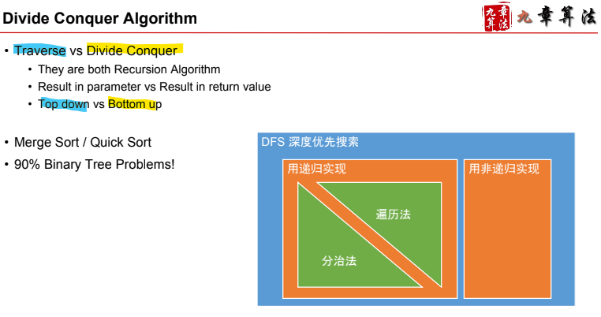
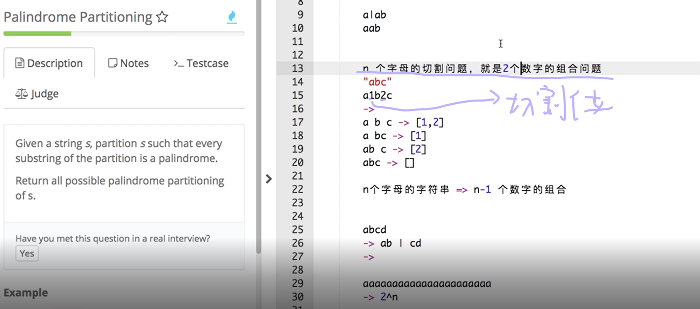
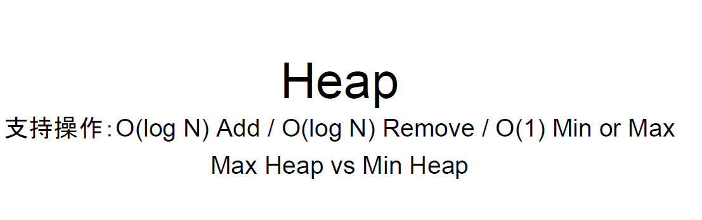
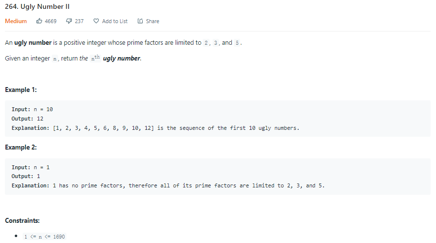

# Algorithm Note

## Binary Search

> Big O Notation and Time Complexity

- ```Time Complexity``` is a way of showing how the runtime of a function increases as the size of the input increases.

<p align="center">
  
</p>

<p align="center">
  
</p>

> For binary search

<p align="center">
  
</p>

<p align="center">
  
</p>

<p align="center">
  
</p>

- (8 / n), if ```n = 8```, ```T(n) = 2^3 * O(n) = O(log_2(n)) ```

<p align="center">
  
</p>

<p align="center">
  
</p>

- 也可以把```T(n)```想象成问题规模

- Quick sort， Merge sort -> ```O(nlogn)```

<p align="center">
  
</p>

<p align="center">
  
</p>

<p align="center">
  
</p>

1. ```start + 1 < end```

> We need it for stopping, for example, ```start = 0, end = 1```

> Then, we check ```vector[start]``` and ```vector[end]``` to see if they are the value we need.

2. ```start + (end - start) / 2```

<p align="center">
  
</p>

> If we use ```(start + end) / 2```, start + end might exceed the INT_MAX, result in negative value

```c++
class Solution {
public:
    int search(vector<int>& nums, int target) {
        int start {0};
        int end = nums.size() - 1;
        
        int result {-1};
        
        while(start + 1 < end) {
            int mid = start + (end - start) / 2;
            
            if (nums[mid] == target) {
                result = mid;
                break;
            } else if (nums[mid] > target)
                end = mid;
            else if (nums[mid] < target)
                start = mid;
        }
        
        if (nums[start] == target)
            result = start;
        if (nums[end] == target)
            result = end;
        
        return result;
    }
};
```

- [First Bad Version](https://leetcode.com/problems/first-bad-version/)

```c++
// The API isBadVersion is defined for you.
// bool isBadVersion(int version);

class Solution {
public:
    int firstBadVersion(int n) {
        if (n == 1)
            return n;

        int start {1};
        int end = {n};
        
        while(start + 1 < end) {
            int mid = start + (end - start) / 2;
            
            if (isBadVersion(mid))
                end = mid;
            else
                start = mid;
        }
        
        if (isBadVersion(start))
            return start;
        return end;
    }
};
```

- 动态数组实现方式 -》先有一个initial length -》不够的时候就double， 然后copy

<p align="center">
  
</p>

## Binary Tree & Divide Conquer

<p align="center">
  
</p>

> 理想高度 -> ```O(logn)（Balanced）``` -> 实际定义 h

> 最坏O(n)

<p align="center">
  
</p>

- Binary tree 寻找 -> O(1) -> if语句

<p align="center">
  
</p>

- 遍历

<p align="center">
  
</p>

> Inorder

```c++
/**
 * Definition for a binary tree node.
 * struct TreeNode {
 *     int val;
 *     TreeNode *left;
 *     TreeNode *right;
 *     TreeNode() : val(0), left(nullptr), right(nullptr) {}
 *     TreeNode(int x) : val(x), left(nullptr), right(nullptr) {}
 *     TreeNode(int x, TreeNode *left, TreeNode *right) : val(x), left(left), right(right) {}
 * };
 */
class Solution {
public:
    
    void traversal(TreeNode* root, vector<int>& result) {
        if (root == nullptr)
            return;
        
        traversal(root->left, result);
        result.push_back(root->val);
        traversal(root->right, result);
    }
    
    vector<int> inorderTraversal(TreeNode* root) {
        vector<int> result;
        
        traversal(root, result);
           
        return result;
    }
};
```

> Preorder

```c++
/**
 * Definition for a binary tree node.
 * struct TreeNode {
 *     int val;
 *     TreeNode *left;
 *     TreeNode *right;
 *     TreeNode() : val(0), left(nullptr), right(nullptr) {}
 *     TreeNode(int x) : val(x), left(nullptr), right(nullptr) {}
 *     TreeNode(int x, TreeNode *left, TreeNode *right) : val(x), left(left), right(right) {}
 * };
 */
class Solution {
public:
    void traversal(TreeNode* root, vector<int>& result) {
        if (root == nullptr)
            return;
        
        result.push_back(root->val);
        traversal(root->left, result);
        traversal(root->right, result);
    }
    
    vector<int> preorderTraversal(TreeNode* root) {
        vector<int> result;
        
        traversal(root, result);
           
        return result;
    }
};
```

- Non-recursion version

<p align="center">
  
</p>

<p align="center">
  
</p>

- Divide Conquer

<p align="center">
  
</p>

<p align="center">
  
</p>

<p align="center">
  
</p>

```c++
/**
 * Definition for a binary tree node.
 * struct TreeNode {
 *     int val;
 *     TreeNode *left;
 *     TreeNode *right;
 *     TreeNode() : val(0), left(nullptr), right(nullptr) {}
 *     TreeNode(int x) : val(x), left(nullptr), right(nullptr) {}
 *     TreeNode(int x, TreeNode *left, TreeNode *right) : val(x), left(left), right(right) {}
 * };
 */

int g_depth = std::numeric_limits<int>::min();

class Solution {
public:
    // Divide Conquer
    int maxDepthDivCon(TreeNode* root, int depth) {
        if (root == nullptr)
            return depth;
        
        int leftMax = maxDepthDivCon(root->left, depth + 1);
        int rightMax = maxDepthDivCon(root->right, depth + 1);
        
        return leftMax > rightMax ? leftMax : rightMax;
    }
    
    // Traverse
    void maxDepthTraverse(TreeNode* root, int depth) {
        if (root == nullptr) {
            g_depth = depth > g_depth ? depth : g_depth;
            return;
        }
        
        maxDepthTraverse(root->left, depth + 1);
        maxDepthTraverse(root->right, depth + 1);
    }
    
    int maxDepth(TreeNode* root) {
        // Divide Conquer
        //return maxDepthDivCon(root, 0);
        
        // Traverse
        maxDepthTraverse(root, 0);
        int result = g_depth;
        g_depth = std::numeric_limits<int>::min();
        return result;
    }
};
```

<p align="center">
  
</p>

```c++
class Solution {
public:
    void binaryTreePathsTraverse(TreeNode* root, string result, vector<string>& result_list) {
        if (root == nullptr)
            return;

        if (root->left == nullptr && root->right == nullptr) {
            result_list.push_back(result + to_string(root->val));
            return;
        }
        
        binaryTreePathsTraverse(root->left, result + to_string(root->val) + "->", result_list);
        binaryTreePathsTraverse(root->right, result + to_string(root->val) + "->", result_list);
    }
    
    vector<string> binaryTreePaths(TreeNode* root) {
        vector<string> to_return;
        
        binaryTreePathsTraverse(root, "", to_return);
        
        return to_return;
    }
};
```

> [Balanced Binary Tree](https://leetcode.com/problems/balanced-binary-tree/)

- Binary Search Tree

<p align="center">
  
</p>

<p align="center">
  
</p>

> [Validate Binary Search Tree](https://leetcode.com/problems/validate-binary-search-tree/)

- **Inorder traverse to get sorted array is not enough!!!**

```c++
class Solution {
public:
    // pair<long, long>
    // Max value, Min value
    pair<bool, pair<long, long>> isValidBSTDivCon(TreeNode* root) {
        if (root == nullptr)
            return {true, {numeric_limits<long>::min(), numeric_limits<long>::max()}};
        
        auto leftIsValid = isValidBSTDivCon(root->left);
        auto rightIsValid = isValidBSTDivCon(root->right);
        
        if (!leftIsValid.first || !rightIsValid.first)
            return {false, {0, 0}};
        else if (root->val > leftIsValid.second.first && root->val < rightIsValid.second.second) {
            return {true, {max(rightIsValid.second.first, static_cast<long>(root->val)), 
                           min(leftIsValid.second.second,  static_cast<long>(root->val))}};
        }
                    
        return {false, {0, 0}};
    }
    
    bool isValidBST(TreeNode* root) {
        return isValidBSTDivCon(root).first;
    }
};
```

- [Sorted Array to Balanced BST](https://www.geeksforgeeks.org/sorted-array-to-balanced-bst/)
- [Convert a normal BST to Balanced BST](https://www.geeksforgeeks.org/convert-normal-bst-balanced-bst/)

<p align="center">
  
</p>

<p align="center">
  
</p>

```py
from math import log2

# The idea is to find the middle element of the array and make it the root of the tree,
# then perform the same operation on the left subarray for the root’s left child
# and the same operation on the right subarray for the root’s right child.
def constructBBST(nodeList, insertIndex, resultList, maxListLen):
    # Stop condition
    if insertIndex > maxListLen - 1 or len(nodeList) == 0:
        return

    midIndex = int(len(nodeList) / 2)
    midNode = nodeList[midIndex]
    # If the resultList has less element to hold the node, append -1 up to the index pos
    if insertIndex > len(resultList) - 1:
        for i in range(insertIndex - len(resultList) + 1):
            resultList.append(-1)
    resultList[insertIndex] = midNode

    # Left
    constructBBST(nodeList[0:midIndex], 2 * insertIndex + 1, resultList, maxListLen)
    # Right
    constructBBST(nodeList[midIndex + 1:len(nodeList)], 2 * insertIndex + 2, resultList, maxListLen)


def optbst(t):
    validNodesList = []
    resultList = []

    for node in t:
        if node != -1:
            validNodesList.append(node)

    # Find out maximum length for recursion stop condition
    validHeight = int(log2(len(validNodesList)))
    maxListLen = (2 ** (validHeight + 1)) - 1

    # Need to sort the list to use constructBBST
    validNodesList.sort()

    # Recursion construct BBST
    constructBBST(validNodesList, 0, resultList, maxListLen)

    return resultList
```

## Two Pointers

<p align="center">
  
</p>

<p align="center">
  
</p>

```c++
class Solution {
public:
    vector<int> sortedSquares(vector<int>& nums) {
        int pointerNeg {0};
        int pointerPos {static_cast<int>(nums.size()) - 1};
        int pointerResultPos{static_cast<int>(nums.size()) - 1};
        
        vector<int> result;
        result.resize(nums.size());
        
        for(int i = 0; i < nums.size(); i ++) {
            if (pointerPos > pointerNeg) {
                if (pow(nums[pointerPos], 2) >= pow(nums[pointerNeg], 2)) {
                    result[pointerResultPos] = pow(nums[pointerPos], 2);
                    pointerPos = pointerPos - 1;
                } else {
                    result[pointerResultPos] = pow(nums[pointerNeg], 2);
                    pointerNeg = pointerNeg + 1;
                }
            } else if (pointerPos == pointerNeg) {
                    result[pointerResultPos] = pow(nums[pointerNeg], 2);
            }
            
            pointerResultPos = pointerResultPos - 1;
        }
                    
        return result;
    }
};
```

- Three step rotation

<p align="center">
  
</p>

```c++
class Solution {
public:
    // Three step rotate
    // 1,2,3,4 | 5,6,7
    // 4,3,2,1 | 7,6,5
    // 5,6,7,1 | 2,3,4
    void rotate(vector<int>& nums, int k) {
        if (k == nums.size())
            return;
        
        int kMod = k % nums.size();
        int rotateMidPos{static_cast<int>(nums.size()) - kMod};
        
        // left rotate two pointer
        int leftRotateLeftPos{0};
        int leftRotateRightPos{rotateMidPos - 1};
        
        // right rotate two pointer
        int rightRotateLeftPos{rotateMidPos};
        int rightRotateRightPos{static_cast<int>(nums.size()) - 1};
        
        // mid rotate two pointer
        int midRotateLeftPos{0};
        int midRotateRightPos{static_cast<int>(nums.size()) - 1};
        
        while(leftRotateLeftPos < leftRotateRightPos) {
            auto temp = nums[leftRotateRightPos];
            nums[leftRotateRightPos] = nums[leftRotateLeftPos];
            nums[leftRotateLeftPos] = temp;
            
            leftRotateLeftPos ++;
            leftRotateRightPos --;
        }
        
        while(rightRotateLeftPos < rightRotateRightPos) {
            auto temp = nums[rightRotateRightPos];
            nums[rightRotateRightPos] = nums[rightRotateLeftPos];
            nums[rightRotateLeftPos] = temp;
            
            rightRotateLeftPos ++;
            rightRotateRightPos --;
        }
        
        while(midRotateLeftPos < midRotateRightPos) {
            auto temp = nums[midRotateRightPos];
            nums[midRotateRightPos] = nums[midRotateLeftPos];
            nums[midRotateLeftPos] = temp;
            
            midRotateLeftPos ++;
            midRotateRightPos --;
        }
    }
};
```

- Two sum O(n)

<p align="center">
  
</p>

> Sort + Two Pointer -> Sort : O(nlogn), Two Pointer O(n)

<p align="center">
  
</p>

<p align="center">
  
</p>

```c++
class Solution {
public:
    vector<int> twoSum(vector<int>& numbers, int target) {
        int pointerLeft {0};
        int pointerRight {static_cast<int>(numbers.size()) - 1};
        
        for (int i = 0; i < numbers.size(); i ++) {
            auto val = numbers[pointerLeft] + numbers[pointerRight];
            if (val > target)
                pointerRight --;
            else if (val == target)
                return {pointerLeft + 1, pointerRight + 1};
            else
                pointerLeft ++;
        }
        
        return {};
    }
};
```

<p align="center">
  
</p>

- Three sum O(n(n-1)) = O(n^2)

<p align="center">
  
</p>

```c++
class Solution {
public:
    /**
     * @param numbers: Give an array numbers of n integer
     * @return: Find all unique triplets in the array which gives the sum of zero.
     *          we will sort your return value in output
     */
    vector<vector<int>> threeSum(vector<int> &numbers) {
        vector<vector<int>> result;

        // Need to be sorted to use two pointer
        sort(numbers.begin(), numbers.end());

        for (int i = 0; i < numbers.size(); i ++) {
            // Avoid duplicate
            if (i != 0 && numbers[i] == numbers[i - 1])
                continue;

            auto twoSumResult = twoSum(numbers, i, -numbers[i]);

            if (twoSumResult.size() > 0) {
                for(auto j : twoSumResult) {
                    j.push_back(numbers[i]);
                    result.push_back(j);
                }
            }
        }

        return result;
    }

    vector<vector<int>> twoSum(vector<int> &numbers,
                               int ignoreIndex,
                               int target) {
        // Two sum starts at ignoreIndex, anything before are not needed
        int leftPos {ignoreIndex};
        int rightPos {static_cast<int>(numbers.size()) - 1};

        vector<vector<int>> result;

        while(leftPos < rightPos) {
            auto val = numbers[leftPos] + numbers[rightPos];
            if (val > target)
                rightPos --;
            else if (val < target)
                leftPos ++;
            else {
                result.push_back({numbers[leftPos], numbers[rightPos]});

                // Avoid duplicate
                auto resultLeft = numbers[leftPos];
                auto resultRight = numbers[rightPos];

                while (leftPos < rightPos && numbers[leftPos] == resultLeft) {
                    leftPos ++;
                }

                while (leftPos < rightPos && numbers[rightPos] == resultRight) {
                    rightPos --;
                }
            }
        }

        return result;
    }
};
```

- [Quick select](https://www.geeksforgeeks.org/quickselect-algorithm/)

<p align="center">
  
</p>

<p align="center">
  
</p>

```c++
class Solution {
public:
    int findKthLargest(vector<int>& nums, int k) {
        // Use n - k to find the smallest n - k element
        // -> k th largest element
        return partition(nums, 0, 
                         static_cast<int>(nums.size() - 1), 
                         static_cast<int>(nums.size() - k));
    }
    
    int partition(vector<int>& nums, int start, 
                   int end, int k) {
        int left = start, right = end;
        int pivot = nums[left + (right - left) / 2];
            
        cout << pivot << endl;

        // Need to consider = case
        // consider 3, 5, 6, 4
        // 5 as the pivot
        while(left <= right) {
            while (left <= right && nums[left] < pivot) {
                left ++;
            }
            
            while (left <= right && nums[right] > pivot) {
                right --;
            }
            
            if (left <= right) {
                auto temp = nums[right];
                nums[right] = nums[left];
                nums[left] = temp;
                
                left ++;
                right --;
            }
        }

        // Right's value is always greater than left by one
        // So. right -> left side,
        //     left  -> right side
        if (right >= k)
            return partition(nums, start, right, k);
        if (left <= k)
            return partition(nums, left, end, k);
        return nums[k];
    }
};
```
> Better Partition

```c++
// Standard partition process of QuickSort().
// It considers the last element as pivot
// and moves all smaller element to left of
// it and greater elements to right
int partition(int arr[], int l, int r)
{
    int x = arr[r], i = l;
    for (int j = l; j <= r - 1; j++) {
      // When smaller, i and j grows together,
      // When larger j grows until find the first smaller element
      // swap with i, i++
        if (arr[j] <= x) {
            swap(arr[i], arr[j]);
            i++;
        }
    }
    swap(arr[i], arr[r]);
    return i;
}
```

- Middle of the Linked List (Fast and Slow Pointer)

<p align="center">
  
</p>

```c++
class Solution {
public:
    ListNode* middleNode(ListNode* head) {
        ListNode* slow = head;
        ListNode* fast = head;
        while(fast->next != NULL){
            fast = fast->next;
            slow = slow->next;
            if(fast->next != NULL)
                fast = fast->next;
        }
        return slow;
    }
};
```

- Remove Nth Node From End of List

<p align="center">
  
</p>

```c++
/**
 * Definition for singly-linked list.
 * struct ListNode {
 *     int val;
 *     ListNode *next;
 *     ListNode() : val(0), next(nullptr) {}
 *     ListNode(int x) : val(x), next(nullptr) {}
 *     ListNode(int x, ListNode *next) : val(x), next(next) {}
 * };
 */
class Solution {
public:
    ListNode* removeNthFromEnd(ListNode* head, int n) {
        if (head->next == nullptr)
            return nullptr;
        
        // Tail
        ListNode* endPtr {nullptr};
        // Ptr to remove needed element
        ListNode* removePtr {nullptr};
        // Ptr to the element before the remove needed element
        ListNode* removePPtr {nullptr};
        int counter {0};
        
        endPtr = head;
        removePtr = head;
        removePPtr = head;
        
        // Move the removePtr once the counter hit the condition
        // Eventually, when the tail hits the end,
        // removePtr should be the nth element from the end of the list 
        while (endPtr->next != nullptr) {
            counter ++;
            
            endPtr = endPtr->next;
            if (counter >= n)
                removePtr = removePtr->next;
            if (counter > n)
                removePPtr = removePPtr->next;
        }
        
        // Corner case for [1,2] n = 2 (remove the head)
        if (counter < n)
            return head->next;
        
        removePtr = removePtr->next;
        removePPtr->next = removePtr;
        
        return head;
    }
};
```

## **BFS - Breadth First Search - Queue**

<p align="center">
  
</p>

> Queue

<p align="center">
  
</p>

<p align="center">
  
</p>

- [Binary Tree Level Order Traversal](https://leetcode.com/problems/binary-tree-level-order-traversal/)

<p align="center">
  
</p>

```c++
/**
 * Definition for a binary tree node.
 * struct TreeNode {
 *     int val;
 *     TreeNode *left;
 *     TreeNode *right;
 *     TreeNode() : val(0), left(nullptr), right(nullptr) {}
 *     TreeNode(int x) : val(x), left(nullptr), right(nullptr) {}
 *     TreeNode(int x, TreeNode *left, TreeNode *right) : val(x), left(left), right(right) {}
 * };
 */
class Solution {
public:
    vector<vector<int>> levelOrder(TreeNode* root) {
        // Return for empty root
        if (!root)
            return {};
        
        // Result vec
        vector<vector<int>> result;
        // BFS Queuq
        queue<TreeNode*> bfsQueue;
        
        // Push root in as initial state
        bfsQueue.push(root);
        
        // Queque will deal with one level per loop,
        // it will pop out the level nodes in one loop,
        // and get the next level nodes in, when there are
        // no other nodes, kill the loop
        while(bfsQueue.size() != 0) {
            
            // Current level node result
            vector<int> levelVector {};
            
            // !!!!!!!!!!!!!!!!
            // Current leel size!!!!!
            // This is important to keep track of how many nodes per level!!!!!!
            // !!!!!!!!!!!!!!!!
            int currentLevelSize = bfsQueue.size();
            
            // Loop the current level,
            // Push in the next level node,
            // pop out the current level node 
            for (int i = 0; i < currentLevelSize; i ++) {
                auto currentNode = bfsQueue.front();
                
                levelVector.push_back(currentNode->val);
                
                bfsQueue.pop();
                
                if (currentNode->left)
                    bfsQueue.push(currentNode->left);
                if (currentNode->right)
                    bfsQueue.push(currentNode->right);
            }
            
            // Push level result in final result
            result.push_back(levelVector);
        }
        
        return result;
    }
};
```

- Serialization

<p align="center">
  
</p>

<p align="center">
  
</p>

<p align="center">
  
</p>

```c++
/**
 * Definition for a binary tree node.
 * struct TreeNode {
 *     int val;
 *     TreeNode *left;
 *     TreeNode *right;
 *     TreeNode(int x) : val(x), left(NULL), right(NULL) {}
 * };
 */
class Codec {
public:

    // Encodes a tree to a single string.
    // Assume null to be -1 in string
    string serialize(TreeNode* root) {
        if (!root)
            return {};
        
        string result;
        queue<TreeNode*> bfsQueue;
        
        bfsQueue.push(root);
        
        while(bfsQueue.size() > 0) {
            string currentLevel {};
            auto currentBFSLevelSize = bfsQueue.size();
            
            bool allNull {true};
            for (int i = 0; i < currentBFSLevelSize; i++) {
                auto queueFront = bfsQueue.front();
                
                if (!queueFront)
                    currentLevel = currentLevel + "-1_";
                else {
                    allNull = false;
                    
                    currentLevel = currentLevel + to_string(queueFront->val) + "_";
                        
                    if (queueFront->left != nullptr)
                        bfsQueue.push(queueFront->left);
                    else
                        bfsQueue.push(nullptr);

                    if (queueFront->right != nullptr)
                        bfsQueue.push(queueFront->right);
                    else
                        bfsQueue.push(nullptr);
                }

                bfsQueue.pop();
            }
            
            if (!allNull)
                result = result + currentLevel;
        }
        
        return result;
    }

    // Decodes your encoded data to tree.
    // Assume null to be -1 in string 
    TreeNode* deserialize(string data) {
        if (data.size() == 0)
            return nullptr;

        TreeNode* root = new TreeNode(-1);
        int stringDataIndex {0};
        int stringDataSubIndex {0};
        int stringMaxIndex {static_cast<int>(data.size() - 1)};
        queue<TreeNode*> bfsQueue;
        
        // Init
        while (data[stringDataIndex] != '_')
            stringDataIndex ++;
        root->val = stoi(data.substr(stringDataSubIndex, stringDataIndex - stringDataSubIndex));
        stringDataIndex ++;
        stringDataSubIndex = stringDataIndex;
        
        bfsQueue.push(root);
        
        while(bfsQueue.size() > 0) {
            auto currentLevelSize = bfsQueue.size();
            
            for (int i = 0; i < currentLevelSize; i ++) {
                auto currentItem = bfsQueue.front();
                bfsQueue.pop();

                if (stringDataIndex <= stringMaxIndex) {
                    if (data[stringDataIndex] == '-') {
                        currentItem->left = nullptr;
                        stringDataIndex = stringDataIndex + 3;
                        stringDataSubIndex = stringDataIndex;
                    } else {
                        while (data[stringDataIndex] != '_')
                            stringDataIndex ++;

                        if (data[stringDataIndex] == '_') {
                            TreeNode* item = new TreeNode(stoi(data.substr(stringDataSubIndex, 
                                                                           stringDataIndex - stringDataSubIndex)));
                            bfsQueue.push(item);
                            currentItem->left = item;
                            stringDataIndex = stringDataIndex + 1;
                            stringDataSubIndex = stringDataIndex;
                        }
                    }
                    
                    if (data[stringDataIndex] == '-') {
                        currentItem->right = nullptr;
                        stringDataIndex = stringDataIndex + 3;
                        stringDataSubIndex = stringDataIndex;
                    } else {
                        while (data[stringDataIndex] != '_')
                            stringDataIndex ++;

                        if (data[stringDataIndex] == '_') {
                            TreeNode* item = new TreeNode(stoi(data.substr(stringDataSubIndex, 
                                                                           stringDataIndex - stringDataSubIndex)));
                            bfsQueue.push(item);
                            currentItem->right = item;
                            stringDataIndex = stringDataIndex + 1;
                            stringDataSubIndex = stringDataIndex;
                        }
                    }
                }
            }
        }

        return root;
    }
};

// Your Codec object will be instantiated and called as such:
// Codec* ser = new Codec();
// Codec* deser = new Codec();
// string tree = ser->serialize(root);
// TreeNode* ans = deser->deserialize(tree);
// return ans;
```

<p align="center">
  
</p>

```c++
class Solution {
public:
    int maxAreaOfIsland(vector<vector<int>>& grid) {
        if (grid[0].size() <= 0)
            return 0;
        
        int result {0};
        vector<vector<bool>> islandIndexSet;
        queue<pair<int,int>> bfsQueue;
        
        // Set up map for iterated elements
        // Cannot use string set since string might collide
        islandIndexSet.resize(grid.size());
        for (int i = 0; i < grid.size(); i ++) {
            islandIndexSet[i].resize(grid[0].size());
            for (int j = 0; j < grid[0].size(); j ++) {
                islandIndexSet[i][j] = false;
            }
        }
        
        // Double for loop to go over the island
        for (int i = 0; i < grid.size(); i ++) {
            for (int j = 0; j < grid[0].size(); j ++) {
                
                // BFS on the island land that is not recorded
                if (grid[i][j] == 1 && islandIndexSet[i][j] == false) {
                    
                    int tempResult {1};
                    islandIndexSet[i][j] = true;
                    bfsQueue.push({i, j});
                    
                    // BFS here no need to record per level
                    while(bfsQueue.size() > 0) {
                        auto currentIndex = bfsQueue.front();
                        bfsQueue.pop();

                        // Top
                        if (currentIndex.first - 1 >= 0 &&
                            !islandIndexSet[currentIndex.first - 1][currentIndex.second] &&
                            grid[currentIndex.first - 1][currentIndex.second] == 1) {
                            tempResult ++;
                            
                            islandIndexSet[currentIndex.first - 1][currentIndex.second] = true;
                            bfsQueue.push({currentIndex.first - 1, currentIndex.second});
                        }
                        
                        // Bottom
                        if (currentIndex.first + 1 < grid.size() &&
                            !islandIndexSet[currentIndex.first + 1][currentIndex.second] &&
                            grid[currentIndex.first + 1][currentIndex.second] == 1) {
                            tempResult ++;
                            
                            islandIndexSet[currentIndex.first + 1][currentIndex.second] = true;
                            bfsQueue.push({currentIndex.first + 1, currentIndex.second});
                        }
                        
                        // Left
                        if (currentIndex.second - 1 >= 0 &&
                            ! islandIndexSet[currentIndex.first][currentIndex.second - 1] &&
                            grid[currentIndex.first][currentIndex.second - 1] == 1) {
                            tempResult ++;
                            
                            islandIndexSet[currentIndex.first][currentIndex.second - 1] = true;
                            bfsQueue.push({currentIndex.first, currentIndex.second - 1});
                        }
                        
                        // Right
                        if (currentIndex.second + 1 < grid[0].size() &&
                            !islandIndexSet[currentIndex.first][currentIndex.second + 1] &&
                            grid[currentIndex.first][currentIndex.second + 1] == 1) {
                            tempResult ++;
                            
                            islandIndexSet[currentIndex.first][currentIndex.second + 1] = true;
                            bfsQueue.push({currentIndex.first, currentIndex.second + 1});
                        }
                    }
                    
                    result = max(tempResult, result);
                }
            }
        }
        
        return result;
    }
};
```

- BFS in Graph

<p align="center">
  
</p>

> Record the node visited

<p align="center">
  
</p>

- Valid Tree

<p align="center">
  
</p>

> N vertices, N - 1 edges

> Vertices are connected

- Adjacency list

<p align="center">
  
</p>

- [Clone Graph](https://leetcode.com/problems/clone-graph/)

<p align="center">
  
</p>

```c++
/*
// Definition for a Node.
class Node {
public:
    int val;
    vector<Node*> neighbors;
    Node() {
        val = 0;
        neighbors = vector<Node*>();
    }
    Node(int _val) {
        val = _val;
        neighbors = vector<Node*>();
    }
    Node(int _val, vector<Node*> _neighbors) {
        val = _val;
        neighbors = _neighbors;
    }
};
*/

class Solution {
public:
    Node* cloneGraph(Node* node) {
        if (!node)
            return nullptr;
        
        // Root clone node
        Node* rootClone = new Node(node->val);
        // BFS queue for original graph
        queue<Node*> bfsQueueOG;
        // BFS queue for clone graph
        queue<Node*> bfsQueueCG;
        // Record visited node to avoid duplication in queue,
        // value will be the created clone node corresponded
        // to the key (int)
        map<int, Node*> visitedNodeCloneMap;
        
        // Init
        bfsQueueOG.push(node);
        bfsQueueCG.push(rootClone);
        visitedNodeCloneMap[node->val] = rootClone;
        
        while(bfsQueueOG.size() > 0) {
            auto currentNode = bfsQueueOG.front();
            auto currentCloneNode = bfsQueueCG.front();
            
            bfsQueueOG.pop();
            bfsQueueCG.pop();
            
            // Iterate neighbors
            for (auto i: currentNode->neighbors) {
                Node* neighborNode;
                
                // Check if the neighborNode is visited or not
                // so that we decided whether we need to
                // iterate its neighbors and clone the node
                if (visitedNodeCloneMap.find(i->val) == visitedNodeCloneMap.end()) {
                    // Clone if not cloned yet
                    neighborNode = new Node(i->val);
                    
                    // Next level
                    bfsQueueOG.push(i);
                    bfsQueueCG.push(neighborNode);
                    
                    visitedNodeCloneMap[i->val] = neighborNode;
                } else {
                    // If it is visited, then used the clone node in the map
                    neighborNode = visitedNodeCloneMap[i->val];
                }
                
                // Record neighbors in the clone node
                currentCloneNode->neighbors.push_back(neighborNode);
            }
        }

        return rootClone;
    }
};
```

<p align="center">
  
</p>

## Topological Sorting

<p align="center">
  
</p>

> 排的是拓扑序 - topo order - 依赖关系

> Directed graph

<p align="center">
  
</p>

> Indegree - 入度, the starting node of the topological order should have indegree zero

> Indegree zero means that no directed edge is **pointing to** the node -> no dependecies

> bfs until the node has zero ingegree, record in the list

<p align="center">
  
</p>

- Course Schedule

<p align="center">
  
</p>

```c++
class Solution {
public:
    bool canFinish(int numCourses, vector<vector<int>>& prerequisites) {
        if (prerequisites.size() == 0)
            return true;
        
        // Topological sorting
        
        // Indegree Map - key : course, value : indegree
        map<int, int> indegreeMap;
        // Queue bfs
        queue<int> bfsQueue;
        // Couse Taken set
        set<int> courseTakenSet;

        // Fill map with course
        for (int i = 0; i < numCourses; i ++) {
            indegreeMap[i] = 0;
        }
        
        // Record Indegree - all the pairs prerequisites[i] are unique.
        for (const auto& i : prerequisites) {
            indegreeMap[i[0]] = indegreeMap[i[0]] + 1;
        }
        
        // Fill bfsQueue and courseTakenSet with a node with indegree 0
        for (auto& i : indegreeMap) {
            if (i.second == 0) {
                bfsQueue.push(i.first);
                courseTakenSet.insert(i.first);
                break;
            }
        }

        // BFS loop
        while(bfsQueue.size() > 0) {
            auto currentCourse = bfsQueue.front();

            bfsQueue.pop();

            // Change the indegree map when the currentCourse is taken
            for (const auto& i : prerequisites) {
                if (i[1] == currentCourse)
                    indegreeMap[i[0]] = indegreeMap[i[0]] - 1;
            }

            // Put all indegree zero courses into the queue to loop
            for (auto& i : indegreeMap) {
                // Avoid duplication by usinfg set
                if (i.second == 0 && courseTakenSet.find(i.first) == courseTakenSet.end()) {
                    bfsQueue.push(i.first);
                    courseTakenSet.insert(i.first);
                }
            }
        }

        // Final check to see if all indegree is zero
        bool allCourseCouldBeTaken {true};
        for (auto& i : indegreeMap) {
            if (i.second != 0)
                allCourseCouldBeTaken = false;
        }

        return allCourseCouldBeTaken;
    }
};
```

<p align="center">
  
</p>

```c++
class Solution {
public:
    int ladderLength(string beginWord, string endWord, vector<string>& wordList) {
        // Use HashSet to reduce the search cost
        bool endWordIn {false};
        set<string> wordListSet;
        
        // Return if the endWord is not in the wordList
        for (auto& i :wordList) {
            if (i == endWord) {
                endWordIn = true;
            }
            wordListSet.insert(i);
        }
        
        if (!endWordIn)
            return 0;
        
        // Actual BFS
        int result {1};
        queue<string> bfsSearchQueue;
        set<string> onceInList;
        
        // Init
        bfsSearchQueue.push(beginWord);
        onceInList.insert(beginWord);
        
        // BFS Loop
        while(bfsSearchQueue.size() > 0) {
            auto currentLevelSize = bfsSearchQueue.size();
            
            // Level loop
            for(int i = 0; i < currentLevelSize; i ++) {
                auto currentString = bfsSearchQueue.front();
                
                bfsSearchQueue.pop();
                
                // String change char loop
                for (int currentCharIndex = 0; currentCharIndex < currentString.size(); currentCharIndex++) {
                    
                    // 97 -> 'a'
                    // 26 char loop
                    for (int asciiChar = 97; asciiChar <= 122; asciiChar ++) {
                        // Same char, continue
                        if (static_cast<char>(asciiChar) == currentString[currentCharIndex])
                            continue;
                        
                        auto modifiedString = currentString;
                        modifiedString[currentCharIndex] = static_cast<char>(asciiChar);
                        
                        // Visited, then continue, reduce redudant string
                        if (onceInList.find(modifiedString) != onceInList.end())
                            continue;
                        // Return if mutated string is the endWord
                        if (modifiedString == endWord)
                            return result + 1;
                        
                        // Check if it is in the wordListSet
                        if (wordListSet.find(modifiedString) != wordListSet.end()) {
                            bfsSearchQueue.push(modifiedString);
                            onceInList.insert(modifiedString);
                        }
                    }
                }
            }
            
            result ++;
        }
        
        return 0;
    }
};
```

## DFS (Depth First Search)

<p align="center">
  
</p>

<p align="center">
  
</p>

- Combination

<p align="center">
  
</p>

<p align="center">
  
</p>

<p align="center">
  
</p>

<p align="center">
  
</p>

```c++
class Solution {
public:
    // DFS recursiom
    // currentCom record the current comnination item
    //
    // startIndex indicates that the loop should start
    // from the current loop element to avoid duplication
    //
    // depth means the k callstack
    void findCombination(vector<int> currentCom,
                         int n,
                         int k,
                         int startIndex,
                         int depth,
                         vector<vector<int>>& result){
        // Stop Condition
        if (depth == k)
            return;
        
        for (int i = startIndex; i <= n; i ++) {
            currentCom.push_back(i);

            if (currentCom.size() == k)
                result.push_back(currentCom);

            findCombination(currentCom, n, k, i + 1, depth + 1, result);

            currentCom.erase(currentCom.end() - 1);
        }
    }
    
    vector<vector<int>> combine(int n, int k) {
        vector<vector<int>> result;
        
        // DFS
        findCombination({}, n, k, 1, 0, result);
        
        return result;
    }
};
```
- Combination Sum

<p align="center">
  
</p>

```c++
class Solution {
public:
    void combinationSumDFS(int sum,
                           int target,
                           int startingIndex,
                           vector<int> currentCom,
                           const vector<int>& candidates,
                           vector<vector<int>>& result) {
        // Stop condition
        // This is needed instead of directly return from if (currentSum == target)
        // Since if target == 8, 4,4 -> still need 4, 2, 2
        if (sum >= target)
            return;
        
        for (int i = startingIndex; i < candidates.size(); i++) {
            auto currentSum = sum + candidates[i];
            
            // Larger -> continue the loop
            if (currentSum > target)
                continue;
            
            // Not, larger common code for other case
            sum = currentSum;
            currentCom.push_back(candidates[i]);
            
            // Record when equal
            if (currentSum == target)
                result.push_back(currentCom);
            
            // DFS call
            combinationSumDFS(sum, target, i, currentCom,
                              candidates, result);
            
            // Trace back
            currentCom.pop_back();
            sum = sum - candidates[i];
        }
    }
    
    vector<vector<int>> combinationSum(vector<int>& candidates, int target) {
        vector<vector<int>> result;
        
        combinationSumDFS(0, target, 0, {}, candidates, result);
        
        return result;
    }
};
```

<p align="center">
  
</p>

- How to avoid duplicate -> e.g. [1, 1, 1, 1, 2], target 4 -> avoid 1',1''',1''''2 and 1'',1''',1'''' 2

```c++
    // Sort the candidate, so that [1, 1, 1, 2], target 4
    // 1', and 1'', and 1''' can be distinguished
    sort(candidates.begin(), candidates.end());
    
    void combinationSumDFS(int sum,
                           int target,
                           int startingIndex,
                           vector<int> currentCom,
                           const vector<int>& candidates,
                           vector<vector<int>>& result) {
        // Stop condition
        // This is needed instead of directly return from if (currentSum == target)
        // Since if target == 8, 4,4 -> still need 4, 2, 2
        if (sum >= target)
            return;
        
        for (int i = startingIndex; i < candidates.size(); i++) {
            // [1, 1, 1, 2], target 4
            // 1', and 1'', and 1''' can be distinguished
            // check if 1'' == 1'
            // and i != startingIndex means the second for loop
            // 1', 1'', 1''' will be taken in DFS,
            // Avoid 1',1'',1''' in the second for (non dfs) loop
            if (i != startingIndex && candidates[i] == candidates[i - 1])
                continue;
            
            auto currentSum = sum + candidates[i];
            
            // Larger -> continue the loop
            if (currentSum > target)
                continue;
            
            // Not, larger common code for other case
            sum = currentSum;
            currentCom.push_back(candidates[i]);
            
            // Record when equal
            if (currentSum == target)
                result.push_back(currentCom);
            
            // DFS call
            combinationSumDFS(sum, target, i + 1, currentCom,
                              candidates, result);
            
            // Trace back
            currentCom.pop_back();
            sum = sum - candidates[i];
        }
    }
```

- Good recursion example

<p align="center">
  
</p>

```c++
class Solution {
public:
    void recurHelper(
        int depth,
        int index,
        const string& s,
        string currentS,
        vector<string>& result) {
        
        if(depth == s.size()) {
            result.push_back(currentS);
            return;
        }
        
        int asciiNum = static_cast<int>(s[index]);
        
        // Upper case
        if (asciiNum >= 65 && asciiNum <= 90) {
            recurHelper(depth + 1, index + 1, s, currentS + static_cast<char>(asciiNum + 32), result);
        } else if (asciiNum >= 97 && asciiNum <= 122) {
            recurHelper(depth + 1, index + 1, s, currentS + static_cast<char>(asciiNum - 32), result);
        }
        
        recurHelper(depth + 1, index + 1, s, currentS + static_cast<char>(asciiNum), result);
    }
    
    vector<string> letterCasePermutation(string s) {
        vector<string> result;
        
        recurHelper(0, 0, s, {}, result);
        
        return result;
    }
};
```

> https://leetcode.com/problems/reverse-linked-list/

<p align="center">
  
</p>

- Permutation

<p align="center">
  
</p>

<p align="center">
  
</p>

```c++
class Solution {
public:
    void permuteRecu(vector<int> currentItem, 
                     vector<int>& nums, vector<vector<int>>& result,
                    int depth) {
        if (depth == nums.size())
            return;
        
        for(int i = 0; i < nums.size(); i ++) {
            auto it = find (currentItem.begin(), currentItem.end(), nums[i]);
            if (it == currentItem.end()) {
                currentItem.push_back(nums[i]);
                if (currentItem.size() == nums.size()) {
                    result.push_back(currentItem);
                    break;
                }
                
                permuteRecu(currentItem, nums, result, depth + 1);
            
                currentItem.pop_back();
            }
        }
    }
    
    vector<vector<int>> permute(vector<int>& nums) {
        vector<vector<int>> result;
        
        permuteRecu({}, nums, result, 0);
        
        return result;
    }
};
```

- Permutation II (remove duplicate)

<p align="center">
  
</p>

```c++
class Solution {
public:
    void findPermuteUnique(int depth,
                           vector<int> currentItem,
                           vector<int>& nums,
                           vector<vector<int>>& result,
                           vector<bool>& visited) {
        if (currentItem.size() == nums.size()) {
            result.push_back(currentItem);
            return;
        }
        
        for (int i = 0; i < nums.size(); i ++) {
            // Remove duplicate
            //[1`, 1``, 2]
            // 1` -> 1`,1` (1 ` visited, continue) -> 1`, 1``, (visited[i - 1] == 1) recorded
            // 1`` -> 1``, 1`, visited[i - 1] == 0, continue
            if (i != 0 && nums[i] == nums[i - 1] && visited[i - 1] == 0) {
                continue;
            }
            
            if (!visited[i]) {
                currentItem.push_back(nums[i]);
                visited[i] = true;

                findPermuteUnique(depth + 1, currentItem, nums, result, visited);

                currentItem.pop_back();
                visited[i] = false;
            }
        }
    }
    
    vector<vector<int>> permuteUnique(vector<int>& nums) {
        vector<vector<int>> result;
        vector<bool> visited (nums.size(), false);
        
        sort(nums.begin(), nums.end());
        
        findPermuteUnique(0, {}, nums, result, visited);
        
        return result;
    }
};
```

- N queen

<p align="center">
  
</p>

```c++
class Solution {
public:
    vector<vector<string>> ret;
    bool is_valid(vector<string> &board, int row, int col){
        // check col
        for(int i=row;i>=0;--i)
            if(board[i][col] == 'Q') return false;
        // check left diagonal
        for(int i=row,j=col;i>=0&&j>=0;--i,--j)
            if(board[i][j] == 'Q') return false;
        //check right diagonal
        for(int i=row,j=col;i>=0&&j<board.size();--i,++j)
            if(board[i][j] == 'Q') return false;
        return true;
    }
    void dfs(vector<string> &board, int row){
        // exit condition
        if(row == board.size()){
            ret.push_back(board);
            return;
        }
        // iterate every possible position
        for(int i=0;i<board.size();++i){
            if(is_valid(board,row,i)){
                // make decision
                board[row][i] = 'Q';
                // next iteration
                dfs(board,row+1);
                // back-tracking
                board[row][i] = '.';
            }
        }
    }
    vector<vector<string>> solveNQueens(int n) {
		// return empty if n <= 0
        if(n <= 0) return {{}};
        vector<string> board(n,string(n,'.'));
        dfs(board,0);
        return ret;
    }
};
```

<p align="center">
  
</p>

> ```Hashmap or HashSet find string -> O(L)```

- [Word Ladder II](https://www.jiuzhang.com/solutions/word-ladder-ii)

- Subset II (Find the representitive -> need sorted)

<p align="center">
  
</p>

```c++
class Solution {
public:
    void findSubset(int currentIndex,
                    vector<int> currentItem,
                    const vector<int>& nums,
                    vector<vector<int>>& result) {
        for (int i = currentIndex; i < nums.size(); i ++) {
            // Find the representitive
            // i != currentIndex means [1 ,2` ,2``, 2```] -> [1, 2`, 2```] -> second iteration of [1, 2`] loop
            // nums[i] == nums[i - 1] to remove the duplicate
            if (i != currentIndex && nums[i] == nums[i - 1])
                continue;
            
            currentItem.push_back(nums[i]);
            result.push_back(currentItem);

            findSubset(i + 1, currentItem, nums, result);

            currentItem.pop_back();
        }
    }
    
    vector<vector<int>> subsetsWithDup(vector<int>& nums) {
        vector<vector<int>> result;
        result.push_back({});
        
        // Find the representitive method has to be sorted
        sort(nums.begin(), nums.end());
        
        findSubset(0, {}, nums, result);
        
        return result;
    }
};
```

## Hash and Heap

### Hash

- Hash function

<p align="center">
  
</p>

<p align="center">
  
</p>

- Open hashing vs Closed hashing

<p align="center">
  
</p>

> Closed hashing - collision -> take other cell

> Open hashing - collision -> take the same cell (**linked list**)

> **Open hasing is generally better**

<p align="center">
  
</p>

> After rehashing, the computed hash value from hash funtion might change, we need to rehash all elements again

- Least Recently Used (LRU Cache, the timing be used is the longest) 

> (Least Frequently Used is the number of times being used is the smallest)

<p align="center">
  
</p>

<p align="center">
  
</p>

<p align="center">
  
</p>

```c++
class LRUCache {
public:
    // Capacity
    int cap;
    // Map -> has to store iterator to make list erase faster
    // Map to store the value
    map<int, pair<list<int>::iterator, int>> keyMapInVec;
    // Linked list
    // to maintain the order LRU
    list<int> itemList;
    
    LRUCache(int capacity) {
        cap = capacity;
        // Ugly to solve leet code issue
        ios_base::sync_with_stdio(false);
        cin.tie(nullptr);
        cout.tie(nullptr);
    }
    
    int get(int key) {
        // Find if in the map
        auto mapIt = keyMapInVec.find(key);
        if (mapIt == keyMapInVec.end())
            return -1;
        
        // In the map, reorder LRU
        itemList.erase(mapIt->second.first);
        itemList.push_front(key);
        mapIt->second.first = itemList.begin();
        return mapIt->second.second;
    }
    
    void put(int key, int value) {
        auto mapIt = keyMapInVec.find(key);
        // Not in the map
        if (mapIt == keyMapInVec.end()) {
            // Over Cap
            if (keyMapInVec.size() == cap) {
                // Remove the current LRU
                auto lru = itemList.back();
                keyMapInVec.erase(lru);
                // Reorder the new key
                itemList.pop_back();
                itemList.push_front(key);
            } else {
                itemList.push_front(key);
            }
        // Not in the map
        } else {
            // Reorder
            itemList.erase(mapIt->second.first);
            itemList.push_front(key);
        }
        
        // Record the key
        keyMapInVec[key] = {itemList.begin(), value};
    }
};

/**
 * Your LRUCache object will be instantiated and called as such:
 * LRUCache* obj = new LRUCache(capacity);
 * int param_1 = obj->get(key);
 * obj->put(key,value);
 */
```

- ```std::set``` , ```std::map``` is **Red-black tree**
- ```std::unordered_set```, ```std::unordered_map``` is **Hashing**

<p align="center">
  
</p>

### Heap

<p align="center">
  
</p>

<p align="center">
  
</p>

- [```std::priority_queue```](https://en.cppreference.com/w/cpp/container/priority_queue)

> Max-heap by default

<p align="center">
  
</p>

<p align="center">
  
</p>

<p align="center">
  
</p>

```c++
class Solution {
public:
    int nthUglyNumber(int n) {
        // Min heap to meake sure the top is minimum value
        priority_queue<long long, vector<long long>,greater<long long>> minHeap;
        set<long long> uniqueSet;
        
        // Push one into the quque
        minHeap.push(1);
        uniqueSet.insert(1);
        
        // Counter to be n -> pop n times from quque
        int counter{0};
        while(true) {
            // Currrent minimum item
            auto currentItem {minHeap.top()};
            minHeap.pop();
            
            // Return when reaches the n times
            counter ++;
            if(counter == n)
                return currentItem;
            
            // Current minimum to calculate new ugly number
            // First loop -> pop 1
            // 1 -> 2, 1 -> 3, 1 -> 5
            // Second loop -> pop 2
            // 2 -> 2 * 2 = 4, 2 -> 2 * 3 = 6, 2 -> 2 * 5 = 10
            // ...
            // The nth poped item should be the nth ugly number
            for (int j = 0; j < 3; j ++) {   
                auto tempItem = currentItem;
                
                if (j == 0)
                    tempItem = tempItem * 2;
                else if (j == 1)
                    tempItem = tempItem * 3;
                else if (j == 2)
                    tempItem = tempItem * 5;
                
                // Not in set, add to queue
                if (uniqueSet.find(tempItem) == uniqueSet.end()) {
                    uniqueSet.insert(tempItem);
                    minHeap.push(tempItem);
                }
            }
        }
        
        return minHeap.top();
    }
};
```

<p align="center">
  
</p>

```c++
class Solution {
public:
    /*
    Compare	-	A Compare type providing a strict weak ordering. Note that the Compare parameter 
                is defined such that it returns true if its first argument comes before its second 
                argument in a weak ordering. But because the priority queue outputs largest elements 
                first, the elements that "come before" are actually output last. That is, the front of 
                the queue contains the "last" element according to the weak ordering imposed by Compare.
    */
    struct cmp {
        bool operator()(const pair<string, int>& A, 
                        const pair<string, int>& B) {
            // Sort the words with the same frequency by their lexicographical order.
            if (A.second == B.second) {
                int index{0};
                
                while(A.first[index] == B.first[index])
                    index ++;
                
                // Ascii code for 'a' < 'z', so we need 'a', return false
                return static_cast<int>(A.first[index]) < static_cast<int>(B.first[index]) ?
                    false : true;
            }
            
            // Frequency A > B, we need A, return false
            return A.second > B.second ? false : true;
        }
    };
    
    vector<string> topKFrequent(vector<string>& words, int k) {
        map<string, int> recordMap;
        vector<string> result;
        
        // Record frequency
        for (auto & i : words) {
            if (recordMap.find(i) == recordMap.end()) {
                recordMap[i] = 0;
            } else
                recordMap[i] = recordMap[i] + 1;
        }
        
        // Use functor
        priority_queue<pair<string, int>, vector<pair<string, int>>, cmp> pQ (recordMap.begin(), recordMap.end());
        
        for (int i = 0; i < k; i ++) {
            result.push_back(pQ.top().first);
            pQ.pop();
        }
        
        return result;
    }
};
```

- [Merge k Sorted Lists](https://leetcode.com/problems/merge-k-sorted-lists/)

## Sliding Window

<p align="center">
  
</p>


```c++
class Solution {
public:
    int minSubArrayLen(int target, vector<int>& nums) {
        int leftW {0};
        int rightW {0};
        long long result {numeric_limits<long long>::max()};
        
        int currentR{nums[0]};
        while (leftW < nums.size()) {
            // If smaller, keep adding to currentR until reaches limit
            if (currentR < target) {
                rightW ++;
                
                if (rightW == nums.size()) {
                    break;
                }
                
                currentR = currentR + nums[rightW];
            } else {
                // If larger, record result
                result = min(result, static_cast<long long>(rightW - leftW + 1));
                
                // Safely remove the left item
                currentR = currentR - nums[leftW];
                leftW ++;
                
                // if the currentR is still larger than target
                // keep reaching this branch until it is not
            }
        }
        
        return result == numeric_limits<long long>::max() ? 0 : result;
    }
};
```

## [Perfect Squares - Dynamic Programming - Leetcode 279](https://www.youtube.com/watch?v=HLZLwjzIVGo&ab_channel=NeetCode)

## **Ring Buffer**

From: https://zhuanlan.zhihu.com/p/394231116

## **Trees (AVL树，红黑树，B树，B+树，Trie)**

From: https://www.zhihu.com/question/30527705/answer/1663740519 <br/>
From: https://zhuanlan.zhihu.com/p/72505589 <br/>
From: https://mp.weixin.qq.com/s/cnDx8lJ6fXHgLZWsqjWrag <br/>
From: https://mp.weixin.qq.com/s/waFh-_7Q3EiFdUfXawm4Ww <br/>

## **Dynamic Programming**

From: https://zhuanlan.zhihu.com/p/91582909

## **LeetCode**
From: https://github.com/youngyangyang04/leetcode-master

## **Shell Sort**

From: https://mp.weixin.qq.com/s/b9-dkpAhWJYshuSs5cwnOw

## **Binary**

From: https://mp.weixin.qq.com/s/Cd4uRslnek8r_a6chjwnYQ

## **KMP**

From: https://mp.weixin.qq.com/s/3gYbmAAFh08BQmT-9quItQ