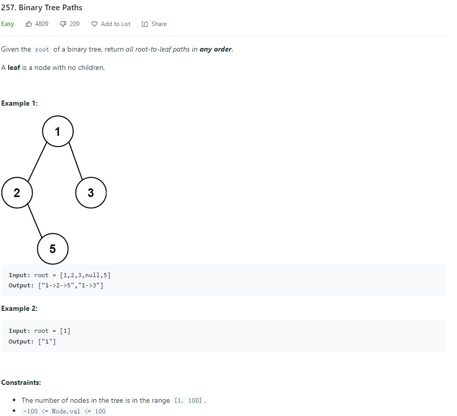
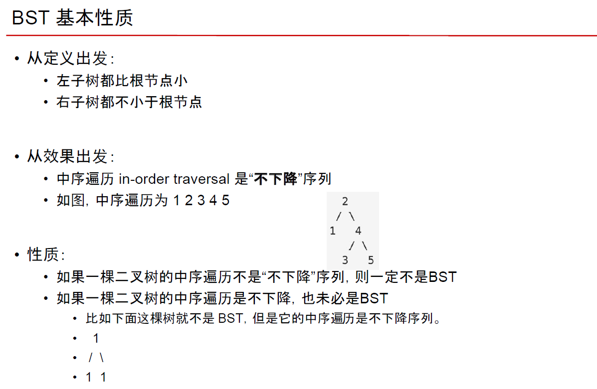

# Algorithm Note

## Binary Search

> Big O Notation and Time Complexity

- ```Time Complexity``` is a way of showing how the runtime of a function increases as the size of the input increases.

<p align="center">
  
</p>

<p align="center">
  
</p>

> For binary search

<p align="center">
  
</p>

<p align="center">
  
</p>

<p align="center">
  
</p>

- (8 / n), if ```n = 8```, ```T(n) = 2^3 * O(n) = O(log_2(n)) ```

<p align="center">
  
</p>

<p align="center">
  
</p>

- 也可以把```T(n)```想象成问题规模

- Quick sort， Merge sort -> ```O(nlogn)```

<p align="center">
  
</p>

<p align="center">
  
</p>

<p align="center">
  
</p>

1. ```start + 1 < end```

> We need it for stopping, for example, ```start = 0, end = 1```

> Then, we check ```vector[start]``` and ```vector[end]``` to see if they are the value we need.

2. ```start + (end - start) / 2```

<p align="center">
  
</p>

> If we use ```(start + end) / 2```, start + end might exceed the INT_MAX, result in negative value

```c++
class Solution {
public:
    int search(vector<int>& nums, int target) {
        int start {0};
        int end = nums.size() - 1;
        
        int result {-1};
        
        while(start + 1 < end) {
            int mid = start + (end - start) / 2;
            
            if (nums[mid] == target) {
                result = mid;
                break;
            } else if (nums[mid] > target)
                end = mid;
            else if (nums[mid] < target)
                start = mid;
        }
        
        if (nums[start] == target)
            result = start;
        if (nums[end] == target)
            result = end;
        
        return result;
    }
};
```

- [First Bad Version](https://leetcode.com/problems/first-bad-version/)

```c++
// The API isBadVersion is defined for you.
// bool isBadVersion(int version);

class Solution {
public:
    int firstBadVersion(int n) {
        if (n == 1)
            return n;

        int start {1};
        int end = {n};
        
        while(start + 1 < end) {
            int mid = start + (end - start) / 2;
            
            if (isBadVersion(mid))
                end = mid;
            else
                start = mid;
        }
        
        if (isBadVersion(start))
            return start;
        return end;
    }
};
```

- 动态数组实现方式 -》先有一个initial length -》不够的时候就double， 然后copy

<p align="center">
  
</p>

## Binary Tree & Divide Conquer

<p align="center">
  
</p>

> 理想高度 -> ```O(logn)（Balanced）``` -> 实际定义 h

> 最坏O(n)

<p align="center">
  
</p>

- Binary tree 寻找 -> O(1) -> if语句

<p align="center">
  
</p>

- 遍历

<p align="center">
  
</p>

> Inorder

```c++
/**
 * Definition for a binary tree node.
 * struct TreeNode {
 *     int val;
 *     TreeNode *left;
 *     TreeNode *right;
 *     TreeNode() : val(0), left(nullptr), right(nullptr) {}
 *     TreeNode(int x) : val(x), left(nullptr), right(nullptr) {}
 *     TreeNode(int x, TreeNode *left, TreeNode *right) : val(x), left(left), right(right) {}
 * };
 */
class Solution {
public:
    
    void traversal(TreeNode* root, vector<int>& result) {
        if (root == nullptr)
            return;
        
        traversal(root->left, result);
        result.push_back(root->val);
        traversal(root->right, result);
    }
    
    vector<int> inorderTraversal(TreeNode* root) {
        vector<int> result;
        
        traversal(root, result);
           
        return result;
    }
};
```

> Preorder

```c++
/**
 * Definition for a binary tree node.
 * struct TreeNode {
 *     int val;
 *     TreeNode *left;
 *     TreeNode *right;
 *     TreeNode() : val(0), left(nullptr), right(nullptr) {}
 *     TreeNode(int x) : val(x), left(nullptr), right(nullptr) {}
 *     TreeNode(int x, TreeNode *left, TreeNode *right) : val(x), left(left), right(right) {}
 * };
 */
class Solution {
public:
    void traversal(TreeNode* root, vector<int>& result) {
        if (root == nullptr)
            return;
        
        result.push_back(root->val);
        traversal(root->left, result);
        traversal(root->right, result);
    }
    
    vector<int> preorderTraversal(TreeNode* root) {
        vector<int> result;
        
        traversal(root, result);
           
        return result;
    }
};
```

- Non-recursion version

<p align="center">
  
</p>

<p align="center">
  
</p>

- Divide Conquer

<p align="center">
  
</p>

<p align="center">
  
</p>

<p align="center">
  
</p>

```c++
/**
 * Definition for a binary tree node.
 * struct TreeNode {
 *     int val;
 *     TreeNode *left;
 *     TreeNode *right;
 *     TreeNode() : val(0), left(nullptr), right(nullptr) {}
 *     TreeNode(int x) : val(x), left(nullptr), right(nullptr) {}
 *     TreeNode(int x, TreeNode *left, TreeNode *right) : val(x), left(left), right(right) {}
 * };
 */

int g_depth = std::numeric_limits<int>::min();

class Solution {
public:
    // Divide Conquer
    int maxDepthDivCon(TreeNode* root, int depth) {
        if (root == nullptr)
            return depth;
        
        int leftMax = maxDepthDivCon(root->left, depth + 1);
        int rightMax = maxDepthDivCon(root->right, depth + 1);
        
        return leftMax > rightMax ? leftMax : rightMax;
    }
    
    // Traverse
    void maxDepthTraverse(TreeNode* root, int depth) {
        if (root == nullptr) {
            g_depth = depth > g_depth ? depth : g_depth;
            return;
        }
        
        maxDepthTraverse(root->left, depth + 1);
        maxDepthTraverse(root->right, depth + 1);
    }
    
    int maxDepth(TreeNode* root) {
        // Divide Conquer
        //return maxDepthDivCon(root, 0);
        
        // Traverse
        maxDepthTraverse(root, 0);
        int result = g_depth;
        g_depth = std::numeric_limits<int>::min();
        return result;
    }
};
```

<p align="center">
  
</p>

```c++
class Solution {
public:
    void binaryTreePathsTraverse(TreeNode* root, string result, vector<string>& result_list) {
        if (root == nullptr)
            return;

        if (root->left == nullptr && root->right == nullptr) {
            result_list.push_back(result + to_string(root->val));
            return;
        }
        
        binaryTreePathsTraverse(root->left, result + to_string(root->val) + "->", result_list);
        binaryTreePathsTraverse(root->right, result + to_string(root->val) + "->", result_list);
    }
    
    vector<string> binaryTreePaths(TreeNode* root) {
        vector<string> to_return;
        
        binaryTreePathsTraverse(root, "", to_return);
        
        return to_return;
    }
};
```

> [Balanced Binary Tree](https://leetcode.com/problems/balanced-binary-tree/)

- Binary Search Tree

<p align="center">
  
</p>

<p align="center">
  
</p>

> [Validate Binary Search Tree](https://leetcode.com/problems/validate-binary-search-tree/)

- **Inorder traverse to get sorted array is not enough!!!**

```c++
class Solution {
public:
    // pair<long, long>
    // Max value, Min value
    pair<bool, pair<long, long>> isValidBSTDivCon(TreeNode* root) {
        if (root == nullptr)
            return {true, {numeric_limits<long>::min(), numeric_limits<long>::max()}};
        
        auto leftIsValid = isValidBSTDivCon(root->left);
        auto rightIsValid = isValidBSTDivCon(root->right);
        
        if (!leftIsValid.first || !rightIsValid.first)
            return {false, {0, 0}};
        else if (root->val > leftIsValid.second.first && root->val < rightIsValid.second.second) {
            return {true, {max(rightIsValid.second.first, static_cast<long>(root->val)), 
                           min(leftIsValid.second.second,  static_cast<long>(root->val))}};
        }
                    
        return {false, {0, 0}};
    }
    
    bool isValidBST(TreeNode* root) {
        return isValidBSTDivCon(root).first;
    }
};
```

- [Sorted Array to Balanced BST](https://www.geeksforgeeks.org/sorted-array-to-balanced-bst/)
- [Convert a normal BST to Balanced BST](https://www.geeksforgeeks.org/convert-normal-bst-balanced-bst/)

<p align="center">
  
</p>

<p align="center">
  
</p>

```py
from math import log2

# The idea is to find the middle element of the array and make it the root of the tree,
# then perform the same operation on the left subarray for the root’s left child
# and the same operation on the right subarray for the root’s right child.
def constructBBST(nodeList, insertIndex, resultList, maxListLen):
    # Stop condition
    if insertIndex > maxListLen - 1 or len(nodeList) == 0:
        return

    midIndex = int(len(nodeList) / 2)
    midNode = nodeList[midIndex]
    # If the resultList has less element to hold the node, append -1 up to the index pos
    if insertIndex > len(resultList) - 1:
        for i in range(insertIndex - len(resultList) + 1):
            resultList.append(-1)
    resultList[insertIndex] = midNode

    # Left
    constructBBST(nodeList[0:midIndex], 2 * insertIndex + 1, resultList, maxListLen)
    # Right
    constructBBST(nodeList[midIndex + 1:len(nodeList)], 2 * insertIndex + 2, resultList, maxListLen)


def optbst(t):
    validNodesList = []
    resultList = []

    for node in t:
        if node != -1:
            validNodesList.append(node)

    # Find out maximum length for recursion stop condition
    validHeight = int(log2(len(validNodesList)))
    maxListLen = (2 ** (validHeight + 1)) - 1

    # Need to sort the list to use constructBBST
    validNodesList.sort()

    # Recursion construct BBST
    constructBBST(validNodesList, 0, resultList, maxListLen)

    return resultList
```

## Two Pointers

<p align="center">
  
</p>

<p align="center">
  
</p>

```c++
class Solution {
public:
    vector<int> sortedSquares(vector<int>& nums) {
        int pointerNeg {0};
        int pointerPos {static_cast<int>(nums.size()) - 1};
        int pointerResultPos{static_cast<int>(nums.size()) - 1};
        
        vector<int> result;
        result.resize(nums.size());
        
        for(int i = 0; i < nums.size(); i ++) {
            if (pointerPos > pointerNeg) {
                if (pow(nums[pointerPos], 2) >= pow(nums[pointerNeg], 2)) {
                    result[pointerResultPos] = pow(nums[pointerPos], 2);
                    pointerPos = pointerPos - 1;
                } else {
                    result[pointerResultPos] = pow(nums[pointerNeg], 2);
                    pointerNeg = pointerNeg + 1;
                }
            } else if (pointerPos == pointerNeg) {
                    result[pointerResultPos] = pow(nums[pointerNeg], 2);
            }
            
            pointerResultPos = pointerResultPos - 1;
        }
                    
        return result;
    }
};
```

- Three step rotation

<p align="center">
  
</p>

```c++
class Solution {
public:
    // Three step rotate
    // 1,2,3,4 | 5,6,7
    // 4,3,2,1 | 7,6,5
    // 5,6,7,1 | 2,3,4
    void rotate(vector<int>& nums, int k) {
        if (k == nums.size())
            return;
        
        int kMod = k % nums.size();
        int rotateMidPos{static_cast<int>(nums.size()) - kMod};
        
        // left rotate two pointer
        int leftRotateLeftPos{0};
        int leftRotateRightPos{rotateMidPos - 1};
        
        // right rotate two pointer
        int rightRotateLeftPos{rotateMidPos};
        int rightRotateRightPos{static_cast<int>(nums.size()) - 1};
        
        // mid rotate two pointer
        int midRotateLeftPos{0};
        int midRotateRightPos{static_cast<int>(nums.size()) - 1};
        
        while(leftRotateLeftPos < leftRotateRightPos) {
            auto temp = nums[leftRotateRightPos];
            nums[leftRotateRightPos] = nums[leftRotateLeftPos];
            nums[leftRotateLeftPos] = temp;
            
            leftRotateLeftPos ++;
            leftRotateRightPos --;
        }
        
        while(rightRotateLeftPos < rightRotateRightPos) {
            auto temp = nums[rightRotateRightPos];
            nums[rightRotateRightPos] = nums[rightRotateLeftPos];
            nums[rightRotateLeftPos] = temp;
            
            rightRotateLeftPos ++;
            rightRotateRightPos --;
        }
        
        while(midRotateLeftPos < midRotateRightPos) {
            auto temp = nums[midRotateRightPos];
            nums[midRotateRightPos] = nums[midRotateLeftPos];
            nums[midRotateLeftPos] = temp;
            
            midRotateLeftPos ++;
            midRotateRightPos --;
        }
    }
};
```

- Two sum O(n)

<p align="center">
  
</p>

> Sort + Two Pointer -> Sort : O(nlogn), Two Pointer O(n)

<p align="center">
  
</p>

<p align="center">
  
</p>

```c++
class Solution {
public:
    vector<int> twoSum(vector<int>& numbers, int target) {
        int pointerLeft {0};
        int pointerRight {static_cast<int>(numbers.size()) - 1};
        
        for (int i = 0; i < numbers.size(); i ++) {
            auto val = numbers[pointerLeft] + numbers[pointerRight];
            if (val > target)
                pointerRight --;
            else if (val == target)
                return {pointerLeft + 1, pointerRight + 1};
            else
                pointerLeft ++;
        }
        
        return {};
    }
};
```

<p align="center">
  
</p>

- Three sum O(n(n-1)) = O(n^2)

<p align="center">
  
</p>

```c++
class Solution {
public:
    /**
     * @param numbers: Give an array numbers of n integer
     * @return: Find all unique triplets in the array which gives the sum of zero.
     *          we will sort your return value in output
     */
    vector<vector<int>> threeSum(vector<int> &numbers) {
        vector<vector<int>> result;

        // Need to be sorted to use two pointer
        sort(numbers.begin(), numbers.end());

        for (int i = 0; i < numbers.size(); i ++) {
            // Avoid duplicate
            if (i != 0 && numbers[i] == numbers[i - 1])
                continue;

            auto twoSumResult = twoSum(numbers, i, -numbers[i]);

            if (twoSumResult.size() > 0) {
                for(auto j : twoSumResult) {
                    j.push_back(numbers[i]);
                    result.push_back(j);
                }
            }
        }

        return result;
    }

    vector<vector<int>> twoSum(vector<int> &numbers,
                               int ignoreIndex,
                               int target) {
        // Two sum starts at ignoreIndex, anything before are not needed
        int leftPos {ignoreIndex};
        int rightPos {static_cast<int>(numbers.size()) - 1};

        vector<vector<int>> result;

        while(leftPos < rightPos) {
            auto val = numbers[leftPos] + numbers[rightPos];
            if (val > target)
                rightPos --;
            else if (val < target)
                leftPos ++;
            else {
                result.push_back({numbers[leftPos], numbers[rightPos]});

                // Avoid duplicate
                auto resultLeft = numbers[leftPos];
                auto resultRight = numbers[rightPos];

                while (leftPos < rightPos && numbers[leftPos] == resultLeft) {
                    leftPos ++;
                }

                while (leftPos < rightPos && numbers[rightPos] == resultRight) {
                    rightPos --;
                }
            }
        }

        return result;
    }
};
```

- [Quick select](https://www.geeksforgeeks.org/quickselect-algorithm/)

<p align="center">
  
</p>

<p align="center">
  
</p>

```c++
class Solution {
public:
    int findKthLargest(vector<int>& nums, int k) {
        // Use n - k to find the smallest n - k element
        // -> k th largest element
        return partition(nums, 0, 
                         static_cast<int>(nums.size() - 1), 
                         static_cast<int>(nums.size() - k));
    }
    
    int partition(vector<int>& nums, int start, 
                   int end, int k) {
        int left = start, right = end;
        int pivot = nums[left + (right - left) / 2];
            
        cout << pivot << endl;

        // Need to consider = case
        // consider 3, 5, 6, 4
        // 5 as the pivot
        while(left <= right) {
            while (left <= right && nums[left] < pivot) {
                left ++;
            }
            
            while (left <= right && nums[right] > pivot) {
                right --;
            }
            
            if (left <= right) {
                auto temp = nums[right];
                nums[right] = nums[left];
                nums[left] = temp;
                
                left ++;
                right --;
            }
        }

        // Right's value is always greater than left by one
        // So. right -> left side,
        //     left  -> right side
        if (right >= k)
            return partition(nums, start, right, k);
        if (left <= k)
            return partition(nums, left, end, k);
        return nums[k];
    }
};
```
> Better Partition

```c++
// Standard partition process of QuickSort().
// It considers the last element as pivot
// and moves all smaller element to left of
// it and greater elements to right
int partition(int arr[], int l, int r)
{
    int x = arr[r], i = l;
    for (int j = l; j <= r - 1; j++) {
      // When smaller, i and j grows together,
      // When larger j grows until find the first smaller element
      // swap with i, i++
        if (arr[j] <= x) {
            swap(arr[i], arr[j]);
            i++;
        }
    }
    swap(arr[i], arr[r]);
    return i;
}
```

- Middle of the Linked List (Fast and Slow Pointer)

<p align="center">
  
</p>

```c++
class Solution {
public:
    ListNode* middleNode(ListNode* head) {
        ListNode* slow = head;
        ListNode* fast = head;
        while(fast->next != NULL){
            fast = fast->next;
            slow = slow->next;
            if(fast->next != NULL)
                fast = fast->next;
        }
        return slow;
    }
};
```

- Remove Nth Node From End of List

<p align="center">
  
</p>

```c++
/**
 * Definition for singly-linked list.
 * struct ListNode {
 *     int val;
 *     ListNode *next;
 *     ListNode() : val(0), next(nullptr) {}
 *     ListNode(int x) : val(x), next(nullptr) {}
 *     ListNode(int x, ListNode *next) : val(x), next(next) {}
 * };
 */
class Solution {
public:
    ListNode* removeNthFromEnd(ListNode* head, int n) {
        if (head->next == nullptr)
            return nullptr;
        
        // Tail
        ListNode* endPtr {nullptr};
        // Ptr to remove needed element
        ListNode* removePtr {nullptr};
        // Ptr to the element before the remove needed element
        ListNode* removePPtr {nullptr};
        int counter {0};
        
        endPtr = head;
        removePtr = head;
        removePPtr = head;
        
        // Move the removePtr once the counter hit the condition
        // Eventually, when the tail hits the end,
        // removePtr should be the nth element from the end of the list 
        while (endPtr->next != nullptr) {
            counter ++;
            
            endPtr = endPtr->next;
            if (counter >= n)
                removePtr = removePtr->next;
            if (counter > n)
                removePPtr = removePPtr->next;
        }
        
        // Corner case for [1,2] n = 2 (remove the head)
        if (counter < n)
            return head->next;
        
        removePtr = removePtr->next;
        removePPtr->next = removePtr;
        
        return head;
    }
};
```

## BFS - Breadth First Search

<p align="center">
  
</p>

> Queue

<p align="center">
  
</p>

<p align="center">
  
</p>

- [Binary Tree Level Order Traversal](https://leetcode.com/problems/binary-tree-level-order-traversal/)

<p align="center">
  
</p>

```c++
/**
 * Definition for a binary tree node.
 * struct TreeNode {
 *     int val;
 *     TreeNode *left;
 *     TreeNode *right;
 *     TreeNode() : val(0), left(nullptr), right(nullptr) {}
 *     TreeNode(int x) : val(x), left(nullptr), right(nullptr) {}
 *     TreeNode(int x, TreeNode *left, TreeNode *right) : val(x), left(left), right(right) {}
 * };
 */
class Solution {
public:
    vector<vector<int>> levelOrder(TreeNode* root) {
        // Return for empty root
        if (!root)
            return {};
        
        // Result vec
        vector<vector<int>> result;
        // BFS Queuq
        queue<TreeNode*> bfsQueue;
        
        // Push root in as initial state
        bfsQueue.push(root);
        
        // Queque will deal with one level per loop,
        // it will pop out the level nodes in one loop,
        // and get the next level nodes in, when there are
        // no other nodes, kill the loop
        while(bfsQueue.size() != 0) {
            
            // Current level node result
            vector<int> levelVector {};
            
            // !!!!!!!!!!!!!!!!
            // Current leel size!!!!!
            // This is important to keep track of how many nodes per level!!!!!!
            // !!!!!!!!!!!!!!!!
            int currentLevelSize = bfsQueue.size();
            
            // Loop the current level,
            // Push in the next level node,
            // pop out the current level node 
            for (int i = 0; i < currentLevelSize; i ++) {
                auto currentNode = bfsQueue.front();
                
                levelVector.push_back(currentNode->val);
                
                bfsQueue.pop();
                
                if (currentNode->left)
                    bfsQueue.push(currentNode->left);
                if (currentNode->right)
                    bfsQueue.push(currentNode->right);
            }
            
            // Push level result in final result
            result.push_back(levelVector);
        }
        
        return result;
    }
};
```

## [Perfect Squares - Dynamic Programming - Leetcode 279](https://www.youtube.com/watch?v=HLZLwjzIVGo&ab_channel=NeetCode)

## **Ring Buffer**

From: https://zhuanlan.zhihu.com/p/394231116

## **Trees (AVL树，红黑树，B树，B+树，Trie)**

From: https://www.zhihu.com/question/30527705/answer/1663740519 <br/>
From: https://zhuanlan.zhihu.com/p/72505589 <br/>
From: https://mp.weixin.qq.com/s/cnDx8lJ6fXHgLZWsqjWrag <br/>
From: https://mp.weixin.qq.com/s/waFh-_7Q3EiFdUfXawm4Ww <br/>

## **Dynamic Programming**

From: https://zhuanlan.zhihu.com/p/91582909

## **LeetCode**
From: https://github.com/youngyangyang04/leetcode-master

## **Shell Sort**

From: https://mp.weixin.qq.com/s/b9-dkpAhWJYshuSs5cwnOw

## **Binary**

From: https://mp.weixin.qq.com/s/Cd4uRslnek8r_a6chjwnYQ

## **KMP**

From: https://mp.weixin.qq.com/s/3gYbmAAFh08BQmT-9quItQ