# Azure

## Shared responsibility

  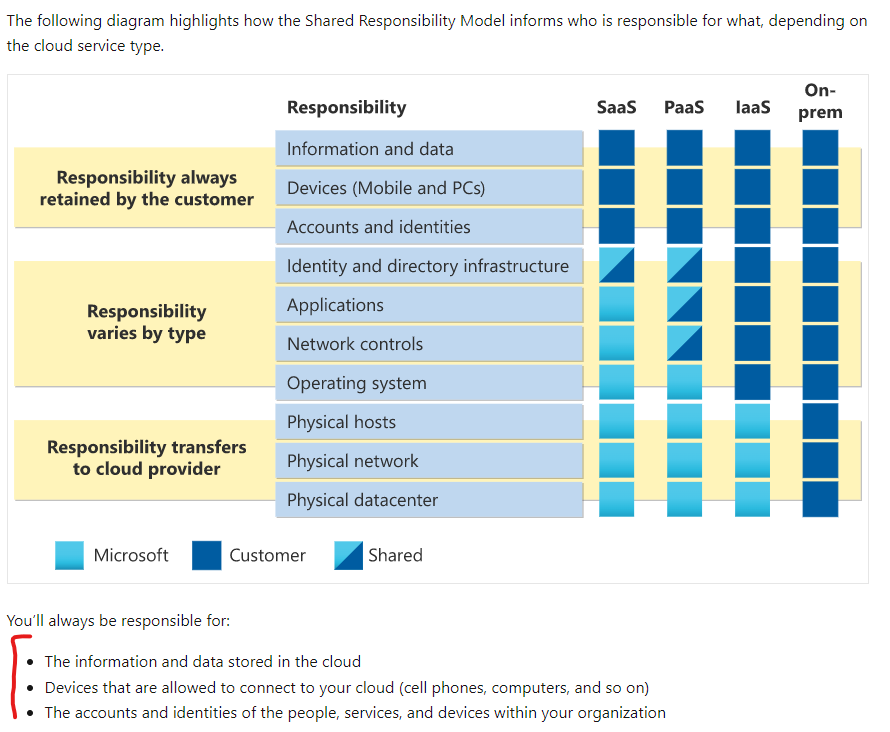

## Hybrid cloud

  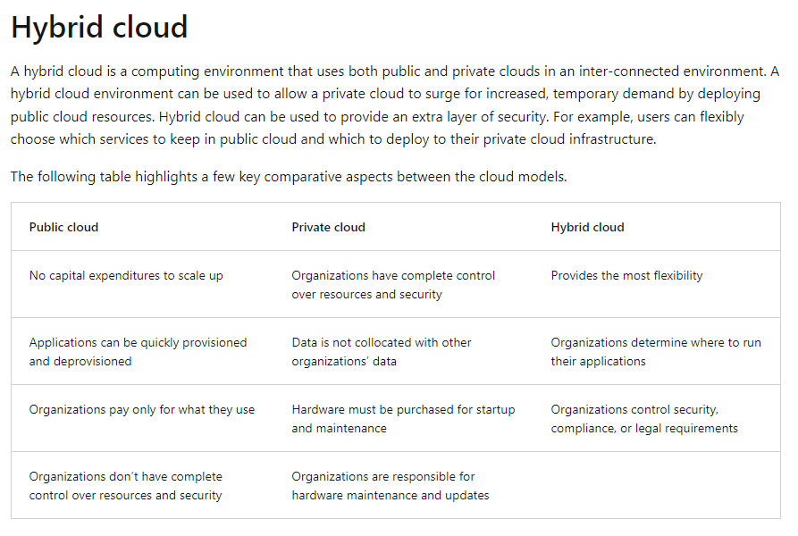

  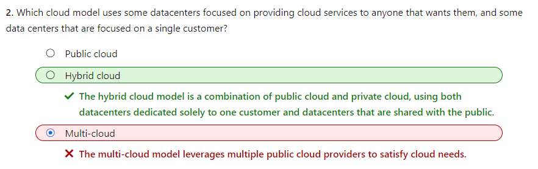

## Platform as a service (PaaS)

  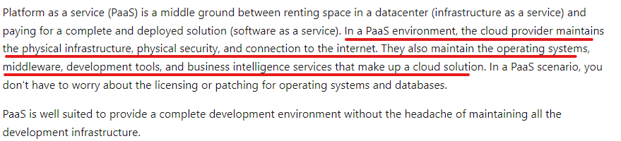

## Software as a service (SaaS)

  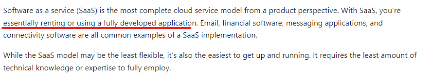

## Availability zones

  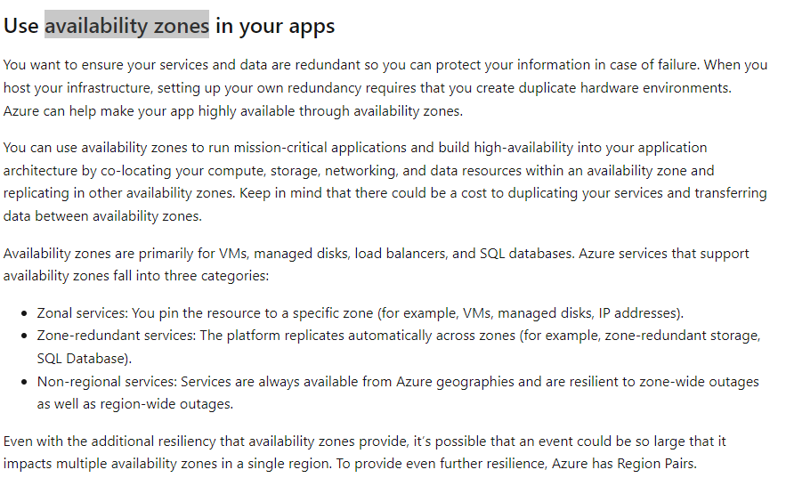

## Azure account & Subscriptions & Resource groups

  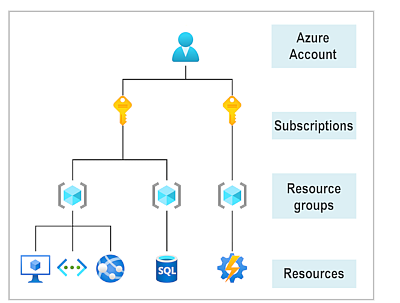

  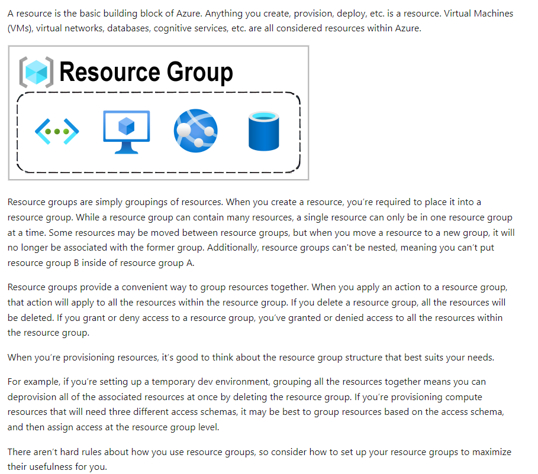

  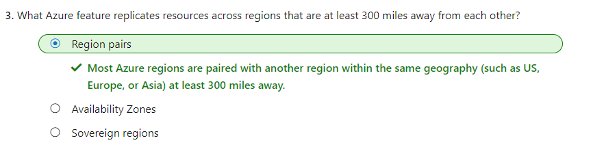

## Azure Virtual Machines & Functions

  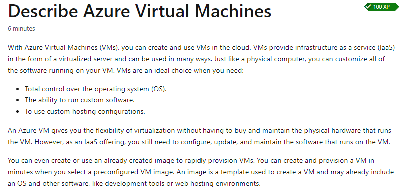

  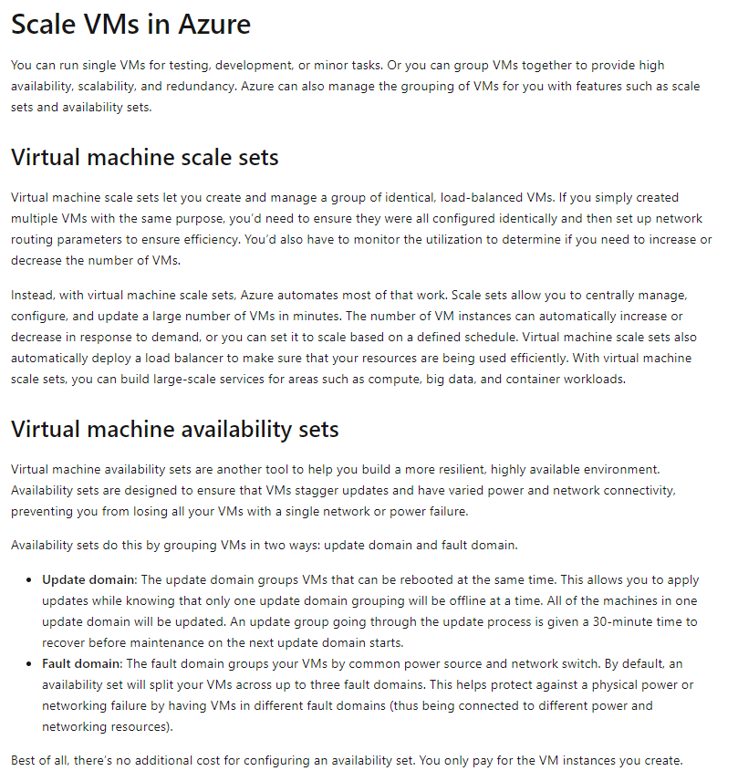

  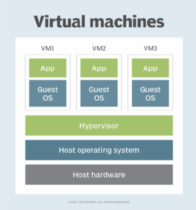

  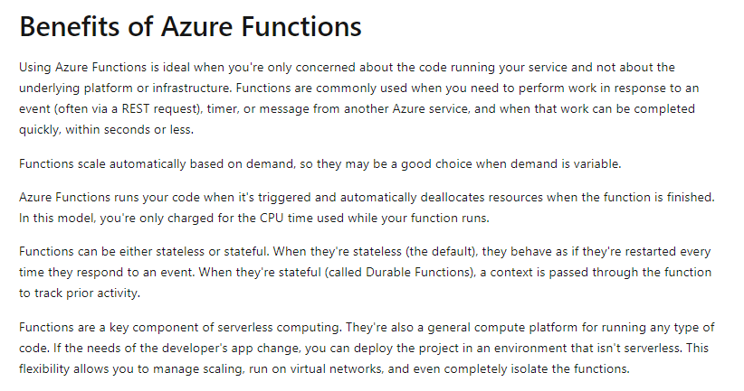

## Azure App Service

  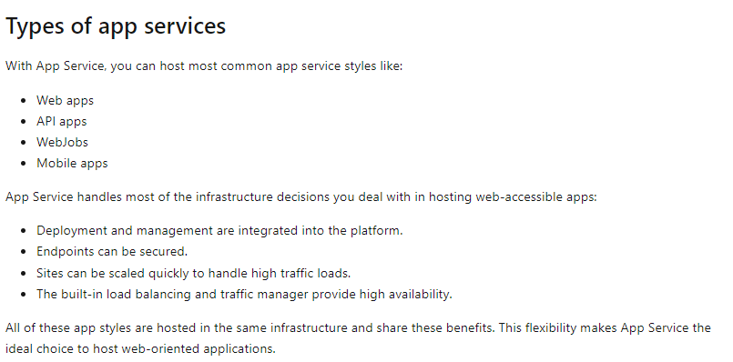

## Network Security Groups

  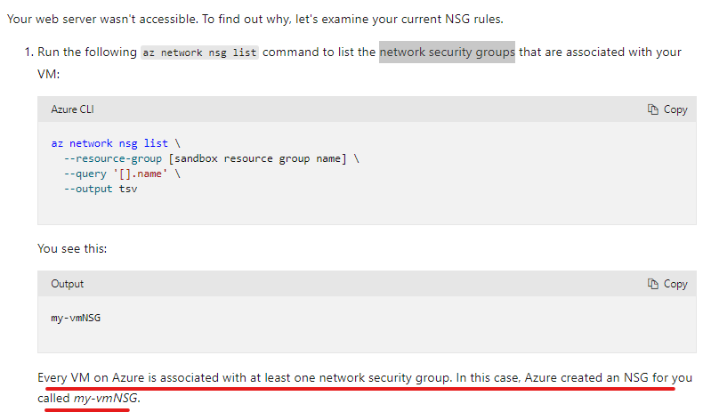

  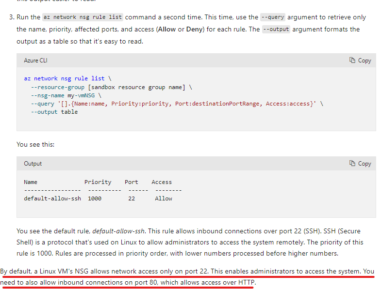

## [Azure storage redundancy](https://learn.microsoft.com/en-us/training/modules/describe-azure-storage-services/3-redundancy)

## Azure AD

  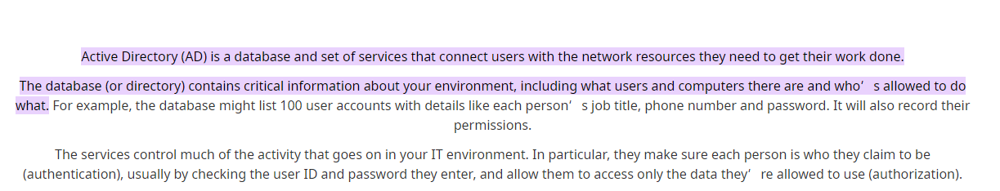

  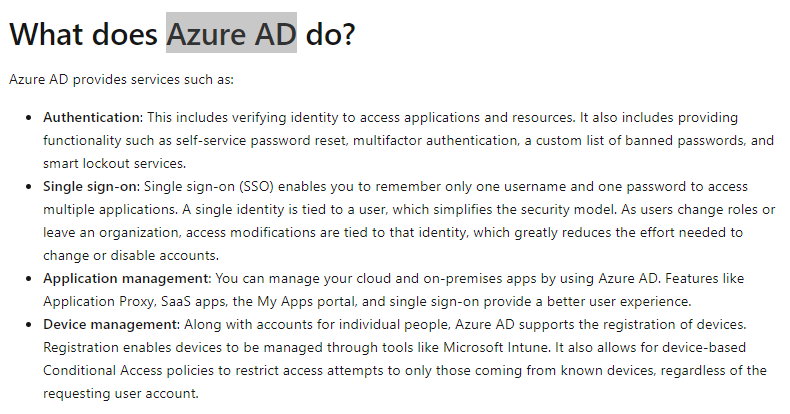

## Single sign-on (SSO)

  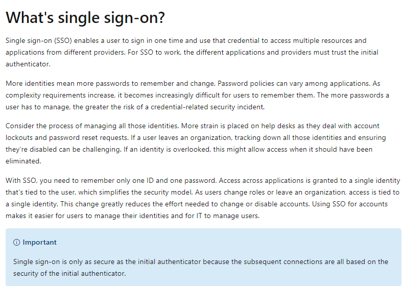

## [CQRS and Event Sourcing](https://learn.microsoft.com/en-us/azure/architecture/patterns/cqrs)